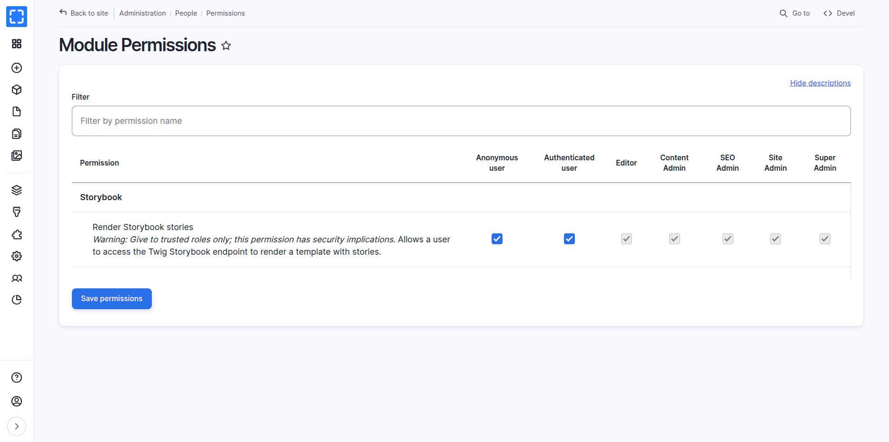
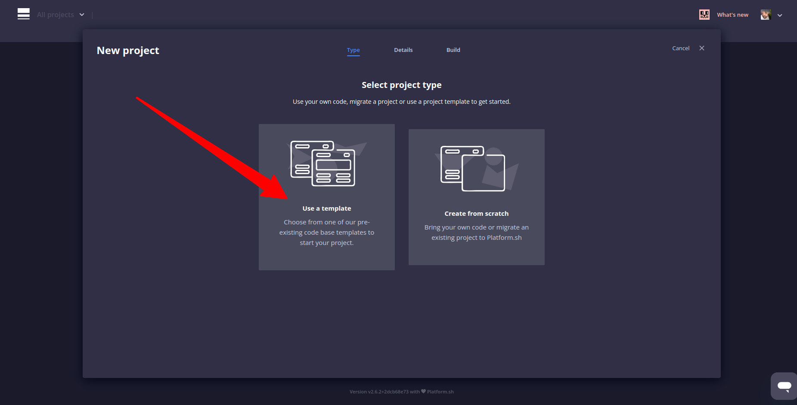
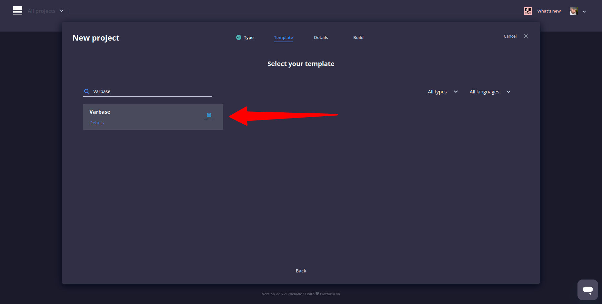

# Integration of Varbase with Storybook

**Varbase** has been integrated with [**Storybook**](https://storybook.js.org/) to provide a listing of stories for [**Single Directory Components (SDC)**](https://www.drupal.org/docs/develop/theming-drupal/using-single-directory-components) components. This integration allows for easier development and testing of [**Varbase Components**](https://www.drupal.org/project/varbase_components).

Not for production!!, only for development or staging.

## Initialize Storybook for DDEV

Follow with the following link to install Varbase 10.0.x with DDEV


#### TEMP for the Varbase 10.1.x Branch

Varbase 10.1.0 stable is not released yet.

Follow the following steps to set up a development environment for Varbase 10.1.x.


Before proceeding, ensure that you have the required tools installed on your local development environment:\
Make sure you have the following installed:

* DDEV → For local development
* wget → To download files from the web
* zip/unzip → To extract compressed files

Learn more about DDEV on the official website: [https://ddev.com](https://ddev.com/)


[**DDEV**](https://github.com/ddev/ddev) **is a development tool!**

Note that while you can run DDEV in production, it is highly discouraged, not recommended, and 100% not supported! DON'T DO IT!


#### 1. Download and Extract Varbase 10.1.x

To get the code for the **Varbase 10.1.x** branch and extract it to your chosen location with a custom folder name, follow these steps:

```bash
wget https://github.com/Vardot/varbase-project/archive/refs/heads/10.1.x.zip
unzip 10.1.x.zip
cd varbase-project-10.1.x
```

#### 2. Start DDEV and Install Dependencies

Start DDEV and build inside it.

```bash
ddev start
ddev composer install -vvv
```

#### 3. Install Varbase Using the Custom DDEV Container Command

<kbd>Install Varbase using drush. (shell web container command)</kbd>\
<kbd>**Usage:**</kbd> <kbd></kbd><kbd>ddev install-varbase minimal|full|demo \[flags]</kbd>\
<kbd>**Aliases:**</kbd> <kbd></kbd><kbd>install-varbase, varbase:install</kbd>

Install Varbase for the DDEV project.

A password for the webmaster user will be provided after the installation is complete.

Have a look at the content of the [install-varbase](https://github.com/Vardot/varbase-project/blob/10.1.x/.ddev/commands/web/install-varbase) command.

**Examples:**\
**Quick Varbase Demo installation**\
`ddev install-varbase demo`

**Full Varbase installation**\
`ddev install-varbase full`

**Minimal Varbase installation**\
`ddev install-varbase minimal`

#### 4. Initialize Storybook for Varbase

```bash
ddev init-storybook
```

The `ddev init-storybook` command in Varbase is a custom DDEV command designed to initialize Storybook for the DDEV project.

Have a look at the content of the [init-storybook](https://github.com/Vardot/varbase-project/blob/10.1.x/.ddev/commands/web/init-storybook) command.

#### 5. Generate Stories

Generate all stories using the following alias script&#x20;

```bash
ddev yarn storybook:gen
```

It will run the following drush command

`drush storybook:generate-all-stories --force`

#### 6. Start Varbase Storybook 2.0

```bash
ddev yarn storybook:dev
```

#### 7. Verify Installation and Links

```bash
ddev status
```

```
┌────────────────────────────────────────────────────────────────────────────────────────────────────────────────────┐
│ Project: varbase-project-10.1.x /var/www/html/dev/varbase-project-10.1.x https://varbase-project-10.1.x.ddev.site: │
│ 8443                                                                                                               │
│ Docker platform: linux-docker                                                                                      │
│ Router: traefik                                                                                                    │
├──────────────┬──────┬─────────────────────────────────────────────────────────────────────────┬────────────────────┤
│ SERVICE      │ STAT │ URL/PORT                                                                │ INFO               │
├──────────────┼──────┼─────────────────────────────────────────────────────────────────────────┼────────────────────┤
│ web          │ OK   │ https://varbase-project-10.1.x.ddev.site:8443                           │ drupal11 PHP 8.3   │
│              │      │ InDocker -> Host:                                                       │ Server: apache-fpm │
│              │      │  - web:80 -> 127.0.0.1:32897                                            │ Docroot: 'docroot' │
│              │      │  - web:443 -> 127.0.0.1:32898                                           │ Perf mode: none    │
│              │      │  - web:6006 -> 127.0.0.1:32899                                          │ Node.js: 20        │
│              │      │  - web:8025 -> 127.0.0.1:32900                                          │                    │
├──────────────┼──────┼─────────────────────────────────────────────────────────────────────────┼────────────────────┤
│ db           │ OK   │ InDocker -> Host:                                                       │ mariadb:10.11      │
│              │      │  - db:3306 -> 127.0.0.1:32901                                           │ User/Pass: 'db/db' │
│              │      │                                                                         │ or 'root/root'     │
├──────────────┼──────┼─────────────────────────────────────────────────────────────────────────┼────────────────────┤
│ Mailpit      │      │ Mailpit: https://varbase-project-10.1.x.ddev.site:8026                  │                    │
│              │      │ Launch: ddev mailpit                                                    │                    │
├──────────────┼──────┼─────────────────────────────────────────────────────────────────────────┼────────────────────┤
│ storybook    │      │ https://varbase-project-10.1.x.ddev.site:6006                           │                    │
│              │      │ InDocker: web:6006                                                      │                    │
├──────────────┼──────┼─────────────────────────────────────────────────────────────────────────┼────────────────────┤
│ Project URLs │      │ https://varbase-project-10.1.x.ddev.site:8443, https://127.0.0.1:32898, │                    │
│              │      │ http://varbase-project-10.1.x.ddev.site:8080, http://127.0.0.1:32897    │                    │
└──────────────┴──────┴─────────────────────────────────────────────────────────────────────────┴────────────────────┘
```

## When Adding or Changing Stories

Important to run the `ddev yarn storybook:gen`  command for all new or changed stories.

## Manual Steps by step to Set up a Working Storybook for Varbase

* Enable the **`storybook`** module on the site either through the site's interface or by running the command `drush en storybook` with Drush. Note that the CL Server module should not be kept running on a production site.
* Navigate to **`"/admin/people/permissions/module/storybook"`**  to give the `Render storybook stories` permission to all user roles. Check the  `Anonymous user` and `Authenticated user` checkbox and press **`Save permission`** submit button.

<figure><figcaption><p>Use the Storybook endpoint Module Permissions</p></figcaption></figure>

**Use Drush to** [**grant specified permission(s) to a role**](https://www.drush.org/12.4.2/commands/role_perm_add/)**.**

`./bin/drush role:perm:add anonymous 'render storybook stories'`

`./bin/drush role:perm:add authenticated 'render storybook stories'`&#x20;

**Use the** Render Storybook stories


**Use the** Render Storybook stories

_**Warning:** Give to trusted roles only; this permission has security implications._ Allows a user to access the Twig Storybook endpoint to render a template with stories.


**Use Drush to** [**remove specified permission(s) from a role**](https://www.drush.org/12.4.2/commands/role_perm_remove/)**.**

`./bin/drush role:perm:remove anonymous 'use cl server'`

`./bin/drush role:perm:remove authenticated 'use cl server'`

* Add the following exclude of modules to the `settings.php` or `settings.local.php` only to the development environment:
* Change the following **Cross-Site HTTP requests (CORS)** in the **`development.services.yml`** file.

```yaml
# Local development services.
#
# To activate this feature, follow the instructions at the top of the
# 'settings.platformsh.php' or 'settings.local.php' file, which sits next to this file.
parameters:
  twig.config:
    debug: true
    cache: false
  http.response.debug_cacheability_headers: true
  storybook.development: true
  cors.config:
    enabled: true
    # Specify allowed headers, like 'x-allowed-header'.
    allowedHeaders: ['*']
    # Specify allowed request methods, specify ['*'] to allow all possible ones.
    allowedMethods: ['*']
    # Configure requests allowed from specific origins. Do not include trailing
    # slashes with URLs.
    allowedOrigins: ['*']
    # Configure requests allowed from origins, matching against regex patterns.
    allowedOriginsPatterns: ['*']
    # Sets the Access-Control-Expose-Headers header.
    exposedHeaders: false
    # Sets the Access-Control-Max-Age header.
    maxAge: false
    # Sets the Access-Control-Allow-Credentials header.
    supportsCredentials: true
services:
  cache.backend.null:
    class: Drupal\Core\Cache\NullBackendFactory
```


Not recommended to keep **`"cors.config"`** with **`"enabled: true"`** in production environments.

#### **Better to keep all changes in the `"development.services.yml"` file**


* Enable Twig debugging by `debug: true`  in the `development.services.yml` file.

Having a local services file. Make sure to have the right path for custom local development services file.  `sites/default/development.local.services.yml`

```php
// Enable the development local services for Storybook.
$settings['container_yamls'][] = DRUPAL_ROOT . '/sites/default/development.local.services.yml';
```

Having a local settings `settings.local.php` file. When used in a local development environment, or in Development, Staging, or Demo hosts.

Enabling Twig debugging is not recommended in production environments.

* Disable the Twig cache by `cache: false`  in the `development.services.yml` file.

Disabling the Twig cache is not recommended in production environments.

#### Change the Local Development Domain

* Change `varbase.local` in the **`package.json`** file to the appropriate local or development domain name.
* Replace `process.env.STORYBOOK_SERVER_RENDER_URL` in the **`preview.ts`** file with the base URL of your project or an environment variable representing the local or development domain.
* Open a command terminal window and navigate to your project's directory.
* Run the **`yarn install`** command in the terminal to install the necessary dependencies.
* Run the **`yarn storybook:gen`** to generate all stories.
* Run the **`yarn storybook:dev`** command to start the development site for the **Storybook**.
* Open site domain with **:6006** port.

### Storybook Build

Building the storybook ones for the project, only for demos, staging, or hosted  development, when the other ports are not allowed.

Run the **`yarn storybook:build`** command to build the story, in the local or in at the dev, test, staging, or demo server.


#### Not for production!!, only for development or staging.


A domain name could point at the storybook folder.

**Example:**

1. An example development, staging or demo  `my-staging-varbase-site.com` domain name can point at the  `docroot` directory, which will bootstrap from **Varbase**
2. A sub domain `storybook.my-staging-varbase-site.com` domain name can point at the `storybook` directory, which will load the **Varbase Storybook**, and the **Component Library Server** will have requests from the `my-staging-varbase-site.com`

## Customizing Varbase Storybook for a Project:

### **Switching Between Themes**

To showcase a custom cloned generated theme, uncomment and modify the following line in the **`.storybook/preview.ts`** file:

&#x20;`// mytheme: {title: 'My Custom Theme for a Project'}`&#x20;

### **Show Custom Vartheme BS5's Components**

To include components from **Vartheme BS5 Starterkit**, uncomment and modify the following line in the `.storybook/main.js` file:

```
"../docroot/themes/contrib/vartheme_ba5/components/**/*.mdx",
"../docroot/themes/contrib/vartheme_ba5/components/**/*.stories.@(json)",
```

### Show Custom Them&#x65;**'s Components**

In case of having a custom theme for a project by


[creating-your-own-theme.md](creating-your-own-theme.md)


To include components from a custom cloned generated theme, uncomment and modify the following line in the `.storybook/main.ts` file:

```
"../docroot/themes/custom/mytheme/components/**/*.mdx",
"../docroot/themes/custom/mytheme/components/**/*.stories.@(json)",
```

Please ensure that the path to the custom theme is correct. It should be located either in `"../docroot/themes"` or `"../docroot/themes/custom"`&#x20;

### Show Custom Modul&#x65;**'s Components**

To include components from a custom module, uncomment and modify the following line in the `.storybook/main.ts` file:

```
"../docroot/modules/custom/my_custom_module/components/**/*.mdx",
"../docroot/modules/custom/my_custom_module/components/**/*.stories.@(json)",
```

## Run Varbase Storybook in Platformsh

Having a working Storybook for development, testing or staging.


**NOT** for production environments.


### Select The Varbase Template as The Project Type

Choose [**Vardot/platformsh-varbase**](https://github.com/Vardot/platformsh-varbase) from the pre-existing code base template to start a project with.

<figure><figcaption><p>Click on Use a Template</p></figcaption></figure>


Select **Varbase** as the template, by default a **Varbase 10.1** will be built

<figure><figcaption><p>Select Varbase as the Template</p></figcaption></figure>

After creating the project and installing Varbase 10

### Replace Site URL with an Environment URL

Edit the **`preview.ts`** file in the **`.storybook`** folder, replace this with your Drupal site URL, or an environment variable.

```json
    server: {
      // Replace this with your Drupal site URL, or an environment variable.
      url: process.env.STORYBOOK_SERVER_RENDER_URL,
    },
```

### Use 'development.local.services.yml' File

Have the following in the `settings.platformsh.php` file

```php
// Enable the development local services for Storybook.
if (isset($platformsh->branch)) {
  if (!$platformsh->onProduction() || !$platformsh->onDedicated()) {
    $settings['container_yamls'][] = $app_root . '/' . $site_path . '/development.local.services.yml';
  }
}
```

Both files are in the  [**Vardot/platformsh-varbase**](https://github.com/Vardot/platformsh-varbase10x01) project template.

After committing and starting the development environment for the development branch,

The Storybook link will work as follow

```yaml
https://storybook.{default}
```
