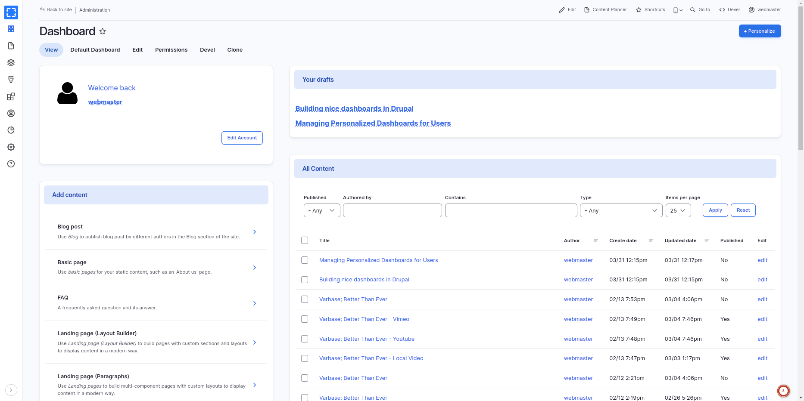
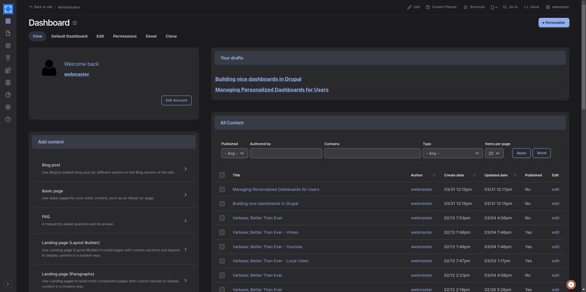

# Varbase Dashboards

A dashboard is what's missing for better Drupal administration experience.

<figure><figcaption><p>Enhanced Experience With the Sleek and Stylish Light Mode for Dashboards</p></figcaption></figure>

This dashboard is built on top of [Dashboards with Layout Builder](https://www.drupal.org/project/dashboards) module, utilize Drupal core's Layout Builder for dynamic dashboards management, and several enhanced blocks and widgets for an intuitive and flexible administration experience.

> The idea is made to provide the site admins with an appealing and concise dashboard to become the home of any Drupal site's administration task.

Provides default set of dashboards with configuration and enhancements for dynamic default, editorial, and admin dashboard management system.

## Varbase Dashboards Module


Varbase workflow features are bundled through the **Varbase Dashboards** module.

&#x20;GitHub: [https://github.com/Vardot/varbase\_dashboards](https://github.com/Vardot/varbase_dashboards)

&#x20;Drupal.org: [https://www.drupal.org/project/varbase\_dashboards](https://www.drupal.org/project/varbase_dashboards)



After building a project using the `varbase-project` template, you can see the code of the **Varbase Dashboards** module in:

```
project_directory
|-- docroot
    |-- modules
        |-- contrib
            |-- varbase_dashboards
```

Brings in the following core and contributed modules to your site:

| Module                                                                     | Purpose                                                                                       |
| -------------------------------------------------------------------------- | --------------------------------------------------------------------------------------------- |
| <p><strong>Layout Builder</strong></p><p><em>(in Drupal core)</em></p>     | Allows users to add and arrange blocks and content fields directly on the content.            |
| <p><strong>Content Moderation</strong></p><p><em>(in Drupal core)</em></p> | Provides additional publication states that can be used by other modules to moderate content. |
| [**Dashboards**](https://www.drupal.org/project/dashboards)                | Dashboards based on layout builder.                                                           |
| [**Dashboards views**](https://www.drupal.org/project/dashboards)          | Setup some views for dashboard.                                                               |


<figure><figcaption><p>Switch Effortlessly Between Modes and Enjoy the Seamless Inclusion of Both Light and Dark Mode</p></figcaption></figure>


