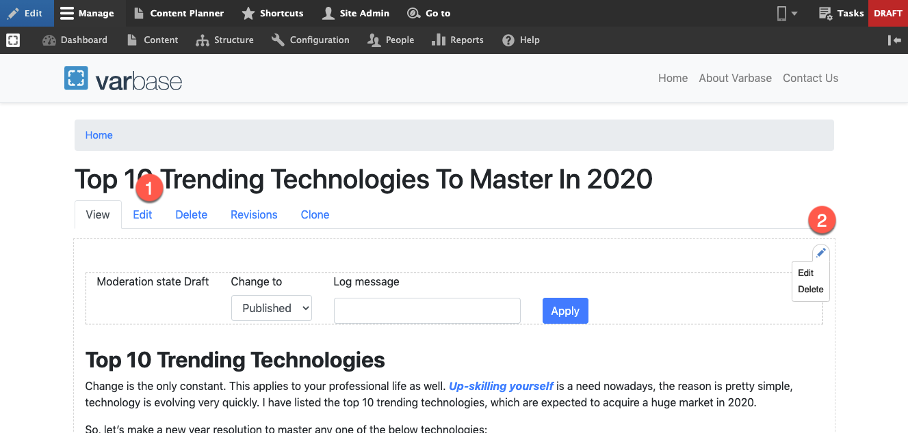
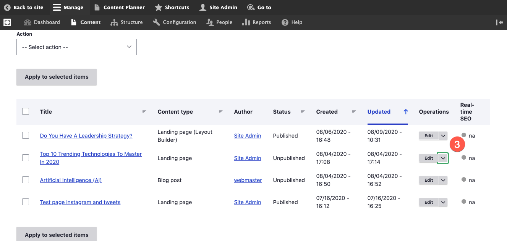

# Modify Content

## How to Edit Pages in Varbase

To edit pages in Varbase you do not need to be technical if you have some experience with a text editor you will find it simple.

On other hand, almost everything can be editable from text, images to menu header, and footer section.&#x20;

## Edit Pages

There are several places you can edit the nodes from it. Here are examples where you can edit the content:\
\
1- In frontend, for every page you can use the admin menu to edit its content.\
2- In frontend, for every section on any page, there is a quick edit menu that easily lets you edit the section with only 1 click. \
3- In backend, there is an edit menu under the content page for each node.&#x20;

