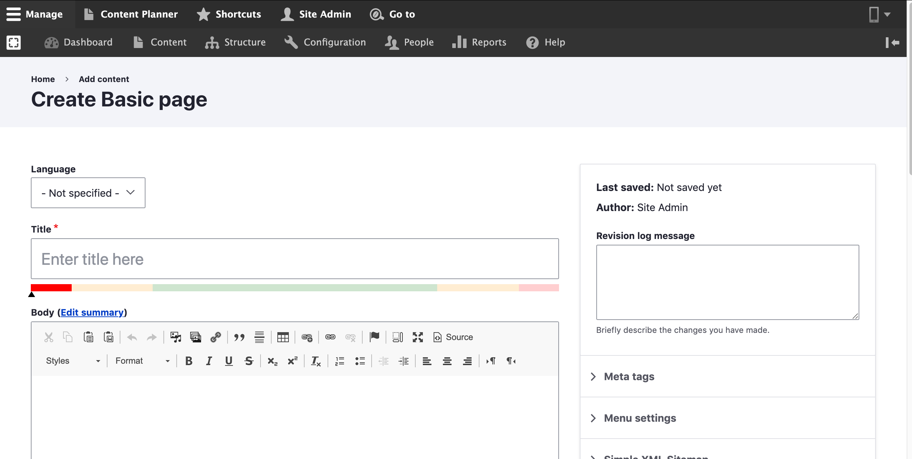

# Add a Basic page

## Create a Basic Page:

Follow these steps to create a new **Basic page** in your website:

1. Select **Add Content** from the **Manage** administrative men&#x75;**.**
2. Select **Basic page.**
3. Fill in with all required data that is needed.
4. Click **Save.**&#x20;

