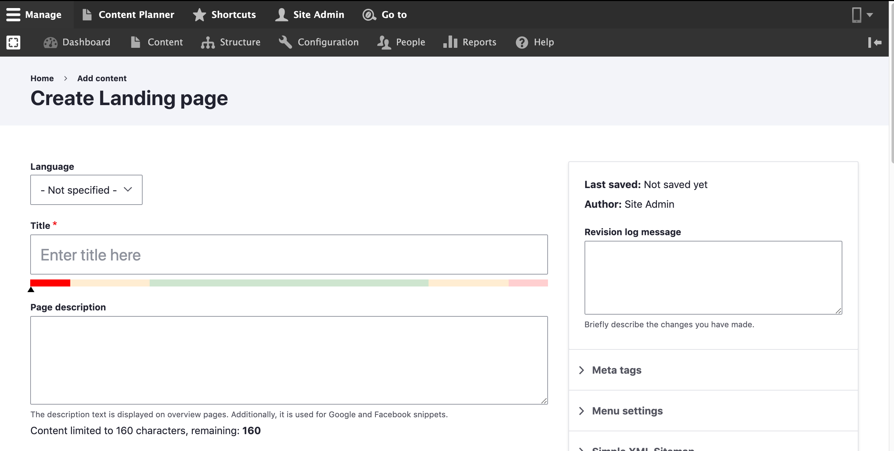

# Add a Landing page

## Create a Landing Page:

Follow these steps to create a new **Landing page** in your website:

1. Select **Add Content** from the **Manage** administrative men&#x75;**.**
2. Select **Landing page**_._
3. Fill in with all required data that is needed.
4. Click **Save**_**.**_&#x20;

