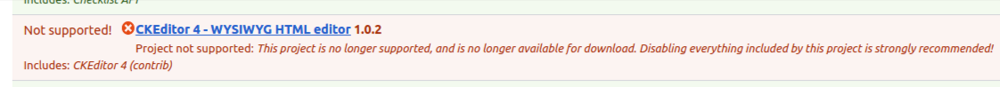

# Switch from CKEditor 4 to CKEditor 5 in Varbase \~9.1.0


[**CKEditor 4 - WYSIWYG HTML editor**](https://www.drupal.org/project/ckeditor)\
Project not supported: This project is no longer supported, and is no longer available for download. Disabling everything included by this project is strongly recommended!


<figure><figcaption><p>Not Supported Message in Old Sites, Which Still Using CKEditor 4</p></figcaption></figure>

## Follow With Steps to Update Varbase to \~9.1.0 With Drupal 10


[updating-varbase-9.0-to-drupal-10.md](updating-varbase-9.0-to-drupal-10.md)


Default **Varbase `9.1.x`** is using **Varbase Editor `9.2.x`** with **CKEditor 5**


✅ Released [**varbase\_editor-9.2.0**](https://www.drupal.org/project/varbase\_editor/releases/9.2.0)

* Issue [#3442752](https://www.drupal.org/i/3442752): Started a new `9.2.x` branch for **Varbase Editor** to support **CKEditor 5** and drop support for CKEditor 4


## Complete the Update to Drupal 10 with CKEditor 4

Use `"Vardot/varbase-patches": "~9.1.0"` in the **root** `composer.json` file.

> with **Varbase `~9.1.0`** **CKEditor `4`** and **Drupal `10`**


**To keep using CKEditor 4** you need the following in the **root** `composer.json` file

`"vardot/varbase-patches": "~9.1.0"`

`"drupal/varbase_editor": "~9.1.0"`


## Uninstall no Longer CKEditor 5 Supported Modules

### Uninstall CKEditor Past  Filter


This module is for CKEditor 4 only. For CKEditor 5 need to use [CKEditor 5 Paste Filter](https://www.drupal.org/project/ckeditor5\_paste\_filter)


```bash
./bin/drush pm:uninstall ckeditor_paste_filter
```

### Uninstall Image Resize Filter


No support for CKEditor 5. No plan for that.


Remove the _"Image Resize Filter: Resize images based on their given height and width attributes"_ check in **Rich editor**, and **Simple Editor,** then uninstall it


Disable this plugin inside the Simple editor and Rich editor before uninstalling the module to avoid issue: image\_resize\_filter: Provides a filter plugin that is in use in the following filter formats: Simple editor, Rich editor


```
./bin/drush pm:uninstall image_resize_filter
```

## Add the Following Under Installer Patches


```
"installer-paths": {
```



```json
"docroot/libraries/ace": ["npm-asset/ace-builds"],
"docroot/libraries/ckeditor5-anchor-drupal": ["npm-asset/northernco--ckeditor5-anchor-drupal"],
"docroot/libraries/ckeditor5/plugins/media-embed": ["npm-asset/ckeditor--ckeditor5-media-embed"],
```


## Add the Following Under Drupal Libraries


```
 "drupal-libraries": {
```



```json
{"name": "ace", "package": "npm-asset/ace-builds"},
{"name": "ckeditor5-anchor-drupal", "package": "npm-asset/northernco--ckeditor5-anchor-drupal"},
{"name": "ckeditor5-media-embed", "package": "npm-asset/ckeditor--ckeditor5-media-embed"}
```


## Enabled the CKEditor 5 Module

```
./bin/drush en ckeditor5
```

## Switch Varbase Editor from \~9.1.0 to \~9.2.0

Use `"Vardot/varbase-patches": "~9.2.0"` in the **root** `composer.json` file.

> with **Varbase `~9.1.0`** **CKEditor `5`** and **Drupal `10`**


Make sure to have the following in your system:

`"vardot/varbase-patches": "~9.2.0"`

&#x20;`"drupal/varbase_editor": "~9.2.0"`


## Enable the **CKEditor 5 Paste Filter Module**

```
./bin/drush en ckeditor5_paste_filter
```

Filter content pasted into the CKEditor 5 visual editor by searching and replacing with the power of regular expressions.


This is a CKEditor 5 version of [CKEditor Paste Filter](https://www.drupal.org/project/ckeditor\_paste\_filter) with additional features, most notably that the filters are fully configurable via a form interface and the filters can be configured individually for each text format. This module has been created as a separate project so that sites that are transitioning over to CKEditor 5 can have both modules installed easily, and to allow this project to evolve without needing to maintain compatibility with both CKEditor 4 and 5.


## Switch Rich Editor Text Format to CKEditor 5

* Navigate to "/admin/config/content/formats/manage/full\_html"
* Select _"CKEditor 5"_ from _"Text editor"_ dropdown.
* Follow up with the needed changes then save configuration

## Switch Simple Editor Text Format to CKEditor 5

* Navigate to "/admin/config/content/formats/manage/basic\_html"
* Select _"CKEditor 5"_ from _"Text editor"_ dropdown.
* Follow up with the needed changes then save configuration

## Disable the CKEditor 4 Module

At Some point you will need to remove `drupal/ckeditor` module from the project, and make sure that it is no longer installed.

```
./bin/drush pm:uninstall ckeditor
```

## Remove All Not Supported CKEditor 5 Plugins and Modules

In case of having extra CKEditor plugins, further than the ones in Varbase Editor, follow with each plugin command button, action, filter. With the new update version

This will for sure, manage to have the full switch from CKEditor 4 to CKEditor 5

## Known Issues When Switching to CKEditor 5

### CKEditor 5 Stylesheets

Manage the stylesheets for the editor in project's sub theme

```php
ckeditor5_stylesheets: false
```

* Issue [#3346060](https://www.drupal.org/i/3346060): Changed `ckeditor5-stylesheets` to `false` in **Vartheme BS5** not to load with the admin theme
