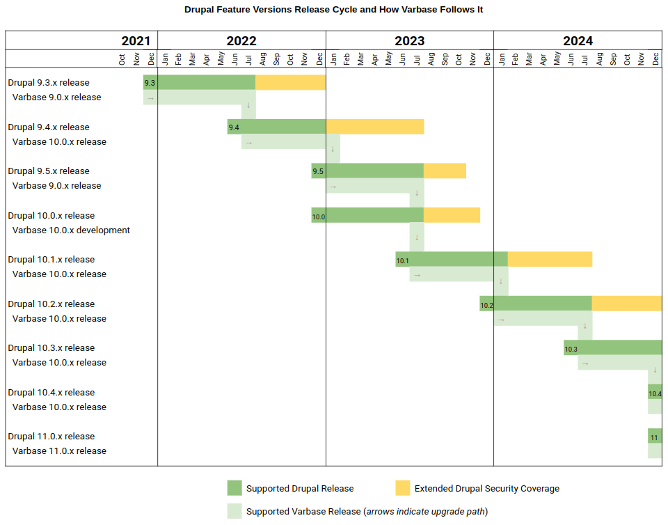

# Release Cycle and Supported Versions

## Understanding Version Numbers

Varbase follows the Drupal 9/10 release cycle. Therefore, a version of Varbase is named 10.0.x uses the same **major** version of Drupal 10.0.x.

## Varbase Supported Versions

Varbase supports one major version. That is the most recent one using the most recent Drupal 9/10 major version (_e.g. `9.0.x` , 10`.0.x`_).

Once the most recent stable version of Drupal 10.1.0 is released (_e.g. 10.0.x_), Varbase will release its _`10.0.x`_ version and drop support of the oldest supported version (_e.g. `8.8.x`_).

Upgrade paths will always be provided to guarantee a smooth move between Varbase versions.

See the below image for an illustration of supported versions and major release cycle:

<figure><figcaption></figcaption></figure>
