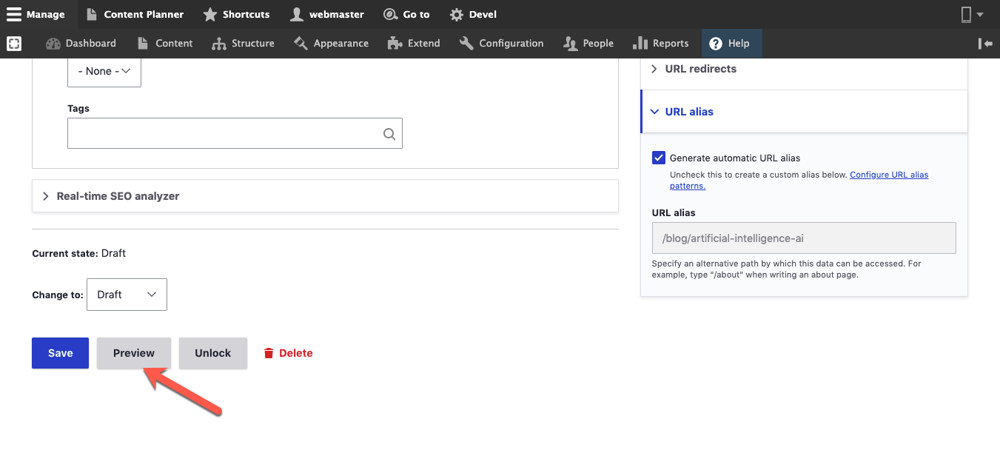

# Preview Content

## Preview your content in a very simple way

Varbase allows you to see and review your content what it looks like after editing it, even if you didn't save it.

### Preview your page on mobile view

There is an option to preview the content on a mobile view, this will give you how your page or the content will look on mobile screens or tablets. &#x20;

.png>)

### Previewing View Modes

Another option available when previewing the content is to preview the view modes available for the entity being previewed.

A view mode list will show up below the administrator bar to the right, changing view modes will show the content in the selected view mode.

Selecting a view mode will result in changing the view mode to the one selected.

The view mode list will show the view modes available for the entity, in case the entity has no view modes or one view mode then it will only appear in its original view mode.

To exit the preview page, click on the **Back to content editing** button, This will take you back to the edit page.
