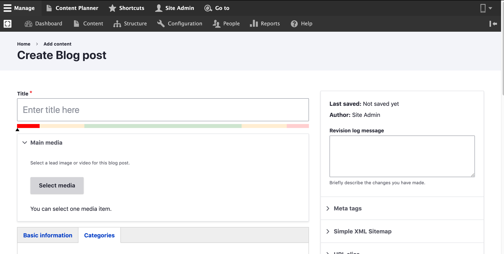

---
metaLinks:
  alternates:
    - >-
      https://app.gitbook.com/s/u42G9phGWi3WksRxVOC1/content-designers/content-management/untitled/add-blog
---

# Add Blog

## Create a Blog Page:

Follow these steps to create a new **Blog** page in your website:

1. Select **Add Content** from the **Manag**_**e**_ administrative men&#x75;**.**
2. Select **Blog page**_._
3. Fill in with all required data that is needed.
4. Click **Save**.&#x20;

