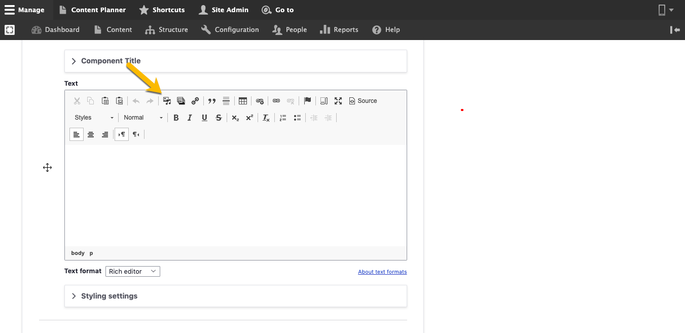

# Add Media

## Media in Varbase:

Varbase _**Media**_ fields are different, you can easily add images, Gallery, video, files, and other several types.\
\
&#x20;You can add _**Media**_ from several places in your website: &#x20;

### 1. Media node page

1. Select _**Media**_ from the _**Manage**_ administrative menu**.**
2. Select _ **Add media**._
3. Select type of the Media that you need to add.

### 2. Media field

You can add _**Media**_ upon clicking the _**Media**_ button in the content type.

\[Add snapshot]

### 3. WYSIWYG

Any time you can add embed media in the WYSIWYG in Rich text editor. \


**Note:** You can edit or delete any _Media_ file from the Media library page.&#x20;


## In this section:

1. [Image](image.md)
2. [Remote video ](remote-video.md)
3. [Video](video.md)

