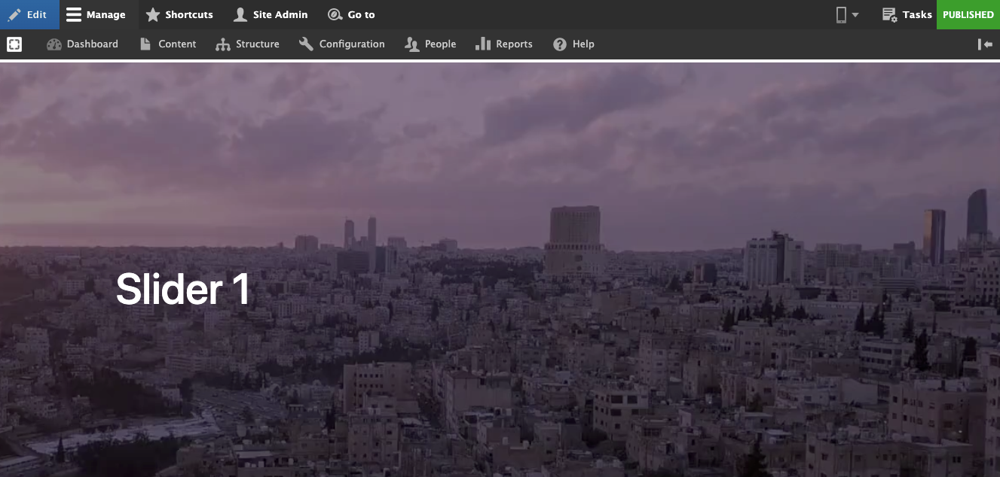

---
metaLinks:
  alternates:
    - >-
      https://app.gitbook.com/s/u42G9phGWi3WksRxVOC1/content-designers/content-management/untitled/add-media/video
---

# Video

## Add New Video&#x20;

In Varbase you can add a video from several places:&#x20;

1. From the media page, you are able to add a video file in the media library.
2. File field.
3. WYSIWYG

### Required file types (Default):

* mp4
* webm
* ogv

