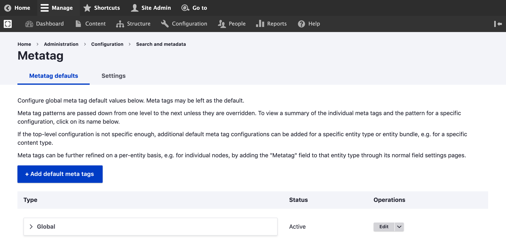
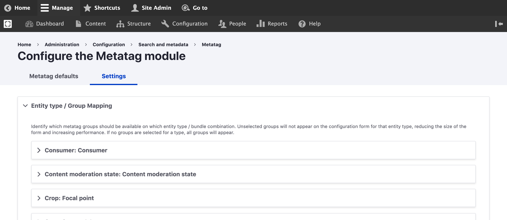

# Meta Tags in Varbase

## Site-wide Meta Tags Configuration&#x20;

Varbase utilizes the [Metatag](https://www.drupal.org/project/metatag) Drupal module and other modules such as [Schema.org Metatag](https://www.drupal.org/project/schema\_metatag) to implement best-in-class Search Engine Optimization best practices.&#x20;

Meta tags are configured by default for the available pages in a Varbase site. You can edit all Meta tags using the **Super admin role** by navigating to:

1. Navigate to **Administration** \ **Configuration** \ **Search and metadata** \ _**Metatag**_
2. You'll see a list of available meta tag default configuration for each page pattern. Click on **Edit** to edit the patterns
3. To add a new default meta tag configuration to a new pattern, click on "**+ Add default meta tags**" and choose the type of the pattern from there (e.g. Your new content type)

__

## Available Meta Tags in Varbase

Varbase comes with the following meta tag groups installed and configured by default:

| Meta tag Group                                                                                              | Description                                                                                                                                                    |
| ----------------------------------------------------------------------------------------------------------- | -------------------------------------------------------------------------------------------------------------------------------------------------------------- |
| Basic tags                                                                                                  | Basic meta tags such as title, description, abstract and keywords.                                                                                             |
| Advanced                                                                                                    | Meta tags that specify advanced information such as content language, short URL, referrer policies, cache control, robots settings.                            |
| Open Graph                                                                                                  | Provides support for Open Graph Protocol meta tags.                                                                                                            |
| Facebook                                                                                                    | A set of meta tags specially for controlling advanced functionality with Facebook.                                                                             |
| Google Plus                                                                                                 | Provides support for Google's Plus meta tags.                                                                                                                  |
| Twitter Cards                                                                                               | Provides support for Twitter's Card meta tags.                                                                                                                 |
| Schema.org: Article                                                                                         | Adds Schema.org/Article to the JSON LD array. Creates Article, BlogPosting, SocialMediaPosting, Report, ScholarlyArticle, TechArticle or APIReference.         |
| Schema.org: ItemList                                                                                        | Adds Schema.org/ItemList to the JSON LD array.                                                                                                                 |
| Schema.org: WebPage                                                                                         | Adds Schema.org/WebPage to the JSON LD array. Creates WebPage, ItemPage, AboutPage, CheckoutPage, ContactPage, CollectionPage, ProfilePage, SearchResultsPage. |
| Schema.org: WebSite                                                                                         | Adds Schema.org/WebSite to the JSON LD array.                                                                                                                  |
| Site verification                                                                                           | Verifies ownership of a site for search engines and other services.                                                                                            |
| Alternative language links (hreflang)                                                                       | Provides support for the hreflang meta tag with some extra logic to simplify it.                                                                               |
| 
Mobile &#x26; UI Adjustment

Apple &#x26; iOS

Android

Windows &#x26; Windows Mobile
 | Provides support for meta tags used to control the mobile browser experience.                                                                                  |

Other additional modules can be installed to provide more meta tag groups. This includes (but not limited to):

* Metatag: App Links
* Metatag: Dublin Core
* Metatag: Favicons
* Metatag: Google Custom Search Engine (CSE)
* Metatag: Open Graph Products
* Schema.org Book
* Schema.org Course
* Schema.org Event
* Schema.org HowTo
* Schema.org Image Object
* Schema.org JobPosting
* Schema.org Movie, Series, Season, Episode
* Schema.org Organization
* Schema.org Person
* Schema.org Place
* Schema.org Product
* Schema.org QAPage and FAQPage
* Schema.org Recipe
* Schema.org Review
* Schema.org Service
* Schema.org SpecialAnnouncement

## Enable Meta Tag Overriding on Content Types

You can identify which meta tag groups (i.e. Simple, Advanced, Open Graph, Facebook ... etc.) to be available on which content type. This means that editors can override default meta tag configuration on an individual piece of content.

To enable meta tag groups, navigate to:

1. Navigate to **Administration** \ **Configuration** \ **Search and metadata** \ **Metatag** \ _**Settings**_
2. Under each desired content type or entity type, select the designed meta tag groups to be available on edit or add forms

Note that unselected groups will not appear on the edit or add forms for that entity type, reducing the size of the form and increasing performance. If no groups are selected for a type, all groups will appear.

## Overriding Meta Tags for a Single Piece of Content

In Varbase, roles that can add and edit content (such as Editors, Content admins, SEO admins, and Site admins) can override the default meta tags for an individual piece of content. This is really helpful for specific scenarios like:

1. Override the default generated meta tags for a blog post
2. Configure special meta tags for a landing page
3. Prevent a specific page from being indexed by search engines

Overriding meta tags can be done when editing or adding new content from the sidebar.

.png>)

.png>)

See the below example of how to prevent a single piece of content from being indexed:


[excluding-content-from-being-indexed.md](excluding-content-from-being-indexed.md)


