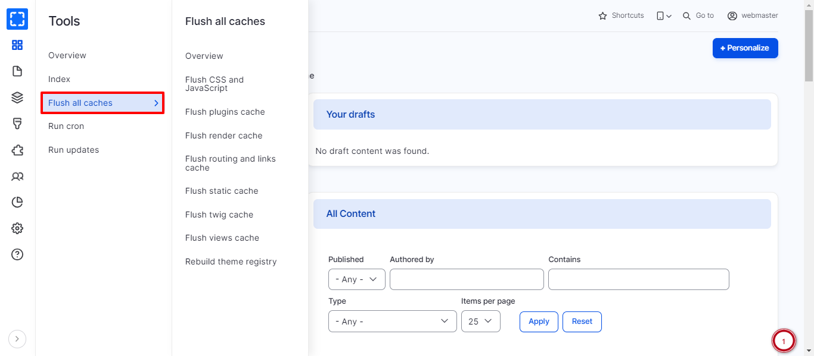

# Clearing Varbase Cache

### How to Clear Varbase Cache?

There are two approaches where to clear the caches:

**The first approach** which is the easiest way, hover the Varbase icon and you will notice **Flush all caches** then click it. The Varbase will now clear all your caches, this might take a couple of seconds then a message will appear indicating your caches are cleared.

<figure><figcaption>
Flush All Caches From Varbase Icon
</figcaption></figure>

**The second approach** which you need to navigate through **Administration \ Configurations \ Development \ **_**Performance.**_


In this section, only the super admin has access to the _Performance_ section.


<figure><figcaption>
Clear All Caches From Performance Page
</figcaption></figure>

You will notice the _Clear all caches_ button, click it. The Varbase will now clear all your caches, this might take a couple of seconds then a message will appear indicating your caches are cleared.
