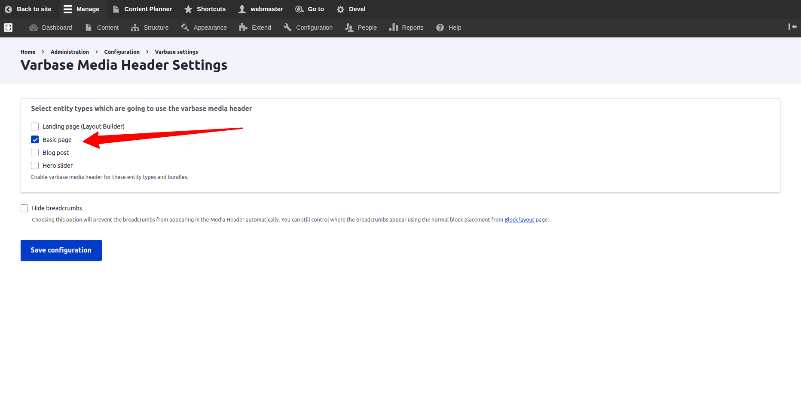
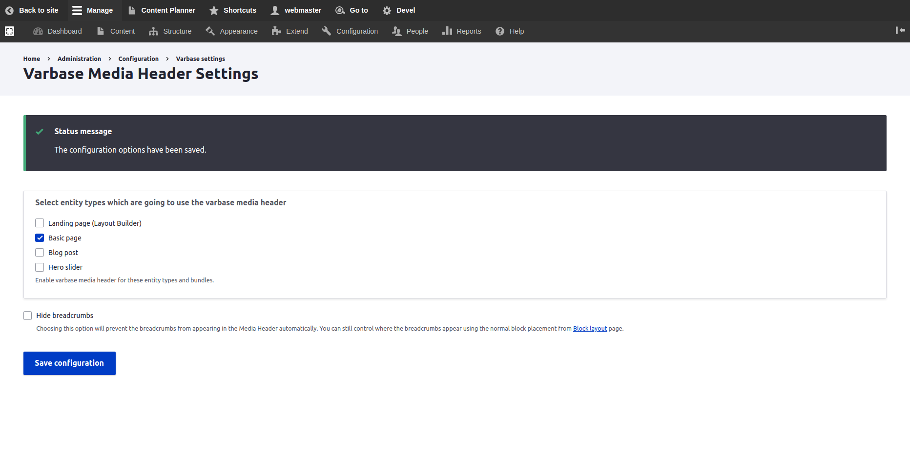

# Configuring Varbase Media Header

Having a universal media header style on top of web pages.

Site builders can activate that for content types.



## Activate Media Header Content Types

### **Varbase Media Header Settings**

* Navigate to **Configuration**  \ **Varbase** **settings**  \ _**Varbase Media Header settings**_ 

* Landing on the _"/admin/config/varbase/varbase-media-header"_  admin link. List of content types are listed with activated or not activated media header.

* Select entity types which are going to use the varbase media header. To enable varbase media header for these selected entity types and bundles.
* Press the **Save Configuration** submit button to activate new configs for the selected content types.


This will add two new fields to each selected content type:

* **Main media** \(field\_media\): to store the media for the header
* **Page header style** \(field\_page\_header\_style\):

  Which stores the choice of header as :

* **Standard** \(standard\)
* **Media Header** \(media\_header\)

For sure more custom page header styles could be added to the filed. But that will need a custom template logic to follow with that.


### **Hide breadcrumbs**

* Check **Hide breadcrumbs** to prevent the breadcrumbs from appearing in the Media Header automatically. To control where the breadcrumbs appear using the normal block placement from **Block layout** page.

### Place The **Varbase Media Header Block**

* Navigate to **Structure** \ **Block layout** and place the **Varbase Media Header block**

  \(usually at the top of the top bar\) 

* Configure the block by choosing `'main media'`for each activated content type. Or other media field which are selected to work as the background image for the media header.
* Choose `'Media header'` for the media view mode. Unless you want a particular view mode, but `'Media header'` will ensure the module template will be used and give you control

  of the display settings. 

## Example

###  Basic Page With Media Header

Activate the **Varbase Media Header** for the **Basic page** content type. By navigating to _**"/admin/config/varbase/varbase-media-header".**_ And checking the Basic page check box and press "Save configuration".

After saving the configuration the system will process the selected content types, and import new configs for them.

On the case of a successful activation the following message will show up 


**Status Message:**

The configuration options have been saved.


### Check Manage Fields For Basic Page Content Type

Navigate to "/admin/structure/types/manage/page/fields"


Notice two new fields:

* **Main media** \(field\_media\)
* **Page header style** \(field\_page\_header\_style\):



In case that the \(field\_media, and field\_page\_header\_style\) fields are not listed in the page. That is indication that the activation process did not work in the right way.


### Check Manage Form Display For Basic Page Content Type

Navigate to "/admin/structure/types/manage/page/form-display"

The **Page header style** field should have the _**"Check boxes/radio buttons"**_ widget.

The **Main media** field should have the _**"Media Library"**_ widget. And **Tab order:** Image, Remote video, Video.

### Create Basic Page Form

Navigate to **Content \ Add content \** _**Basic page .**_ Then the new two fields should show up in the form. Under the Media Header sidebar form region.

