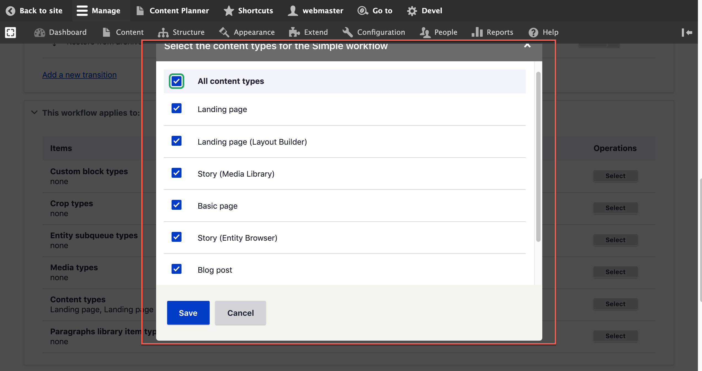
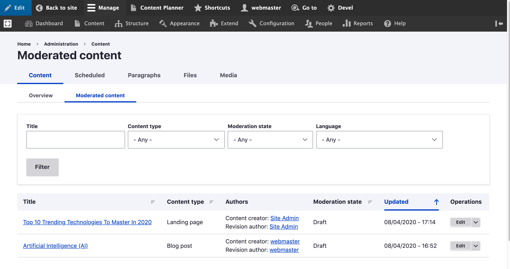

# Content Moderation and Workflows

Varbase comes with a set of content moderation and editorial workflows out of the box. These features are all provided from the Varbase Workflow module, shipped with Varbase as of version 8.8.6.

## Varbase Workflow Module


Content moderation and workflow features are bundled through the **Varbase Workflow** module.  
GitHub: [https://github.com/Vardot/varbase\_workflow](https://github.com/Vardot/varbase_workflow)  
Drupal.org: [https://www.drupal.org/project/varbase\_workflow](https://www.drupal.org/project/varbase_workflow) 

After building a project using the `varbase-project` template, you can see the code of the Varbase Workflow module in:


```text
project_directory
|-- docroot
    |-- modules
        |-- contrib
            |-- varbase_workflow
```

Varbase Workflow brings in the following core and contributed modules to your site:

<table>
  <thead>
    <tr>
      <th style="text-align:left">Module</th>
      <th style="text-align:left">Purpose</th>
    </tr>
  </thead>
  <tbody>
    <tr>
      <td style="text-align:left">
        <p><b>Workflows module</b>
        </p>
        <p><em>(in Drupal core)</em>
        </p>
      </td>
      <td style="text-align:left">Provides an interface to create workflows with transitions between different
        states (for example publication or user status) provided by other modules.</td>
    </tr>
    <tr>
      <td style="text-align:left">
        <p><b>Content Moderation module</b>
        </p>
        <p><em>(in Drupal core)</em>
        </p>
      </td>
      <td style="text-align:left">Provides moderation states for content.</td>
    </tr>
    <tr>
      <td style="text-align:left">&lt;b&gt;&lt;/b&gt;<a href="https://www.drupal.org/project/moderation_sidebar"><b>Moderation Sidebar</b></a><b> module</b>
      </td>
      <td style="text-align:left">Provides a frontend sidebar for Content Moderation.</td>
    </tr>
    <tr>
      <td style="text-align:left">&lt;b&gt;&lt;/b&gt;<a href="https://www.drupal.org/project/scheduler"><b>Scheduler</b></a><b> module</b>
      </td>
      <td style="text-align:left">Publish and unpublish content automatically on specified dates and times.</td>
    </tr>
    <tr>
      <td style="text-align:left">&lt;b&gt;&lt;/b&gt;<a href="https://www.drupal.org/project/content_moderation_notifications"><b>Content Moderation Notifications</b></a>  <b>module</b>
      </td>
      <td style="text-align:left">Allows emails to be sent on state transitions.</td>
    </tr>
    <tr>
      <td style="text-align:left">&lt;b&gt;&lt;/b&gt;<a href="https://www.drupal.org/project/scheduler_content_moderation_integration"><b>Scheduler Content Moderation Integration</b></a><b> module</b>
      </td>
      <td style="text-align:left">Scheduler sub-module providing content moderation functionality for publishing/unpublishing.</td>
    </tr>
    <tr>
      <td style="text-align:left">&lt;b&gt;&lt;/b&gt;<a href="https://www.drupal.org/project/admin_audit_trail"><b>Admin Audit Trail Workflows</b></a><b> module</b>
      </td>
      <td style="text-align:left">Logs workflows events performed by the user.</td>
    </tr>
    <tr>
      <td style="text-align:left">&lt;b&gt;&lt;/b&gt;<a href="https://www.drupal.org/project/content_planner"><b>Content Planner</b></a><b> module and its submodules</b>
      </td>
      <td style="text-align:left">
        <p>Plan your content using a Dashboard, the Content Calendar and Content
          Kanban.</p>
        <p></p>
        <p><em>Content Planner is not enabled by default in Varbase.</em>
        </p>
      </td>
    </tr>
  </tbody>
</table>

## Content Moderation Workflows


Refere to Drupal.org documentation for more about the terminology and usage of the Workflows and Content Moderation module.  
[https://www.drupal.org/docs/8/core/modules/workflows/overview](https://www.drupal.org/docs/8/core/modules/workflows/overview)  
[https://www.drupal.org/docs/8/core/modules/content-moderation/overview](https://www.drupal.org/docs/8/core/modules/content-moderation/overview)


Out of the box, Varbase Workflow offers two workflows for content moderation:

1. **Simple workflow**: Draft, Published, and Archived / Unpublished Useful for any website, and offers the ability make a draft of a live version of content without unpublishing the whole content. 
2. **Editorial workflow**: Draft, In review, Published, and Archived / Unpublished Useful for website with editorial or moderation staff. You can create as many additional states as you like and define transitions between them to suit your organization's needs.

To view or manage these workflows, navigate to: **Administration** \ **Configuration** \ **Workflow** \ _**Workflows**_


### Assigning a Workflow to Content Types


Varbase considers the "Simple" workflow as the default Workflow to be enforced even for sites without a content moderation process. This is mainly because the Simple workflow offers the ability to make a draft of a live version of content without unpublishing the whole content.

Therefore, when creating a new Content Type, whether from the UI, or via code \(i.e. enabling a module\), the "Simple" workflow will be chosen by default.

You can then change the Workflow to another one if you wish. It's advised you do so before adding new content of that Content Type.


#### Assign a Workflow When Creating a New Content Type

By default, Varbase let's you choose the Content Moderation Workflow when creating a new content type from the UI.


#### Assign a Workflow to an Existing Content Type

You can also assign an existing Content Type to a Workflow if it wasn't assigned one yet. To do so"

1. Navigate to: **Administration** \ **Configuration** \ **Workflow** \ _**Workflows**_ 
2. Click "**Edit**" under Operations for the desired Workflow
3. Scroll down to "**This workflow applies to**" section
4. Click "**Select**" next to "Content types"
5. Choose your desired Content Type from the list and click on "**Save**". Note that Content Types assigned to another Workflow will not appear on this list.





### Adding or Editing Workflows

To add a new Workflow or edit an existing one, navigate to: **Administration** \ **Configuration** \ **Workflow** \ **Workflows** then click on "+Add workflow" for a new Workflow, or "Edit" under Operations for the desired Workflow.


Refer to Drupal.org documentation for more about the terminology and usage of the Workflows in Drupal.  
[https://www.drupal.org/docs/8/core/modules/workflows/overview](https://www.drupal.org/docs/8/core/modules/workflows/overview)



## Moderation Sidebar

Moderation Sidebar provides an off-canvas menu to moderate the current content. To use the sidebar, visit any content with an enabled Workflow. You'll see the "**Tasks**" button in the Administration Toolbar. This will open an off-canvas menu that contains contextual actions related to the assigned Workflow.



The default Varbase configuration now hides the "Local Tasks" available in content pages in the front-end theme, assuming that the Moderation Sidebar is the alternative method to edit, view, translate, or manage content.

Read more on how to re-enable the "Local Tasks" to appear again.



## Administration Views for Moderated Content

Varbase Workflow adds a simple administration view to show the available drafts and their moderation state. This view is available for all roles who can edit content.

To see the available drafts, navigate to: **Administration** \ **Content** \ _**Moderated content**_ ****



