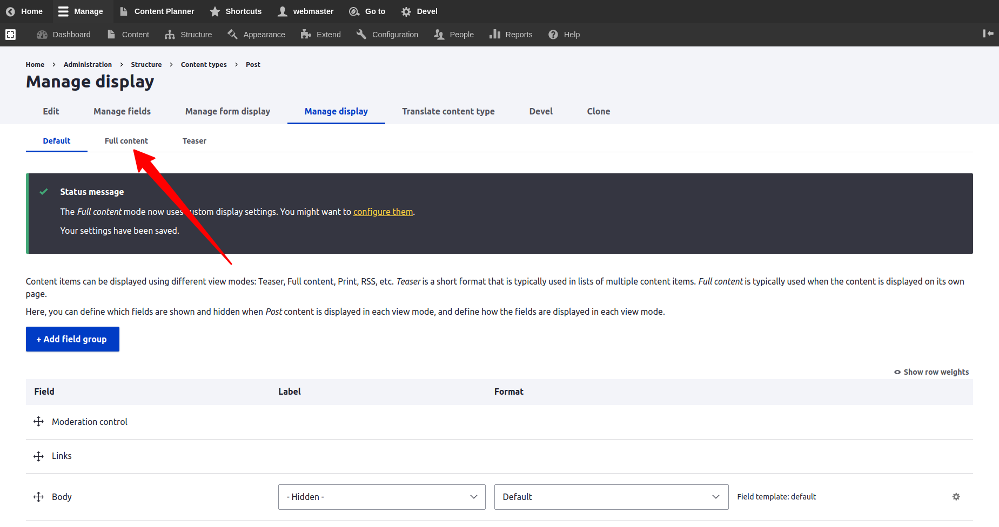

# Activating Varbase Layout Builder for Content Types

The logical use for Varbase Layout Builder configs is with the **"Full Content"** display mode of most content types. If the Content type has an access permission for users to open a page with a URL to see the full content. It's better to activate the Layout Builder for the default layout for that full content.

## Steps to Activate

### Create a New Content Type

**Example:** Let consider creating a _**"Post"**_ content type

* Go to _`"/admin/structure/types/add"`_ link to add a new content type
* Fill in _`"Post"`_ in the _"Name"_ field
* Fill in _**"**Use the Post to add posts to the website. So that they will show up under the posts site section." ****_in the _`"Description"`_ field
* Press the _`"Save and manage fields"`_ submit button to create the content type
* Then the website will be directed to the _**"Manage fields"**_ page
* Add more fields as needed for the project

### Enable the Full Content display mode

* Go to "/admin/structure/types/manage/post/display" page 

* Click on "Custom display settings" tab to show the list of view modes

* Check the "Full content" checkbox  and press save to activate it

* Check the "Use Layout Builder" under the "Layout options" settings group and press save

* Select the following layouts from "Layout available for sections" 
  * _**Bootstrap 1 Col**_
  * _**Bootstrap 2 Cols**_
  * _**Bootstrap 3 Cols**_
  * _**Bootstrap 4 Cols**_
  * _**Bootstrap 6 Cols**_

