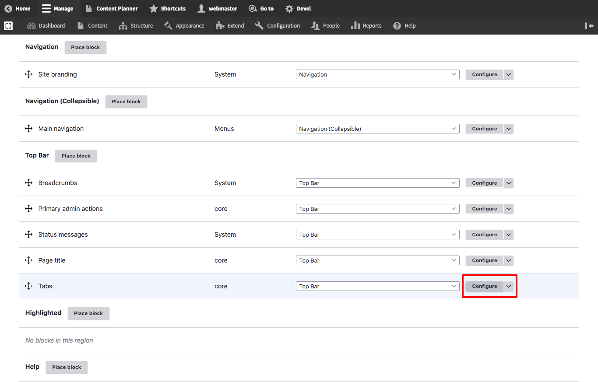

# Local Tasks and Moderation Sidebar

The default Varbase configuration for Vartheme and its sub-themes is to hide the "**Local Tasks** or **Tabs**" available in content pages in the front-end theme, assuming that the **Moderation Sidebar** is the alternative method to edit, view, translate, or manage content.

This is simply done by implementing a visibility rule to the "**Tabs**" block.

To change this behavior, simply remove or edit the visibility settings for "**Tabs**" block.

1. Navigate to **Administration** \ **Structure** \ _**Block layout**_ 
2. Under your desired front-end theme, look for the "**Tabs**" block \(usually under Top Bar region in Vartheme\) and click on "**Configure**"
3. Go to "**Pages**" under Visibility, and either remove the `/node/*` entry or add your own rules. Removing the entry will make the **Tabs** appear again.

