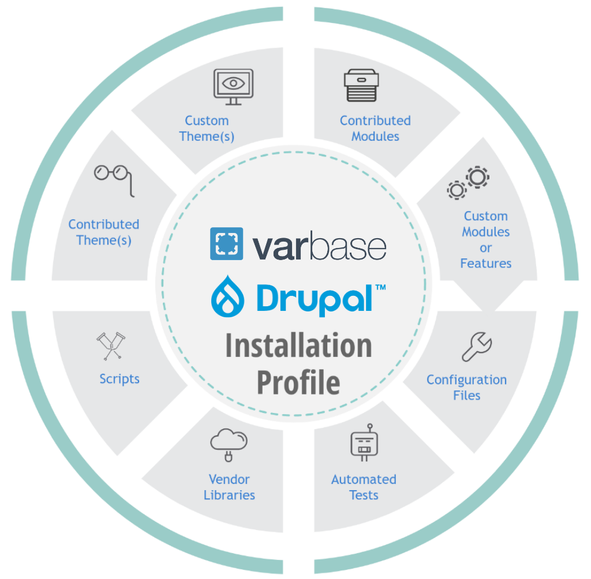

# Basic Concepts

## A Drupal Distribution

A [software distribution](https://en.wikipedia.org/wiki/Software_distribution) or \(distro\) is a collection of software components built, assembled, and configured so that it can essentially be used "as is".

[Varbase ](https://www.vardot.com/blog/essential-things-know-about-varbase)is a [Drupal](https://en.wikipedia.org/wiki/Drupal) distribution. It packages several adaptive functionalities and essential modules into its powerhouse. It takes advantage of Drupal core modules, as well as other famous and contributed modules and software components.


Since Varbase is a Drupal distribution, any Drupal compatible module, theme, library, can be used and utilized with Varbase.

If you're new to Drupal, we recommend you also familiarize yourself with the Drupal docs: [https://www.drupal.org/docs](https://www.drupal.org/docs)


## Packaging Method \(Composer\)

Varbase uses [Composer](https://getcomposer.org/) to package dependencies and components. 

To build a project using Varbase, we have provided a Varbase Composer project template.

See [https://github.com/Vardot/varbase-project](https://github.com/Vardot/varbase-project)

