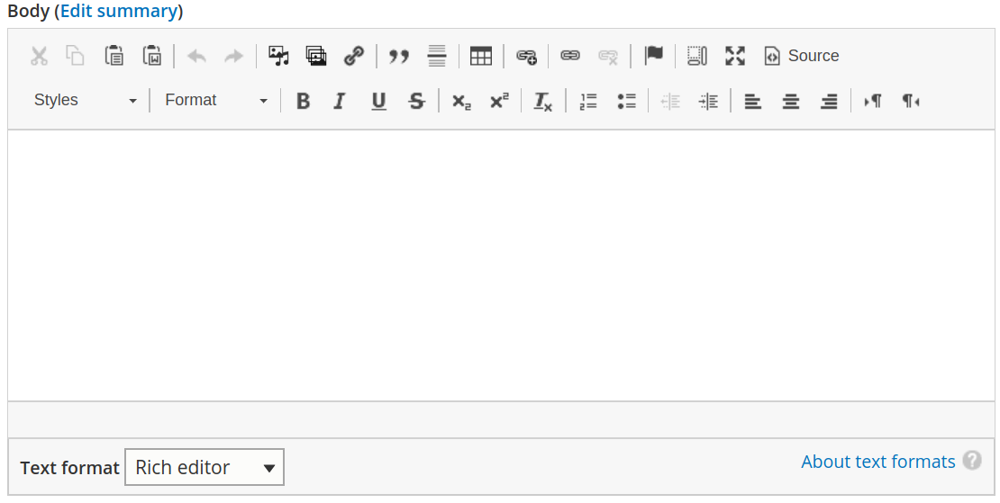
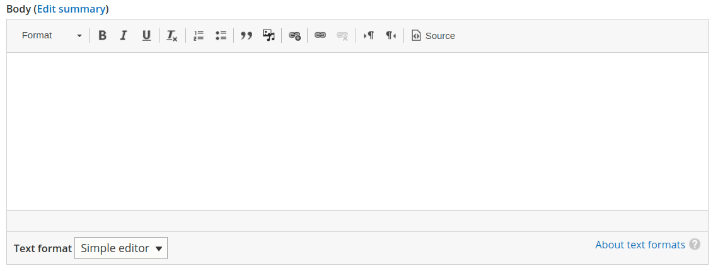
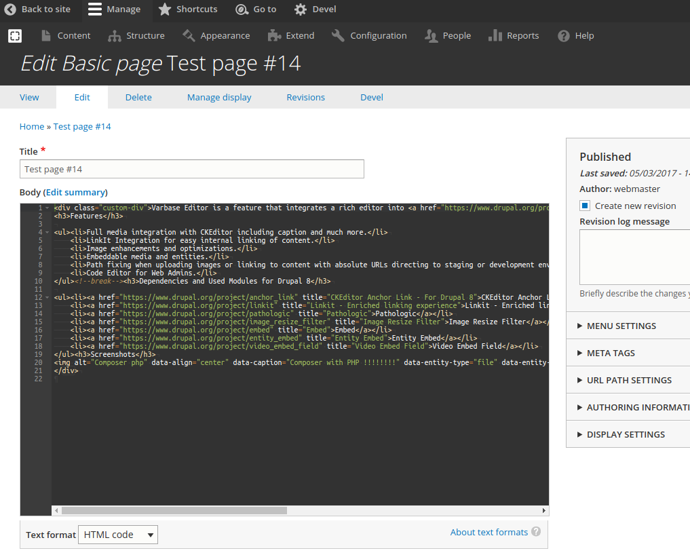

# Varbase Editor

Integrates a rich editor into [Varbase](https://www.drupal.org/project/varbase) distribution.

### Features

* Full media integration with CKEditor including caption and much more.
* LinkIt Integration for easy internal linking of content.
* Image enhancements and optimizations.
* Embeddable media and entities.
* Path fixing when uploading images or linking to content with absolute URLs directing to staging or development environments.
* Code Editor for Web Admins.

### Dependencies and Used Modules

* [CKEditor Anchor](https://www.drupal.org/project/anchor_link)
* [Linkit - Enriched linking experience](https://www.drupal.org/project/linkit)
* [External Links](https://www.drupal.org/project/extlink)
* [Editor Advanced link](https://www.drupal.org/project/editor_advanced_link)
* [Pathologic](https://www.drupal.org/project/pathologic)
* [Image Resize Filter](https://www.drupal.org/project/image_resize_filter)
* [Embed](https://www.drupal.org/project/embed)
* [Entity Embed](https://www.drupal.org/project/entity_embed)
* [CKEditor BiDi Buttons](https://www.drupal.org/project/ckeditor_bidi)
* [Ace Code Editor](https://www.drupal.org/project/ace_editor)

### List of text formats

#### Rich editor

#### Simple editor

#### 

#### HTML code

