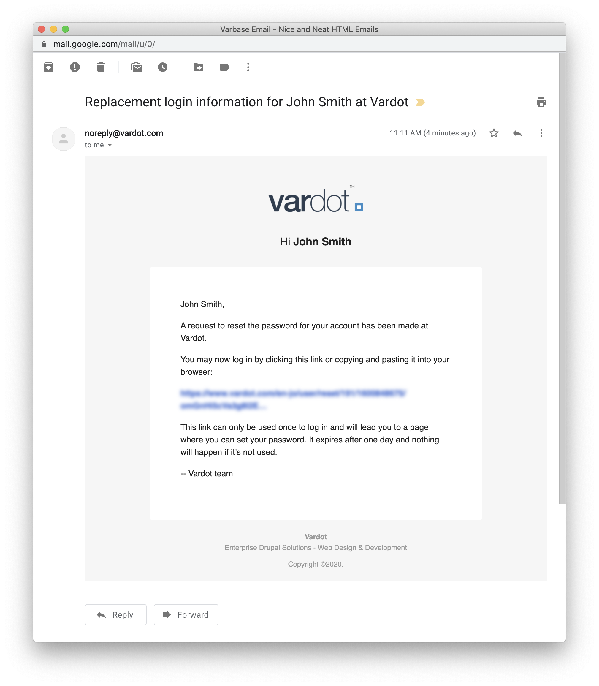

# Varbase Email

Adds HTML email templates for Drupal.

## Varbase Email Module


Varbase emailing features are bundled through the **Varbase Email** module.  
GitHub: [https://github.com/Vardot/varbase\_email](https://github.com/Vardot/varbase_email)  
Drupal.org: [https://www.drupal.org/project/varbase\_email](https://www.drupal.org/project/varbase_email)

After building a project using the `varbase-project` template, you can see the code of the **Varbase Email** module in:


```text
project_directory
|-- docroot
    |-- modules
        |-- contrib
            |-- varbase_email
```

Brings in the following core and contributed modules to your site:

| Module                              | Purpose |
| :--- | :--- |
| Swift Mailer | Installs Swift Mailer as a mail system. |

## Screenshots




