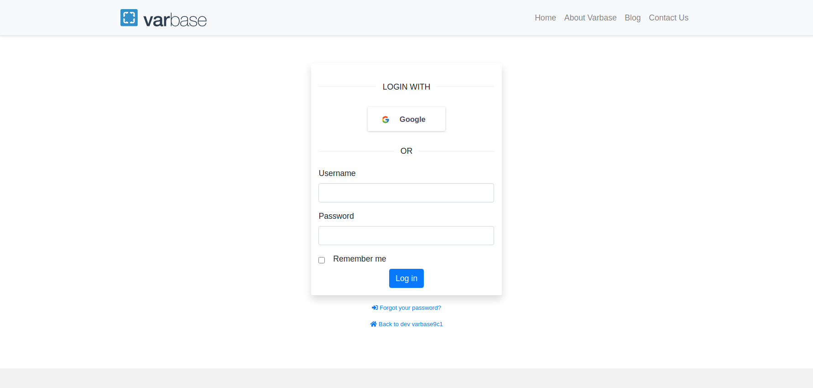
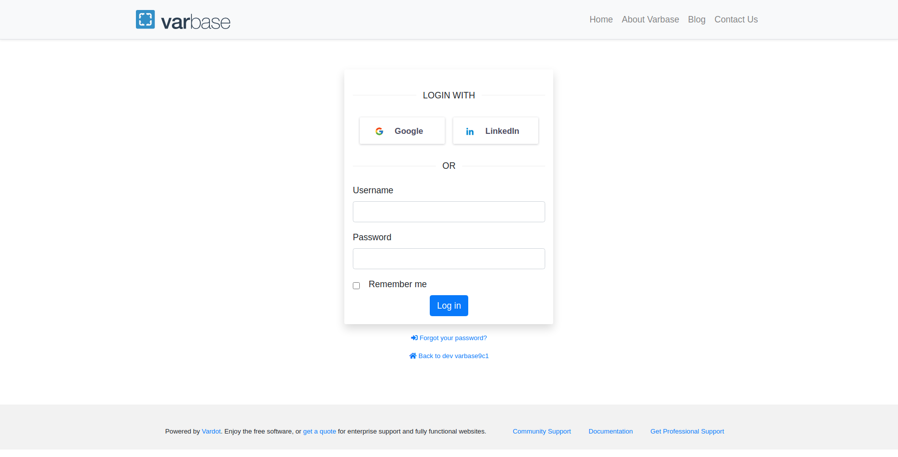
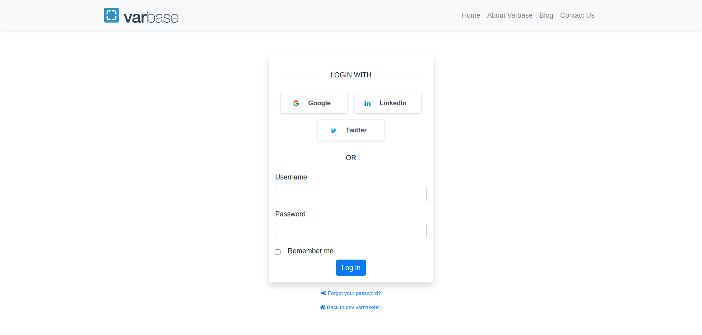
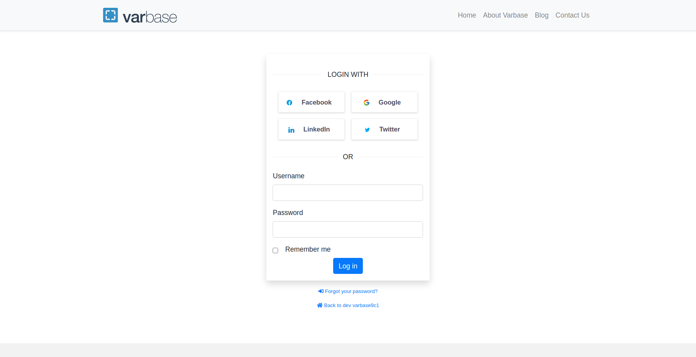

# Varbase Social Single Sign-On

Adds single sign-on using existing information from a social networking service. Such as **Facebook**, **Twitter**, **LinkedIn**, or **Google**. Built using [Social API](https://www.drupal.org/project/social_api).

## Varbase Social Single Sign-On Module


Varbase social authentication features are bundled through the **Varbase Social Single Sign-On** module.  
GitHub: [https://github.com/Vardot/varbase\_auth](https://github.com/Vardot/varbase_auth)  
Drupal.org: [https://www.drupal.org/project/varbase\_auth](https://www.drupal.org/project/varbase_auth)

After building a project using the `varbase-project` template, you can see the code of the **Varbase Social Single Sign-On** module in:


```text
project_directory
|-- docroot
    |-- modules
        |-- contrib
            |-- varbase_auth
```

Brings in the following core and contributed modules to your site:

<table>
  <thead>
    <tr>
      <th style="text-align:left">Module</th>
      <th style="text-align:left">Purpose</th>
    </tr>
  </thead>
  <tbody>
    <tr>
      <td style="text-align:left">
        <p><b>Block</b>
        </p>
        <p><em>(in Drupal core)</em>
        </p>
      </td>
      <td style="text-align:left">Controls the visual building blocks a page is constructed with. Blocks
        are boxes of content rendered into an area, or region, of a web page.</td>
    </tr>
    <tr>
      <td style="text-align:left">&lt;b&gt;&lt;/b&gt;<a href="https://www.drupal.org/project/social_auth"><b>Social Auth</b></a>&lt;b&gt;&lt;/b&gt;</td>
      <td
      style="text-align:left">Allows user authentication with different services.</td>
    </tr>
    <tr>
      <td style="text-align:left">&lt;b&gt;&lt;/b&gt;<a href="https://www.drupal.org/project/social_auth_facebook/"><b>Social Auth Facebook</b></a>&lt;b&gt;&lt;/b&gt;</td>
      <td
      style="text-align:left">Social Auth integration for Facebook.</td>
    </tr>
    <tr>
      <td style="text-align:left">&lt;b&gt;&lt;/b&gt;<a href="https://www.drupal.org/project/social_auth_twitter"><b>Social Auth Twitter</b></a>&lt;b&gt;&lt;/b&gt;</td>
      <td
      style="text-align:left">Social Auth integration for Twitter.</td>
    </tr>
    <tr>
      <td style="text-align:left">&lt;b&gt;&lt;/b&gt;<a href="https://www.drupal.org/project/social_auth_linkedin/"><b>Social Auth LinkedIn</b></a>&lt;b&gt;&lt;/b&gt;</td>
      <td
      style="text-align:left">Social Auth integration for LinkedIn.</td>
    </tr>
    <tr>
      <td style="text-align:left">&lt;b&gt;&lt;/b&gt;<a href="https://www.drupal.org/project/social_auth_google/"><b>Social Auth Google</b></a>&lt;b&gt;&lt;/b&gt;</td>
      <td
      style="text-align:left">Social Auth integration for Google.</td>
    </tr>
  </tbody>
</table>

## Screenshots










