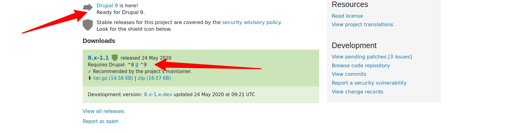

# Updating from Varbase 8.x to 9.x

## Read First Before Updating


[..](../)



[understanding-varbase-updater-package.md](../understanding-varbase-updater-package.md)



Check the **Upgrading a Drupal 8 site to Drupal 9**

&#x20;[https://www.drupal.org/docs/upgrading-drupal/how-to-prepare-your-drupal-7-or-8-site-for-drupal-9/upgrading-a-drupal-8-site](https://www.drupal.org/docs/upgrading-drupal/how-to-prepare-your-drupal-7-or-8-site-for-drupal-9/upgrading-a-drupal-8-site)



Check the **How and why we deprecated code on the way to Drupal 9**

[https://www.drupal.org/docs/understanding-drupal/how-drupal-9-was-made-and-what-is-included/how-and-why-we-deprecated-code](https://www.drupal.org/docs/understanding-drupal/how-drupal-9-was-made-and-what-is-included/how-and-why-we-deprecated-code)




Check the **What changes are there for third-party dependencies?**

[https://www.drupal.org/docs/understanding-drupal/how-drupal-9-is-made-and-what-is-included/what-changes-are-there-for-third](https://www.drupal.org/docs/understanding-drupal/how-drupal-9-is-made-and-what-is-included/what-changes-are-there-for-third)


## 1. Change Composer Version Before Updating

### Varbase 8.8.7 and Older

Make sure that **Composer** version **\~1 **is in use in the development environment.

```
sudo composer self-update --1
```


Later in the steps of upgrade, when the **Varbase** version reaches **8.8.8** or newer.

Be sure to switch the `composer.json` file to work with **Composer \~2**



[updating-varbase-to-work-with-composer-2.0.md](../updating-varbase-to-work-with-composer-2.0.md)


Remove the not needed `"drupal/drupal-library-installer-plugin": "^0.3",`  from the `composer.json` file.

### Varbase 8.8.8 and Newer

Make sure that **Composer** version **\~2 **is in use in the development environment.

```
sudo composer self-update --2
```

## 2. Add Drush \~10

```
composer require drush/drush:~10
```

## 3. Uninstall All Removed Components

A number of modules, themes, and libraries was removed from Varbase 9. That for Drupal 9 compatibility, or for change of selection to use better tools, and newer and better UI/UX themes.


Check that all used modules in the project are **Drupal 9 Compatible!**

* [Check contributed modules.](https://www.drupal.org/docs/updating-drupal/how-to-prepare-your-drupal-7-or-8-site-for-drupal-9/deprecation-checking-and)
* [Check custom in-house developed modules.](https://www.drupal.org/docs/updating-drupal/how-to-prepare-your-drupal-7-or-8-site-for-drupal-9/deprecation-checking-and)


### Modules Had Been Removed&#x20;


**Uninstall the **[**Libraries API**](https://www.drupal.org/project/libraries)** Module**

`drush pm:uninstall libraries`

**Drupal 9 Compatible **but no longer in **Varbase Core **

* Issue [#3170653](https://www.drupal.org/i/3170653): Removed **Libraries API** module as much of its functionality had been moved to **Drupal 9 core**



**Uninstall the **[**Libraries UI**](https://www.drupal.org/project/libraries\_ui)** Module**

&#x20;`drush pm:uninstall libraries_ui`

**Not** **Compatible **with **Drupal 9** yet

* Issue [#3168664](https://www.drupal.org/i/3168664): Removed **Libraries UI** module from **Varbase Development**



**Uninstall the **[**Mail Editor**](https://www.drupal.org/project/mail\_edit)** Module**

&#x20;`drush pm:uninstall mail_edit`

**Not** **Compatible **with **Drupal 9** yet

* Issue [#3168674](https://www.drupal.org/i/3168674): Removed **Mail Editor** module from **Varbase Core**



**Uninstall the **[**Webform Analysis**](https://www.drupal.org/project/webform\_analysis)** Module**

` drush pm:uninstall webform_analysis`

**Not** **Compatible **with **Drupal 9** yet

* Issue [#3175839](https://www.drupal.org/i/3175839): Removed **Webform Analysis** module from **Varbase Core**



**Uninstall the **[**Tour Builder**](https://www.drupal.org/project/tour\_builder)** Module**

` drush pm:uninstall tour_builder`

**Not** **Compatible **with **Drupal 9** yet

* Issue [#3176580](https://www.drupal.org/i/3176580): Removed **Tour Builder **module from **Varbase Core**



**Uninstall the **[**SMTP Authentication Support**](https://www.drupal.org/project/smtp)** Module.**

`drush pm:uninstall smtp`

**Drupal 9 Compatible **but no longer in **Varbase Mail **

* Issue [#3143148](https://www.drupal.org/i/3143148): Removed **Smtp** module&#x20;
* Issue [#3047359](https://www.drupal.org/node/3047359): Removed enabling the **smtp** module as we have switched to use **swiftmailer** \~1.0 and **Varbase** emailing configs switched to **Varbase Email** module.



**Uninstall the **[**Media Library Theme Reset**](https://www.drupal.org/project/media\_library\_theme\_reset)** Module**

`drush pm:uninstall media_library_theme_reset`

**Not** **Compatible **with **Drupal 9** yet

* Issue [#3174423](https://www.drupal.org/i/3174423): Removed **Media Library Theme Reset **module



**Uninstall the **[**Color Field**](https://www.drupal.org/project/color\_field)** Module.**

&#x20; `drush pm:uninstall color_field`

**Drupal 9 Compatible **but no longer in **Varbase Core**

* Issue [#3145737](https://www.drupal.org/i/3145737): Removed **Color Field** module



**Uninstall the **[**Features**](https://www.drupal.org/project/features)** Module.**

&#x20;`drush pm:uninstall features`

&#x20;**Drupal 9 Compatible **but no longer in **Varbase Core**

* Issue [#3145744](https://www.drupal.org/i/3145744): Removed **Features** module



**Uninstall the **[**Adminimal Admin Toolbar**](https://www.drupal.org/project/adminimal\_admin\_toolbar)** Module**

`drush pm:uninstall adminimal_admin_toolbar`

**Drupal 9 Compatible **but no longer in **Varbase Core **

* Issue [#3145709](https://www.drupal.org/i/3145709): Removed **Adminimal Admin Toolbar** module
* Issue [#3145720](https://www.drupal.org/i/3145720): Removed **Vartheme Admin **theme

**Varbase** switched to use [**Vartheme Claro**](https://www.drupal.org/project/vartheme\_claro) and **Claro** from **Drupal Core.**

**Keeping** **Admininimal**? Add the following to the composer.json file In case of choosing to keep the **Adminimal - Responsive Administration Theme**  as the default back-end theme.

`"drupal/vartheme_admin" : "~6.0"`

`"drupal/adminimal_admin_toolbar": "~1.0"`



**Make sure to clear cache and all functional behaviors are working well**

`drush cr`


### Themes Had Been Removed


#### **Uninstall the Vartheme Admin Theme and the **Adminimal - Responsive Administration Theme

**Drupal 9 Compatible **but no longer used by  **Varbase **

* Issue [#3145720](https://www.drupal.org/i/3145720): Removed **Vartheme Admin **theme


* [x] First change the default admin them to [**Vartheme Claro**](https://www.drupal.org/project/vartheme\_claro)****

&#x20;            drush theme:enable vartheme\_claro

&#x20;             drush config:set system.theme admin vartheme\_claro

* [x] Uninstall the old admin themes.

&#x20;           drush theme:uninstall vartheme\_admin

&#x20;           drush theme:uninstall adminimal\_theme

****

**Keeping** **Admininimal**? Add the following to the composer.json file In case of choosing to keep the **Adminimal - Responsive Administration Theme**  as the default back-end theme.

`"drupal/vartheme_admin" : "~6.0"`



In case of not uninstalling them and starting the update, the following issue will show up in the  database update process.

`[1] `[`https://www.drupal.org/docs/8/update/troubleshooting-database-updates`](https://www.drupal.org/docs/8/update/troubleshooting-database-updates)` ) [error] (Currently using Missing or invalid themes The following themes are marked as installed in the core.extension configuration, but they are missing:`

* `adminimal_theme`
* `vartheme_admin`



**Make sure to clear the cache and all functional behaviors are working well**

`drush cr`


## 4. Check All Required Contrib Modules in the Project&#x20;


Check the **Drupal 9 Compatibility** for all used module.

Search for the **"**[**Drupal 9**](https://www.drupal.org/about/9)** is here!"** notice in the Drupal project page for each required module in the root `composer.json` file for the project. Look for **"Requires Drupal:" **In the project page for the module in Drupal.org.


**Example Module:** [**Webform Mautic**](https://www.drupal.org/project/webform\_mautic)****

Projects may or may not use this module. If it was required and used, check the following in the project page.



In case the module was not compatible with Drupal 9 yet, Follow with issues and the maintainer to make the module have a Drupal 9 Compatibility.

## 5. Check All Custom Modules in the Project&#x20;


Check deprecation on all custom in-house modules.

[https://www.drupal.org/docs/updating-drupal/how-to-prepare-your-drupal-7-or-8-site-for-drupal-9/deprecation-checking-and](https://www.drupal.org/docs/updating-drupal/how-to-prepare-your-drupal-7-or-8-site-for-drupal-9/deprecation-checking-and)


## 6. Check All Required Libraries


Make sure that any used library has no conflict with any **Drupal 9** core asset libraries.


## 7. Run the Update Varbase Command

```
bash ./bin/update-varbase.sh
```

Facing issues? Do the steps to do after the commands. next step.

## 8. Steps to Do After the Command


#### Do not abort the update process.&#x20;

Type `no` then press the enter key.\
In order not to abort and restore backups. To keep all work up to that point.


For sure the update will face errors while switching from **Symfony 3** to **Symfony 4**


On the step of updating from **Drupal \~8** to **Drupal \~9**, a number of duplicate key "services" detected in `YamlSymfony.php` and `Parser.php`.

**Drupal 8** is using **Symfony 3** and **Drupal 9** is using **Symfony 4**

[What changes are there for third-party dependencies?](https://www.drupal.org/docs/understanding-drupal/how-drupal-9-is-made-and-what-is-included/what-changes-are-there-for-third)


Make sure to have the following in the _**composer.json**_ file.

```
  "config": {
    "bin-dir": "bin/",
    "secure-http": false,
    "preferred-install": {
      "drupal/core": "dist"
    }
  },
  
```

And the following in the _**extra**, _as having patches is a critical to have the right logic and complete working site.

Enable patching and composer should exit on patch failure. Not to miss any functionality or fixes after the update.

```
"enable-patching": true,
"composer-exit-on-patch-failure": true,
```

The root `composer.json` file should look like the Varbase 9.0.x project template `composer.json` file at the following link. Plus all added modules, themes, libraries, and needed patches for the project.

<mark style="background-color:orange;">**  It should look like the composer.json file .. not the same exact copy of it  **</mark>

[https://github.com/Vardot/varbase-project/blob/9.0.2/composer.json](https://github.com/Vardot/varbase-project/blob/9.0.1/composer.json)

keep the work of the automated updater. Do not do any manual copy and replacing for the outcome composer.json file. Only edit the the same file.


It is better to remove the `composer.lock` and `vendor/` folder. Then do a composer install

```
sudo rm -rf bin/ composer.lock vendor/ docroot/modules/contrib docroot/themes/contrib  docroot/profiles/varbase docroot/core ;
composer install -vvv
```

> Run Database update number of times. Until no updates are needed.

```
drush updb
```

```
drush cr
```

## 9. Remove Drush Before Deployment to Production


Remember to remove Drush from the composer before deploying to the live site.


```
composer remove drush/drush:~10
```

## 10. Set Composer Exit on Patch Failure to True

Please, DO NOT set the following in the `composer.json` for projects

```
    "composer-exit-on-patch-failure": false,
```

It should be

```
    "composer-exit-on-patch-failure": true,
```

On wanting to ignore any patch, please use `patches-ignore`

Have a look at **Ignoring Patches **a link for how to do this in the right way


[extending-varbase](../../extending-varbase/)


\
If it was changed in any way or the **Varbase Updater** had it changed.\
Please change it back to

```
    "composer-exit-on-patch-failure": true,
```

It was sat true in the [**Vardot/varbase-project/composer.json**](https://github.com/Vardot/varbase-project/blob/9.0.2/composer.json) for the following rezone.


A module could have a **security patch** or a **functional feature patch.** If the patch did not apply. That means the project has a **security issue, **or some expected **behaviors will be lost** or a bug will show up in projects.

