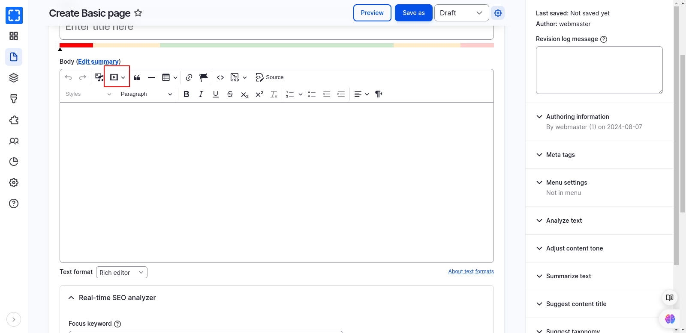
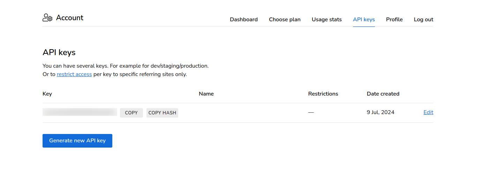

# Configure CKEditor 5 Media Embed

The **Varbase Editor module** comes with the **CKEditor Media Embed Plugin** enabled by default. This feature allows you to directly incorporate resources—such as videos, images, tweets, and more—from external services (known as "content providers") into your content using CKEditor.

<figure><figcaption><p>Body - CKEditor Field Formatter</p></figcaption></figure>

To enable embedding from various sources like Spotify, YouTube, and Instagram, you need to generate an API key from Iframely and add it to the configuration at `/admin/config/media/ckeditor-media-embed/settings`. In the settings page, enter the following in the Provider URL field:

```
http://ckeditor.iframe.ly/api/oembed?url={url}&callback={callback}&api_key=YOUR_API_KEY

```

Then save the configuration.

<figure><figcaption><p>CKEditor Media Embed Configuration</p></figcaption></figure>

The following providers are enabled by default with the URL patterns:

**YouTube**

* URL patterns:
  * `youtube.com/watch?v={id}&t={time}`
  * `youtube.com/v/{id}?t={time}`
  * `youtube.com/embed/{id}?start={time}`
  * `youtu.be/{id}?t={time}`

**Vimeo**

* URL patterns:
  * `vimeo.com/{id}`
  * `vimeo.com/{user}/{name}/video/{id}`
  * `vimeo.com/album/{album_id}/video/{id}`
  * `vimeo.com/channels/{channel_id}/{id}`
  * `vimeo.com/groups/{group_id}/videos/{id}`
  * `vimeo.com/ondemand/{ondemand_id}/{id}`
  * `player.vimeo.com/video/{id}`

**Instagram**

* URL pattern:
  * `instagram.com/p/{id}`

**Twitter**

* URL pattern:
  * `twitter.com`

**Google Maps**

* URL patterns:
  * `google.com/maps`
  * `goo.gl/maps`
  * `maps.google.com`
  * `maps.app.goo.gl`

**Flickr**

* URL pattern:
  * `flickr.com`

**Facebook**

* URL pattern:
  * `facebook.com`

**Dailymotion**

* URL patterns:
  * `dailymotion.com/video/{id}`
  * `dai.ly/{id}`

**Spotify**

* URL patterns:
  * `open.spotify.com/artist/{id}`
  * `open.spotify.com/album/{id}`
  * `open.spotify.com/track/{id}`


**Create a New API Key From Iframely**

To generate a new API key from Iframely:

1. Visit [Iframely's login page](https://iframely.com/login) and log in or create a new account.
2. Go to [Iframely's API keys page](https://iframely.com/keys).
3. Generate a new API key.


<figure><figcaption><p>Iframely API Keys Page</p></figcaption></figure>

