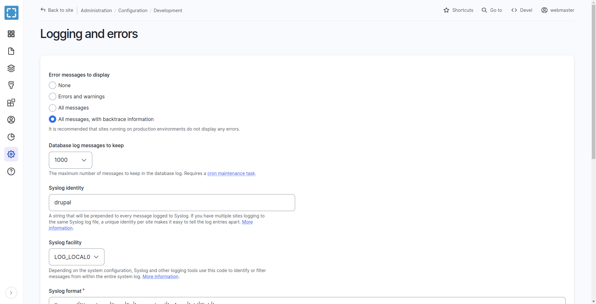
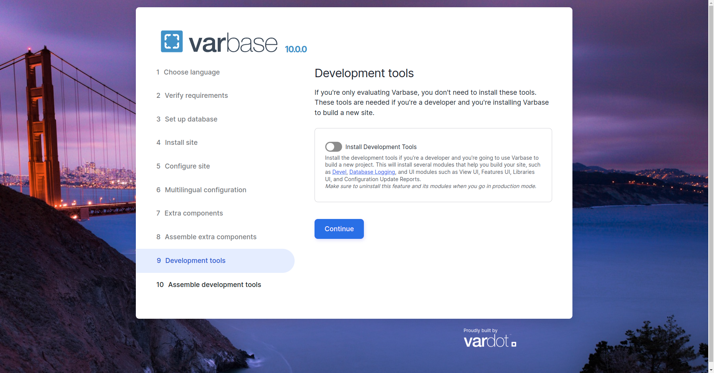
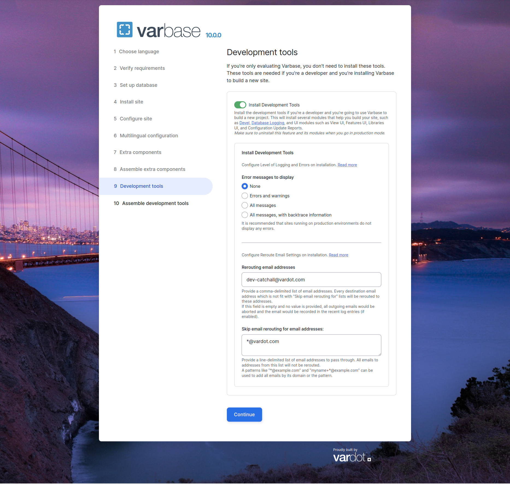

# Configure Level of Logging and Errors

## Configure Error Messages to Display After Installation

It is recommended that sites running on production environments do not display any errors.

Navigate to **Administration \ Configuration \ Development \ Logging and errors**

<figure><figcaption><p>Logging and Errors Configurations</p></figcaption></figure>

Allows developers to set various options for logging errors and messages to a database or Syslog. They can choose the level of detail they want to keep in the log, and even set a unique identity for your site in the Syslog messages. The page also explains the different logging facilities and formats available.


Make sure that the Error messages to display is sat as None on production.


## Set System Error Logging Level with Drush

For `"None"` run the following command.

```
./bin/drush config:set system.logging error_level hide --yes
```

For `"Errors and warnings"` run the following command.

```
./bin/drush config:set system.logging error_level some --yes
```

For `"All messages"` run the following command.

```
./bin/drush config:set system.logging error_level all --yes
```

For `"All messages, with backtrace information"` run the following command.

```
./bin/drush config:set system.logging error_level verbose --yes
```

## Configure Level of Logging and Errors on installation

While installing Varbase, the installer will have an installation step for Development Tools

<figure><figcaption><p>Varbase Development Tools</p></figcaption></figure>

On checking the "Install Development Tools" checkbox, more options will show up to configure on installation.

<figure><figcaption><p>Varbase Development Tools Open - Configure Level of Logging and Errors on installation </p></figcaption></figure>

Keep Error message to display as _**None**_, When installing a **Varbase Demo** site.

Change to other options when starting development for a project.


Recommended to use **`"All messages, with backtrace information"`**` ``in`` `_**`local development`**_**`,`**` ``to keep track and trace of all errors and warnings.`&#x20;



It is recommended that sites running on **production** environments _**DO NOT DISPLAY**_ any errors.

