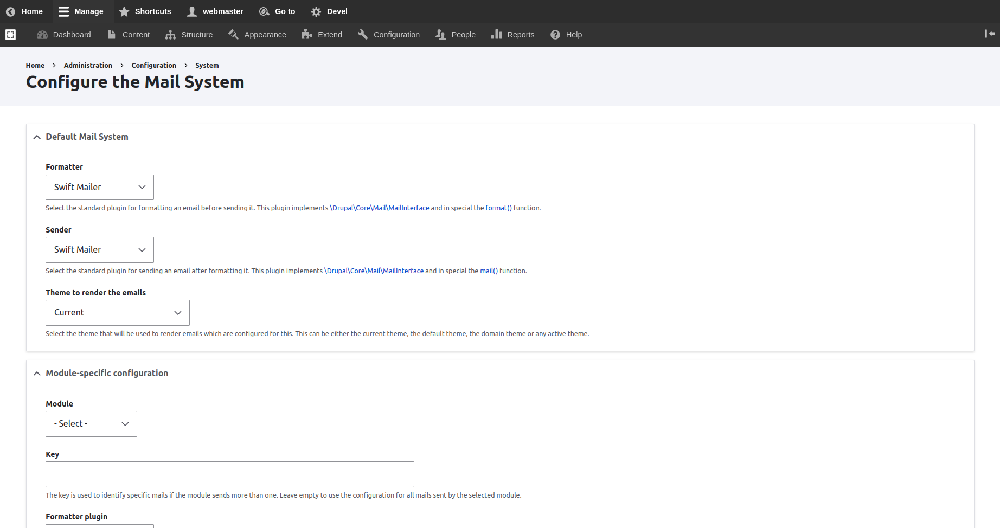
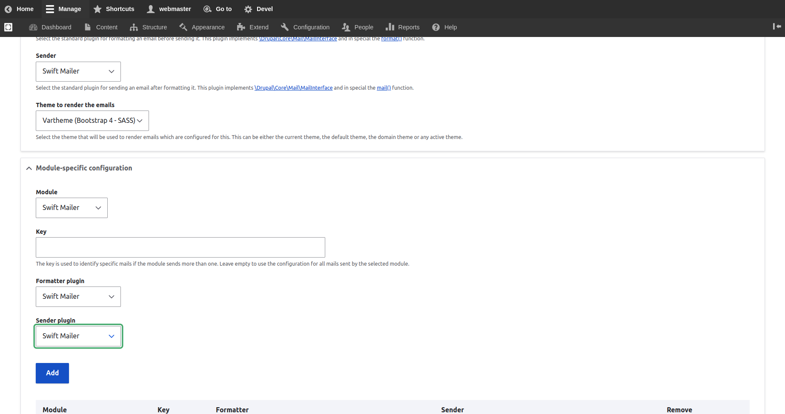
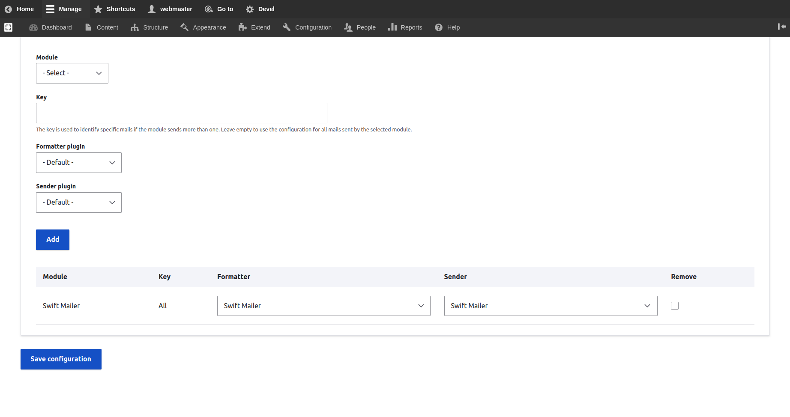

# Configure Swift Mailer

> **Replaced by:** [**Symfony Mailer**](https://www.drupal.org/project/symfony\_mailer)****
>
> A new mail-system based on the popular Symfony Mailer giving full support of HTML mails, file attachments, embedded images, 3rd-party delivery integrations, load-balancing/failover, signing/encryption, async sending and more. Other libraries add capability for CSS inlining and HTML to text conversion.
>
> This module provides a deep integration into Drupal mechanisms, including theme/template/render, multi-language, CSS libraries, configuration, plug-ins, hooks, and logging.
>
>
>
> _**Warning**_**:** the swiftmailer library is no longer maintained and so this module is obsolete. It has not yet been marked unsupported, but that could change at any time due to discovery of a security bug or on advice of the Drupal Security Team.
>
> A new module [Symfony Mailer](https://www.drupal.org/project/symfony\_mailer) is under development, and has a reasonable alpha release. Help with testing or development is welcome.

## Add an SMTP Module Specific Configuration for  Swift Mailer

Navigate to **Administration \ Configuration \ System \ **_**Maile System**_

To access the Configure the Mail System on the site settings page

* Select the theme to render the emails with
* Select Swift Mailer from the modules
* Provide a key that is used to identify specific emails if the module sends more than one. Leave empty to use the configuration for all mails sent by the selected module.
* Select Swift Mailer from the Formatter plugins
* Select Swift Mailer from the Sender plugins

* Press the Add button to add the Swift Mailer module

