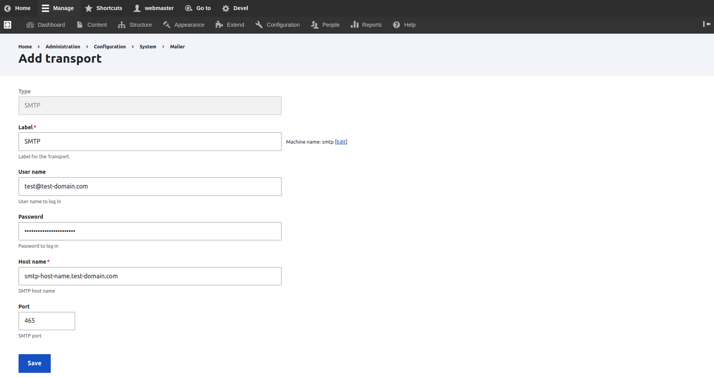

# Configure Symfony Mailer


Have a look at the official documentation for the **Symfony Mailer** module

See [https://www.drupal.org/docs/contributed-modules/symfony-mailer-0](https://www.drupal.org/docs/contributed-modules/symfony-mailer-0)


## Add an SMTP Transport Service

Navigate to **Administration \ Configuration \ System \ Mailer policy \ **_**Transports**_

To see the list of mailer transports.


* Select _SMTP_ from the list of Transport types, and click o the Add transport button
* Fill in the Lebel for this SMTP service
* Fill in the User name for the  SMTP service. It could be the same email sender created in the SMTP service provider
* Provide the password to log in with it
* Provide the Hostname public SMTP domain provider
* Use the right SMTP port, which the provider recommends to use



Press the Save submit button to save the SMTP transport

A message of _"The transport configuration has been saved."_ will show up and the page will be redirected back to the Mailer transports configuration page.


Set the STMP transport as the default transport sender for emails, by clicking on "Set as Default" from the operations list for the SMTP transport.


## Set the Email Logo for Symfony Mailer Template

&#x20;[**Vartheme BS4**](https://www.drupal.org/project/vartheme\_bs4), and [**Vartheme BS5**](https://www.drupal.org/project/vartheme\_bs5) provide theme settings for emails

[creating-your-own-theme.md](../../theme-development-with-varbase/creating-your-own-theme.md "mention")

Navigate to **Administration \ Appearance \ Appearance settings \ **_**A Custom Sub Theme of Vartheme**_

The Email Logo custom theme settings can be filled as desired

 \_ varbase90x1.png>)

The provided Email Logo will feed the Symfony Mailer template with the selected logo, which it will be linked in the email.

## Custom Templates and Styling In Custom Themes

If the custom theme for a project did not have any changes. No extra work is needed at this point.

Change the following steps when having any changes over the custom theme in the project.

Inline or style elements are cleared out in the `email.twig` or `varbase_email.twig` template file.

Create a new library to attach the needed styles to it

**Example:** `custom_subtheme.libraries.yml` file

```
default.email-style.ltr:
  css:
    theme:
      css/theme/email-style.theme.ltr.css: {}

default.email-style.rtl:
  css:
    theme:
      css/theme/email-style.theme.rtl.css: {}

```

Have all custom LTR ( left to right) and RTL ( right to left ) styling in seprate files and libraries, to overrid the default **Varbase Email** libraries.

Symfony Mailer Only Allows Attaching the Custom Styling to the Template Using the Default Drupal Library System.

The **Varbase Email** module has two libraries which are attached to the symfony email template. They can be extended or overridden.

**Example:** `custom_subtheme.info.yml` file in your custom Vartheme Sub Theme

```
libraries-override:
  varbase_email/default.email-style.ltr: custom_subtheme/default.email-style.ltr
  varbase_email/default.email-style.rtl: custom_subtheme/default.email-style.rtl
```

**Symfony Mailer** allows each module to have custom email templates and other sending transport.

The default transport service will be used when no custom transport was configured for the module. When a custom or contrib module is trying to send emails.

If the old project had any custom code or custom multiple mailers in the same system. The code should be migrated to configs. Using the Symfony Mailer plugin system.
