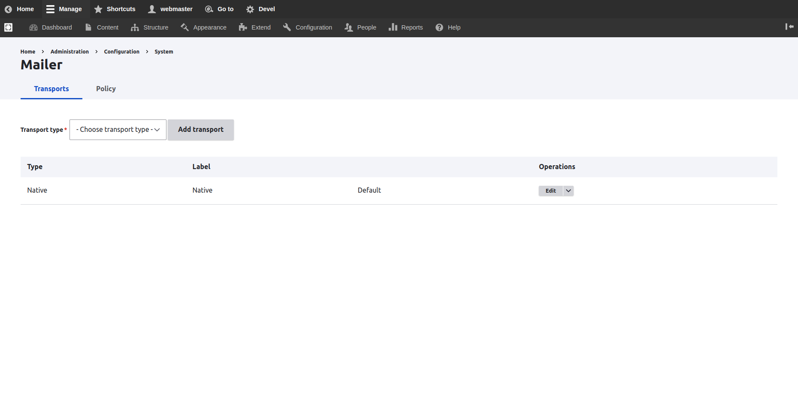

# Configure Symfony Mailer


Have a look at the offical documentation for the **Symfony Mailer** module

[https://www.drupal.org/docs/contributed-modules/symfony-mailer-0](https://www.drupal.org/docs/contributed-modules/symfony-mailer-0)


## Add an SMTP Transport Service

Navigate to **Administration \ Configuration \ System \ **_**Mailer**_

To see the list of mailer transports.

