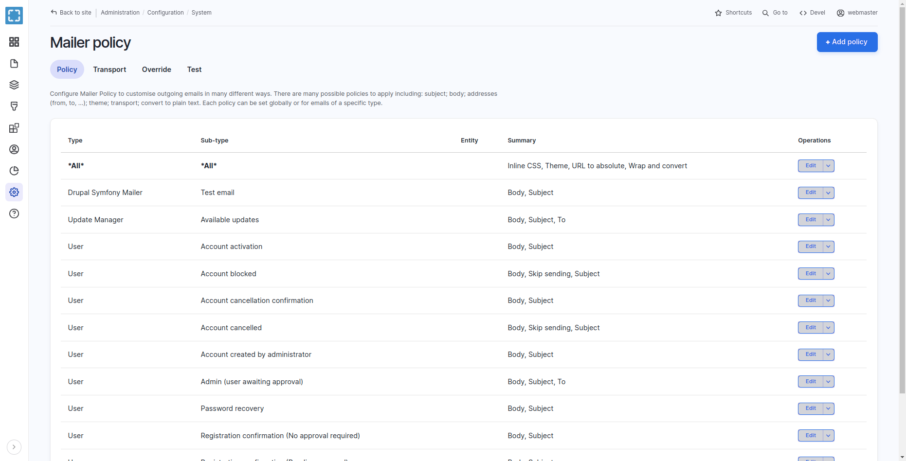
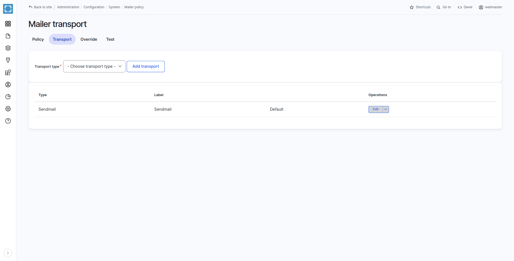
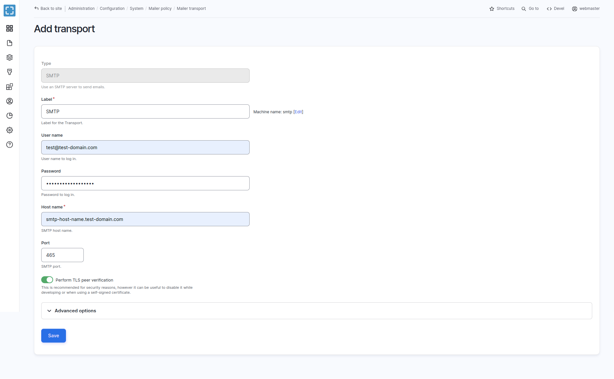
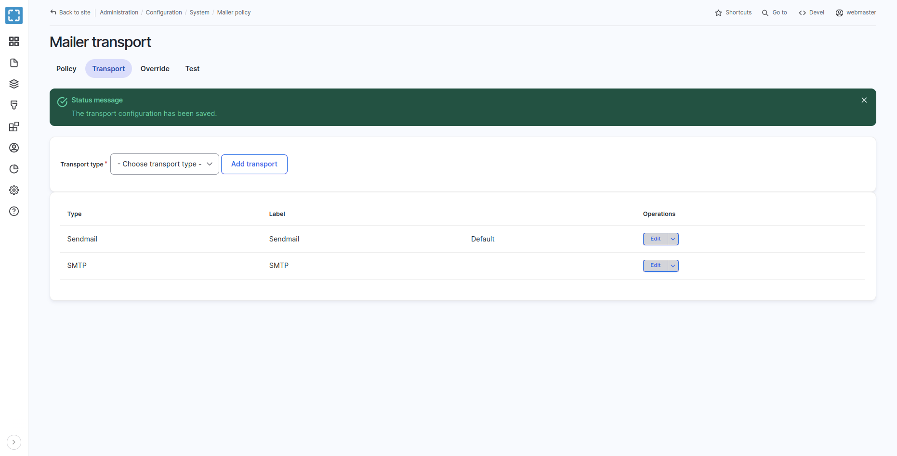
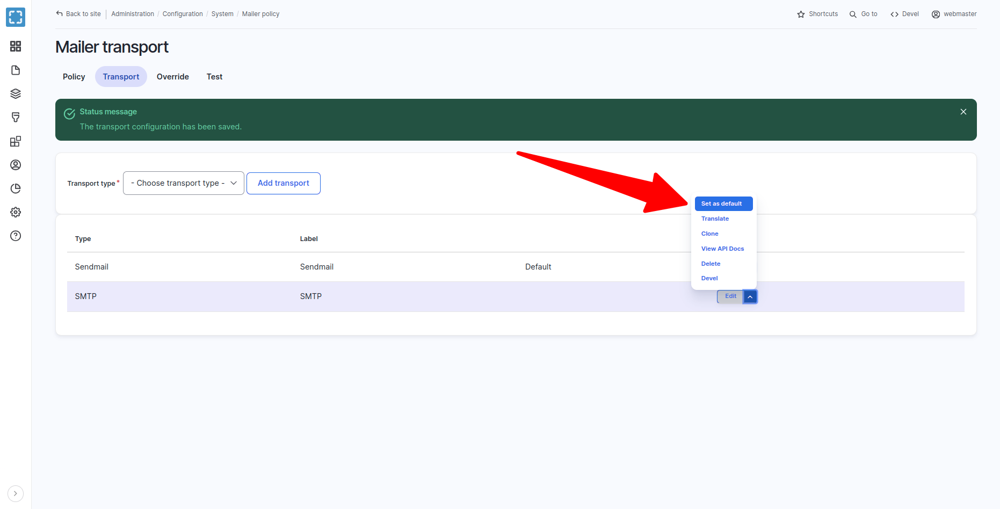
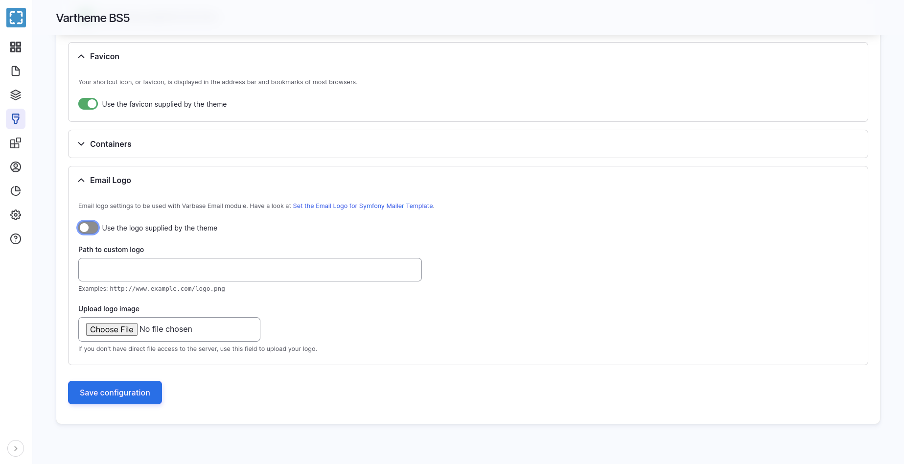

# Configure Symfony Mailer


Have a look at the official documentation for the **Symfony Mailer** module

See [https://www.drupal.org/docs/contributed-modules/symfony-mailer-0](https://www.drupal.org/docs/contributed-modules/symfony-mailer-0)


## Mailer Policy

Navigate to **Administration \ Configuration \ System \ Mailer**

To configure Mailer Policy to customize outgoing emails in many different ways. There are many possible policies to apply including: subject; body; addresses (from, to, ...); theme; transport; convert to plain text. Each policy can be set globally or for emails of a specific type.

<figure><figcaption><p>Mailer Policy</p></figcaption></figure>

## Add SMTP Transport Service

Navigate to **Administration \ Configuration \ System \ Mailer policy \ **_**Transports**_

To see the list of mailer transports.

<figure><figcaption><p>Mailer Transports Configuration Page</p></figcaption></figure>

* Select _SMTP_ from the list of transport types, and click on the Add transport button
* Fill in the Label for the SMTP service
* Fill in the User name for the  SMTP service. It could be the same email sender created in the SMTP service provider
* Provide the password to log in with it
* Provide the Hostname public SMTP domain provider
* Use the right SMTP port, which the provider recommends to use

<figure><figcaption><p>Example Add SMTP Transport</p></figcaption></figure>

Press the Save submit button to save the SMTP transport

A message of _"The transport configuration has been saved."_ will show up and the page will be redirected back to the Mailer transports configuration page.

<figure><figcaption><p>The Transport Configuration Has Been Saved</p></figcaption></figure>

Set the **STMP** transport as the default transport sender for emails, by clicking on "Set as Default" from the operations list for the **SMTP** transport.

<figure><figcaption><p>Set a Transport as Default</p></figcaption></figure>

## Set the Email Logo for Symfony Mailer Template

[**Vartheme BS5**](https://www.drupal.org/project/vartheme\_bs5) provide theme settings for emails too. **Vartheme** generated themes followed with that too.

* Generate a new custom theme following with [creating-your-own-theme.md](../../theme-development-with-varbase/creating-your-own-theme.md "mention")
* Enable the new custom generated theme for example and set it as the default theme on the site.
* Navigate to **Administration \ Appearance \ Appearance settings \ **_**A Custom Generated Theme of Vartheme**_

The email logo custom theme settings can be filled as desired

<figure><figcaption><p>Email Logo Settings in Vartheme and Custom Generated Themes</p></figcaption></figure>

The provided Email Logo will feed the Symfony Mailer template with the selected logo, which it will be linked in the email.

## Custom Templates and Styling In Custom Themes

When the custom theme for a project did not have any changes. No extra work is needed at this point.

Change the following steps when having any changes over the custom theme in the project.

Inline or style elements are cleared out in the `email.twig` , `varbase_email.twig` template file.

Create a new library to attach the needed styles to it

**Example:** `custom_theme.libraries.yml` file

```
default.email-style.ltr:
  css:
    theme:
      css/theme/email-style.theme.ltr.css: {}

default.email-style.rtl:
  css:
    theme:
      css/theme/email-style.theme.rtl.css: {}

```

Have all custom LTR ( left to right) and RTL ( right to left ) styling in separate files and libraries, to override the default **Varbase Email** libraries.

**Symfony Mailer** only allows attaching the custom styling to the template using the default **Drupal** library system.

The **Varbase Email** module has two libraries which are attached to the **Symfony** email template. They can be extended or overridden.

**Example:** `custom_theme.info.yml` file in your custom **Vartheme** generated theme

```
libraries-override:
  varbase_email/default.email-style.ltr: custom_theme/default.email-style.ltr
  varbase_email/default.email-style.rtl: custom_theme/default.email-style.rtl
```

**Symfony Mailer** allows each module to have custom email templates and other sending transport.

The default transport service will be used when no custom transport was configured for the module. When a custom or contrib module is trying to send emails.

If the old project had any custom code or custom multiple mailers in the same system. The code should be migrated to configs. Using the **Symfony Mailer** plugin system.
