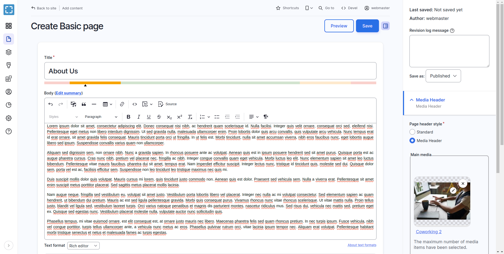
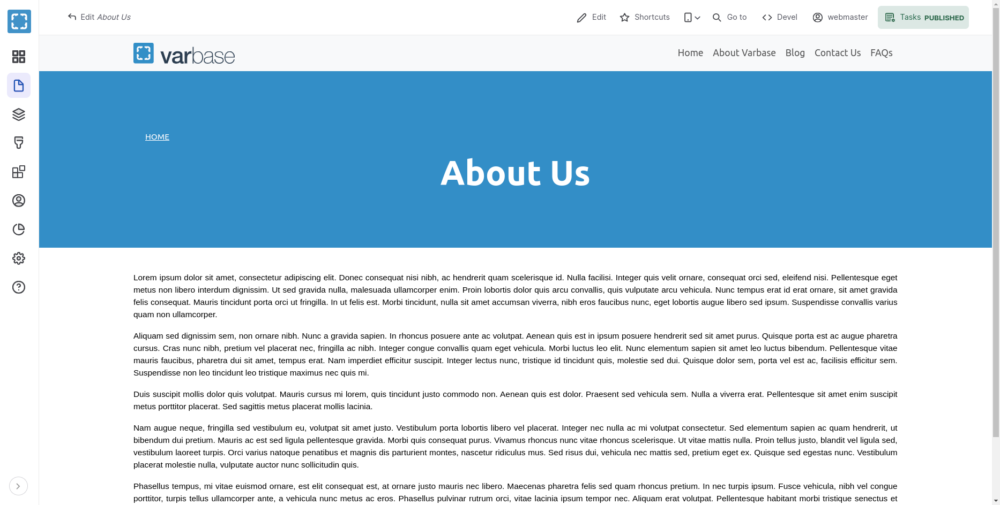
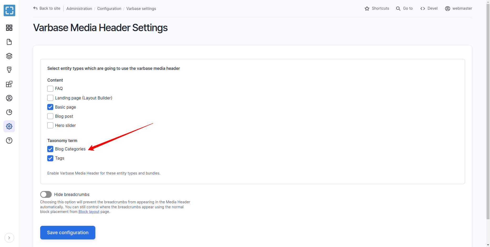
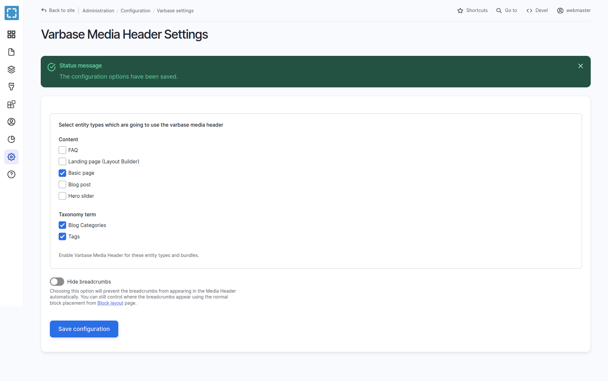
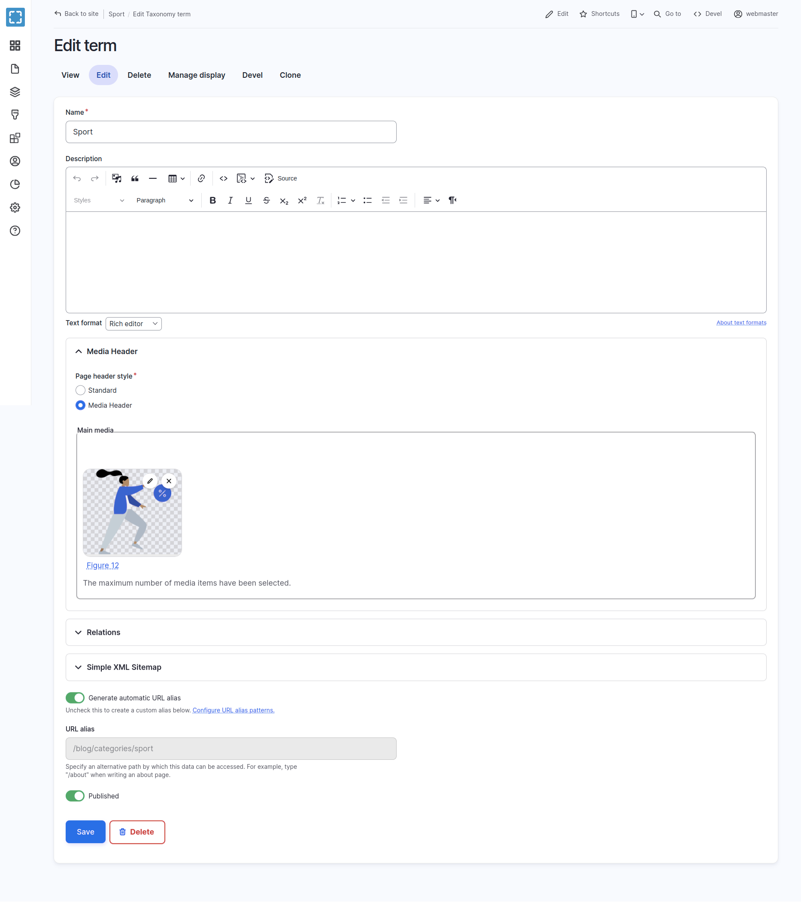
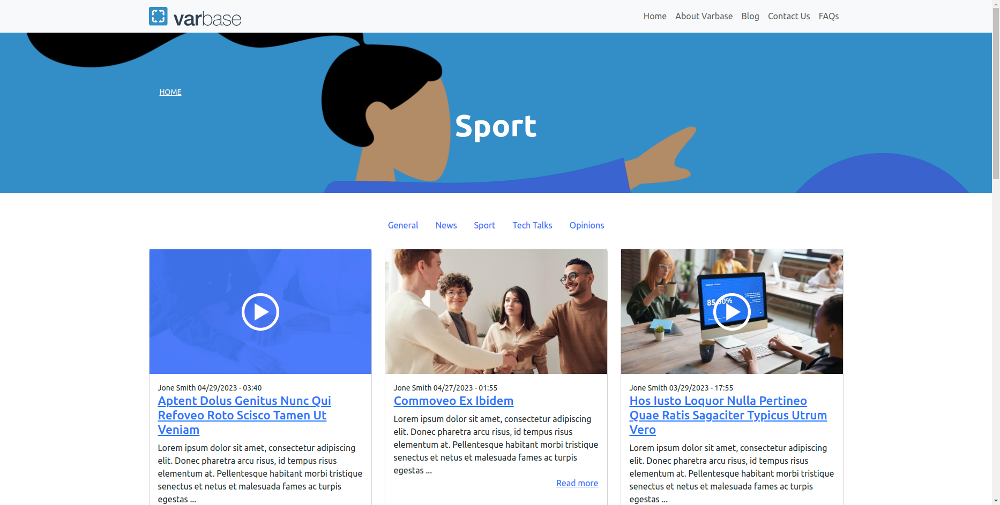

# Configuring Varbase Media Header

Having a universal media header style on top of web pages.

Site builders can activate that for content types.


[varbase-media-header.md](../understanding-varbase/external-components/varbase-media-header.md)


## Activate Media Header For Content Types

### **Varbase Media Header Settings**

* Navigate to **Configuration**  \ **Varbase** **settings**  \ _**Varbase Media Header settings**_&#x20;


<figure><figcaption><p>Admin Menu link to Varbase Media Header Settings</p></figcaption></figure>

* Landing on the _"/admin/config/varbase/varbase-media-header"_  admin link. A list of content types are listed with activated or not activated media header.

<figure><figcaption><p>Varbase Media Header Settings Page</p></figcaption></figure>

* Select entity types which are going to use the varbase media header. To enable varbase media header for these selected entity types and bundles.
* Press the **Save Configuration** submit button to activate new configs for the selected content types.


This will add two new fields to each selected content type:

* **Main media** (field\_media): to store the media for the header
* **Page header style** (field\_page\_header\_style):

&#x20; Which stores the choice of header as :

* **Standard** (standard)
* **Media Header** (media\_header)

For sure more custom page header styles could be added to the field. But that will need a custom template logic to follow with that.



### **Hide breadcrumbs**

* Check **Hide breadcrumbs** to prevent the breadcrumbs from appearing in the Media Header automatically. To control where the breadcrumbs appear using the normal block placement from **Block layout** page.


### Place The **Varbase Media Header Block**

*   Navigate to **Structure** \ **Block layout** and place the **Varbase Media Header block**

    (usually at the top of the top bar)&#x20;
* Configure the block by choosing `'main media'`for each activated content type. Or other media field which are selected to work as the background image for the media header.
*   Choose `'Media header'` for the media view mode. Unless you want a particular view mode, but `'Media header'` will ensure the module template will be used and give you control

    of the display settings.&#x20;

## Example Basic Page With Media Header

### 1. Activate Media Header

Activate the **Varbase Media Header** for the **Basic page** content type. By navigating to _**"/admin/config/varbase/varbase-media-header".**_ And checking the Basic page check box and press "Save configuration".


<figure><figcaption><p>Checked Basic Page Content Type Under Varbase Media Header Settings</p></figcaption></figure>

After saving the configuration the system will process the selected content types, and import new configs for them.

On the case of a successful activation the following message will show up&#x20;


**Status Message:**

The configuration options have been saved.


<figure><figcaption><p>Status Message: The Configuration Options Have Been Saved</p></figcaption></figure>

### 2. Check Manage Fields For Basic Page Content Type

Navigate to "/admin/structure/types/manage/page/fields"


Notice two new fields:

* **Main media** (field\_media)
* **Page header style** (field\_page\_header\_style):


<figure><figcaption><p>Manage Fields For Basic Page Content Type</p></figcaption></figure>


In case that the (field\_media, and field\_page\_header\_style) fields are not listed in the page. That is indication that the activation process did not work in the right way.


### 3. Check Manage Form Display For Basic Page Content Type

Navigate to "/admin/structure/types/manage/page/form-display"

The **Page header style** field should have the _**"Check boxes/radio buttons"**_ widget.

The **Main media** field should have the _**"Media Library"**_ widget. And **Tab order:** Image, Remote video, Video.

<figure><figcaption><p>Manage Form Display For Basic Page Content Type</p></figcaption></figure>

### 4. Create Basic Page Form

Navigate to **Content \ Add content \ **_**Basic page .**_ Then the new two fields should show up in the form. Under the Media Header sidebar form region.

<figure><figcaption><p>Create Basic Page After the Activation for Varbase Media Header</p></figcaption></figure>

### 5. Filling Data and Adding Media then Saving

* Fill in the "About Us" for the Title filed.
* Fill in the Body field with needed content.
* Add a media image file for example to the Main media field. Make sure that the width and height are good to fit for wide screens. At lest `1600px` width and `800px` height.
* Select "Media Header" for the Page header style.

<figure><figcaption><p>Filled Data in the Create Basic Page Form with Varbase Media Header</p></figcaption></figure>

After saving the "Basic page _About Us_ has been created." and the page will look with no media header yet.

<figure><figcaption><p>No Media Header Yet</p></figcaption></figure>

### 6. Configuring the Block

* Navigate to **Structure** \ **Block layout** for your default theme
* Click on the "Place Block" button for the "Content" region ( or any custom region the theme could have for a project ).

<figure><figcaption><p>Place Block Next to Content Region for the Current Default Theme</p></figcaption></figure>

Select the Varbase Media Header block and click on the "Place block" button next to the name.


<figure><figcaption><p>Varbase Media Header - Place Block</p></figcaption></figure>

* Un-check the "Display title" check box.
* Select "Main media" field name for the "Basic page" content type. To use this field as the source for the media background for the header.
* Select "Media Header" for the "Media view mode" config option to size the background media. media header is the default view mode. But it can be changed to any other custom media view mode.

<figure><figcaption><p>Varbase Media Header - Place Block - Configurations</p></figcaption></figure>


Only Place one Varbase Media Header block. which will work for all activated content types.

Having more than one will have a duplicate header and duplicate processing.

One will work. Varbase Media Header block handle all needed restrictions and access process.


After saving the block configs, the block will be placed in the content region, but not in the right order.

<figure><figcaption><p>Initial Order for the Varbase Media Header Block</p></figcaption></figure>

At lest it should be re-ordered on top of  the "Main page content" block

<figure><figcaption><p>Re-ordered the Location on Top of the Main Page Content</p></figcaption></figure>

* Save Blocks in the Block layout admin page

### 7. Check the Front End Page

* Open the example "about us" Basic page.
* Check if the text is visible on top the image.

<figure><figcaption><p>Basic Page - Example With Media Header</p></figcaption></figure>

### 8. Check Reflection on Change of Options

If the Main media field was removed on editing the page. But kept the "Media Header" option selected for the Page header style field. The page will show the header with a default background color.

<figure><figcaption><p>Basic Page - Example With Media Header but no Media</p></figcaption></figure>

## Activate Media Header For Taxonomy Terms

## Example Blog Categories Teams With Media Header

Activate the **Varbase Media Header** for the **Blog Categories** term. By navigating to _**"/admin/config/varbase/varbase-media-header".**_ And checking the Blog Categories check box under Taxonomy terms and press "Save configuration".

<figure><figcaption><p>Checked Blog Categories Taxonomy Terms Under Varbase Media Header Settings</p></figcaption></figure>

After saving the configuration the system will process the selected taxonomy terms, and import new configs for them.

On the case of a successful activation the following message will show up&#x20;


**Status Message:**

The configuration options have been saved.


<figure><figcaption><p>Status Message: The Configuration Options Have Been Saved</p></figcaption></figure>

* Navigate to **Structure** \ **Block layout** for your default theme.
* Click on the "Place Block" button for the "Content" region ( or any custom region the theme could have for a project ).


<figure><figcaption><p>Place Block Next to Content Region for the Current Default Theme</p></figcaption></figure>

Select the Varbase Media Header block and click on the "Place block" button next to the name.

<figure><figcaption><p>Varbase Media Header - Place Block</p></figcaption></figure>

* Un-check the "Display title" check box.
* Select "Main media" field name for the "Basic page" content type. To use this field as the source for the media background for the header.
* Select "Media Header" for the "Media view mode" config option to size the background media. media header is the default view mode. But it can be changed to any other custom media view mode.

<figure><figcaption><p>Place Block Next to Content Region for the Current Default Theme</p></figcaption></figure>


Only Place one Varbase Media Header block. which will work for all activated taxonomy terms and content types.

Having more than one will have a duplicate header and duplicate processing.

One will work. Varbase Media Header block handle all needed restrictions and access process.


After saving the block configs, the block will be placed in the content region, but not in the right order.

<figure><figcaption><p>Initial Order for the Varbase Media Header Block</p></figcaption></figure>

At lest it should be re-ordered on top of  the "Main page content" block

<figure><figcaption><p>Re-ordered the Location on Top of the Main Page Content</p></figcaption></figure>

* Save Blocks in the Block layout admin page
* Create a new term "Sport" in the Blog Categories taxonomy

<figure><figcaption><p>Add Media Header for Taxonomy Term</p></figcaption></figure>

Open the example "Sport" term page.

<figure><figcaption><p>Blog Category Sport Term with a Media Header</p></figcaption></figure>

* Check if the text is visible on top the image.
* Change the Image to fit needed term with images, or videos.

## Change The Default Height and Background Color

[**Varbase Components**](https://www.drupal.org/project/varbase\_components) has a [**Media Header**](https://github.com/Vardot/varbase\_components/tree/2.0.x/components/organisms/media-header) component with all custom styling and variables.

Follow with:


[customize-a-varbase-single-directory-components-sdc-in-a-custom-theme.md](../theme-development-with-varbase/customize-a-varbase-single-directory-components-sdc-in-a-custom-theme.md)


## The Media Header Component

The universal media header style on top of web pages.

### Properties:

* `media_type`: Media entity type. (image, video, remote\_video).
* `provider`: Video provider for remote videos. (youtube, vimeo).
* `utility_classes`: An array of utility classes. Use to add extra Bootstrap utility classes or custom CSS classes over to this to this component.

### Attributes:

* N/A

### Slots:

* `page_breadcrumbs`: Media Header page breadcrumbs.
* `page_title`: Media Header page title.
* `background_media`: Background media (Image, local or remote videos).

## Examples of Using in Custom Templates:

**Example #1: Default use in Varbase Media Header**

```

```

**Example #2: Page title with custom prefix**

```

```

**Example #3: Media Header for node with no breadcrumbs**

```

```


## Styling Variables for Varbase Media Header

```scss
// -----------------------------------------------------------------------------
// Varbase Media Header.
// -----------------------------------------------------------------------------

// Varbase Media Header container height.

$vmh-container-v-padding: 3.75rem;
$vmh-container-h-padding: 1rem;

$vmh-container-min-height: 300px;
$vmh-container-max-height: 300px;

$vmh-container-min-height-lg: 300px;
$vmh-container-max-height-lg: 300px;

$vmh-container-top-margin: 0;
$vmh-container-bottom-margin: 0.6875rem;

// Varbase Media Header fallback container background color.
$vmh-fullback-container-background-color: #338ec7;

// Varbase Media Header content text general style.
$vmh-content-text-color: #fff;

// Varbase Media Header title style.
$vmh-title-color: #fff;
$vmh-title-font-size: 1.875rem;
$vmh-title-font-size-lg: 3.625rem;

// Varbase Media Header breadcrumb style.
$vmh-breadcrumb-color: #fff;
$vmh-breadcrumb-font-size: 0.75rem;
$vmh-breadcrumb-font-size-lg: 0.875rem;
```
