# Configuring Varbase Media Header

Having a universal media header style on top of web pages.

Site builders can activate that for content types.


[varbase-media-header.md](../understanding-varbase/external-components/varbase-media-header.md)


## Activate Media Header For Content Types

### **Varbase Media Header Settings**

* Navigate to **Configuration**  \ **Varbase** **settings**  \ _**Varbase Media Header settings**_&#x20;

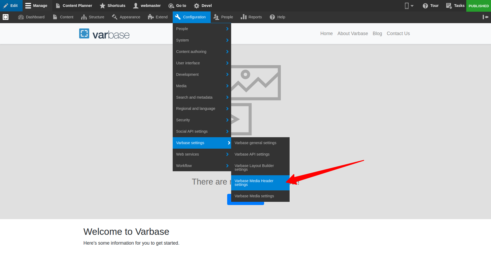


* Landing on the_ "/admin/config/varbase/varbase-media-header"  _admin link. A list of content types are listed with activated or not activated media header.

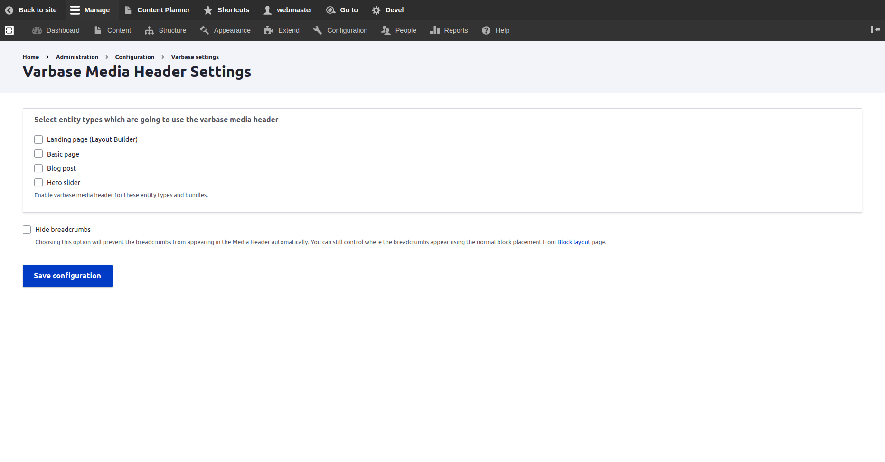

* Select entity types which are going to use the varbase media header. To enable varbase media header for these selected entity types and bundles.
* Press the **Save Configuration** submit button to activate new configs for the selected content types.


This will add two new fields to each selected content type:

* **Main media **(field\_media): to store the media for the header
* **Page header style** (field\_page\_header\_style):

&#x20; Which stores the choice of header as :

* **Standard** (standard)
* **Media Header** (media\_header)

For sure more custom page header styles could be added to the field. But that will need a custom template logic to follow with that.



### **Hide breadcrumbs**

* Check **Hide breadcrumbs** to prevent the breadcrumbs from appearing in the Media Header automatically. To control where the breadcrumbs appear using the normal block placement from **Block layout** page.


### Place The **Varbase Media Header Block**

*   Navigate to **Structure** \ **Block layout **and place the **Varbase Media Header block**

    (usually at the top of the top bar)&#x20;
* Configure the block by choosing `'main media'`for each activated content type. Or other media field which are selected to work as the background image for the media header.
*   Choose `'Media header'` for the media view mode. Unless you want a particular view mode, but `'Media header'` will ensure the module template will be used and give you control

    of the display settings.&#x20;

## Example Basic Page With Media Header

### 1. Activate Media Header

Activate the **Varbase Media Header** for the **Basic page** content type. By navigating to _**"/admin/config/varbase/varbase-media-header". **_And checking the Basic page check box and press "Save configuration".

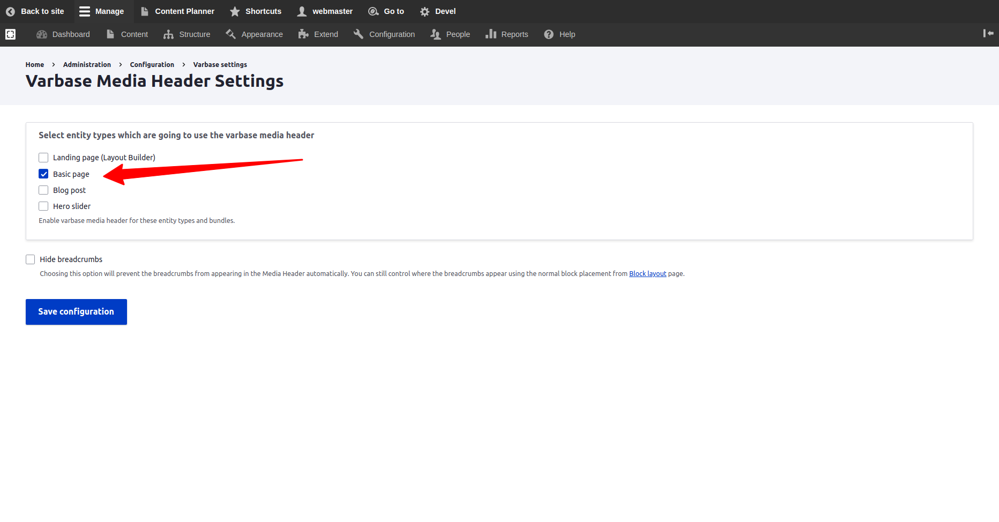

After saving the configuration the system will process the selected content types, and import new configs for them.

On the case of a successful activation the following message will show up&#x20;


**Status Message:**

The configuration options have been saved.


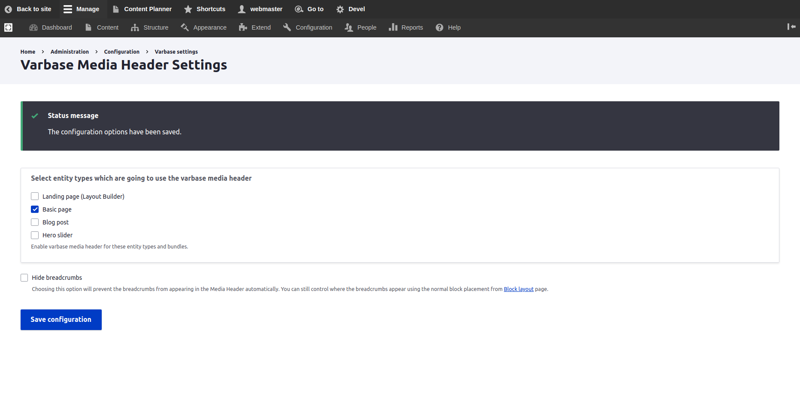

### 2. Check Manage Fields For Basic Page Content Type

Navigate to "/admin/structure/types/manage/page/fields"


Notice two new fields:

* **Main media **(field\_media)
* **Page header style** (field\_page\_header\_style):


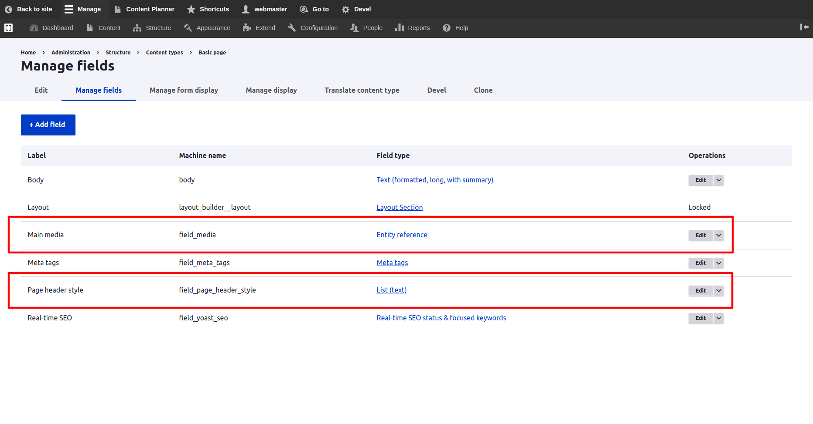


In case that the (field\_media, and field\_page\_header\_style) fields are not listed in the page. That is indication that the activation process did not work in the right way.


### 3. Check Manage Form Display For Basic Page Content Type

Navigate to "/admin/structure/types/manage/page/form-display"

The **Page header style** field should have the _**"Check boxes/radio buttons" **_widget.

The **Main media **field should have the _**"Media Library"**_ widget. And **Tab order:** Image, Remote video, Video.

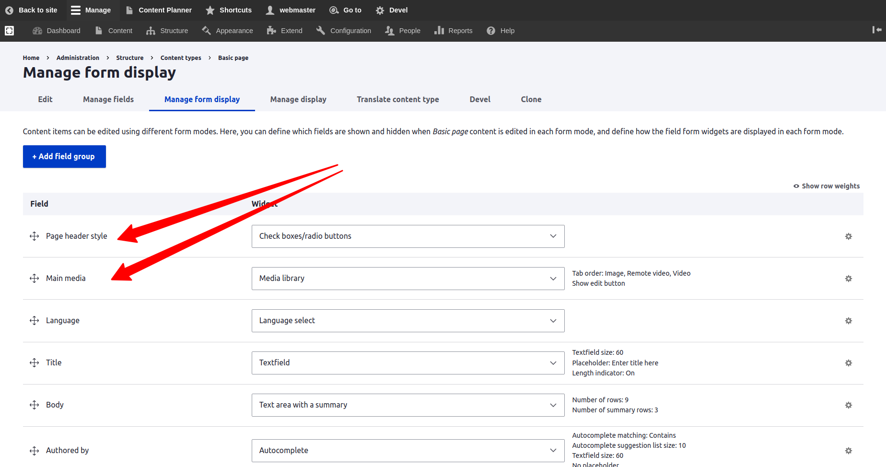


### 4. Create Basic Page Form

Navigate to **Content \ Add content \ **_**Basic page .**_ Then the new two fields should show up in the form. Under the Media Header sidebar form region.

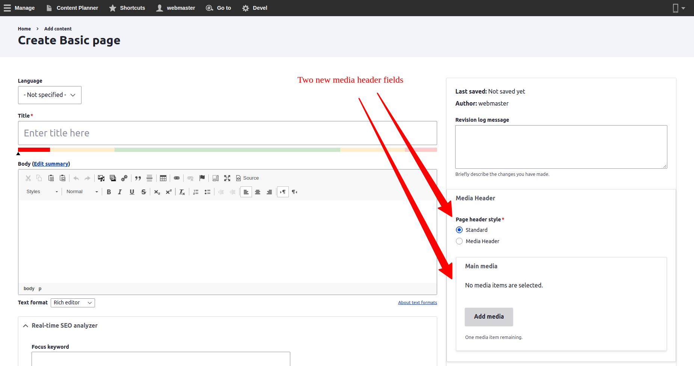

### 5. Filling Data and Adding Media then Saving

* Fill in the "About Us" for the Title filed.
* Fill in the Body field with needed content.
* Add a media image file for example to the Main media field. Make sure that the width and height are good to fit for wide screens. At lest 1600px width and 800px height.
* Select "Media Header" for the Page header style.

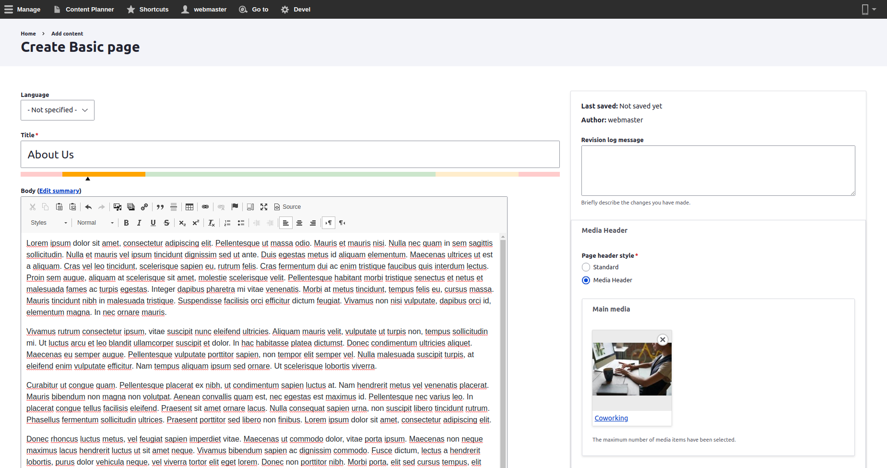

After saving the "Basic page _About Us_ has been created." and the page will look with no media header yet.

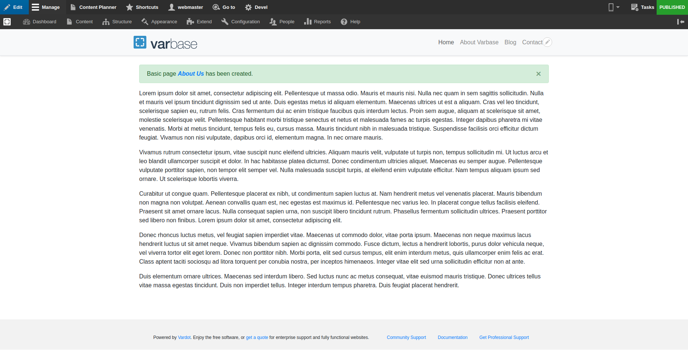

### 6. Configuring the Block

* Navigate to **Structure** \ **Block layout **for your default theme
* Click on the "Place Block" button for the "Content" region ( or any custom region the theme could have for a project ).


* Select the Varbase Media Header block and click on the "Place block" button next to the name.

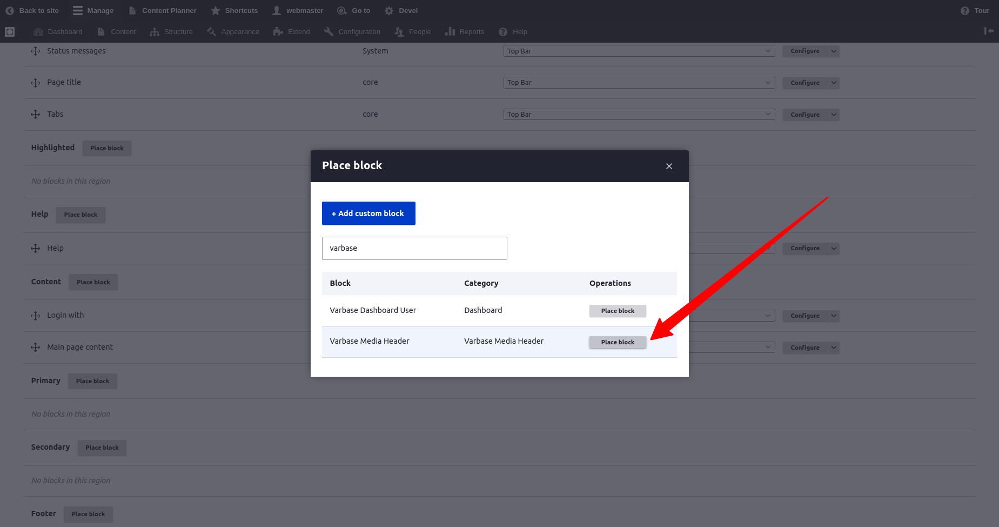

* Un-check the "Display title" check box
* Select "Main media" field name for the "Basic page" content type. To use this field as the source for the media background for the header.
* Select "Media Header" for the "Media view mode" config option to size the background media. media header is the default view mode. But it can be changed to any other custom media view mode.



Only Place one Varbase Media Header block. which will work for all activated content types.

Having more than one will have a duplicate header and duplicate processing.

One will work. Varbase Media Header block handle all needed restrictions and access process.


After saving the block configs, the block will be placed in the content region, but not in the right order.

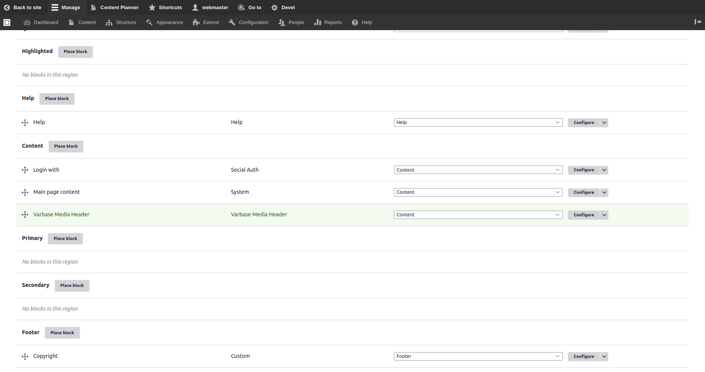

At lest it should be re-ordered on top of  the "Main page content" block

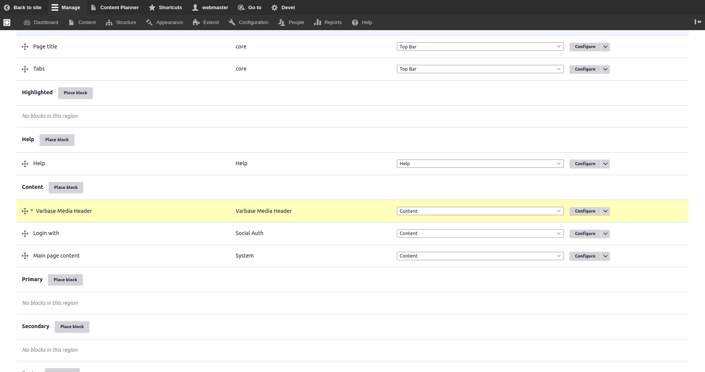

* Save Blocks in the Block layout admin page

### 7. Check the Front End Page

* Open the example "about us" Basic page.
* Check if the text is visible on top the image.

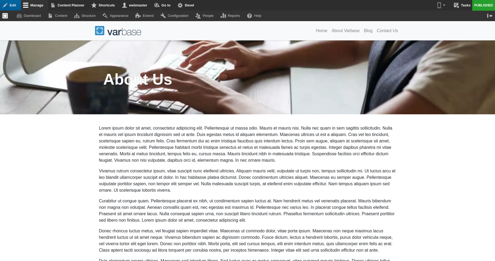

### 8. Check Reflection on Change of Options

If the Main media field was removed on editing the page. But kept the "Media Header" option selected for the Page header style field. The page will show the header with a default background color.

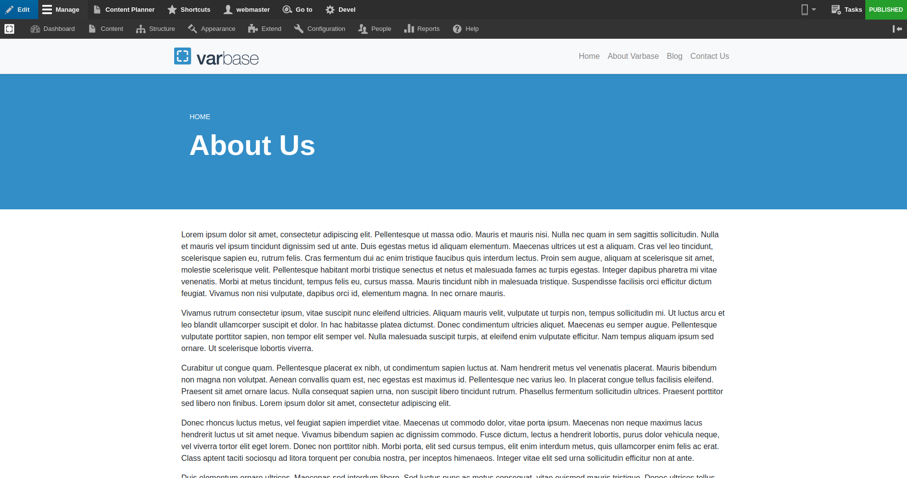

## Change The Default Height and Background Color

Override the `varbase_media_header/media_header_styling` library in the custom default theme

```
media_header_styles:
  css:
    component:
      css/components/media-header.component.css: {}

```

Copy the [**SCSS**](https://git.drupalcode.org/project/varbase\_media\_header/-/tree/9.0.x/scss) files if you are working with **SASS**, and change values in the [_**variables.scss**_](https://git.drupalcode.org/project/varbase\_media\_header/-/blob/9.0.x/scss/variables.scss) file.

Varbase Media Header default variables are:

```
// -----------------------------------------------------------------------------
// Varbase Media Header.
// -----------------------------------------------------------------------------

// Varbase Media Header container height.

$vmh-container-v-padding: 3.75rem;
$vmh-container-h-padding: 1rem;

$vmh-container-min-height: 300px;
$vmh-container-max-height: 300px;

$vmh-container-min-height-lg: 300px;
$vmh-container-max-height-lg: 300px;

$vmh-container-top-margin: 0;
$vmh-container-bottom-margin: 0.6875rem;

// Varbase Media Header fallback container background color.
$vmh-fullback-container-background-color: #338ec7;

// Varbase Media Header content text general style.
$vmh-content-text-color: #fff;

// Varbase Media Header title style.
$vmh-title-color: #fff;
$vmh-title-font-size: 1.875rem;
$vmh-title-font-size-lg: 3.625rem;

// Varbase Media Header breadcrumb style.
$vmh-breadcrumb-color: #fff;
$vmh-breadcrumb-font-size: 0.75rem;
$vmh-breadcrumb-font-size-lg: 0.875rem;

```

After compiling **SCSS** files to **CSS** files and having the custom styling library.

Use the **`libraries-override`** method to replace the library in custom themes.

```
libraries-override:
  varbase_media_header/media_header_styling: custom_theme/custom_header_styling
```


