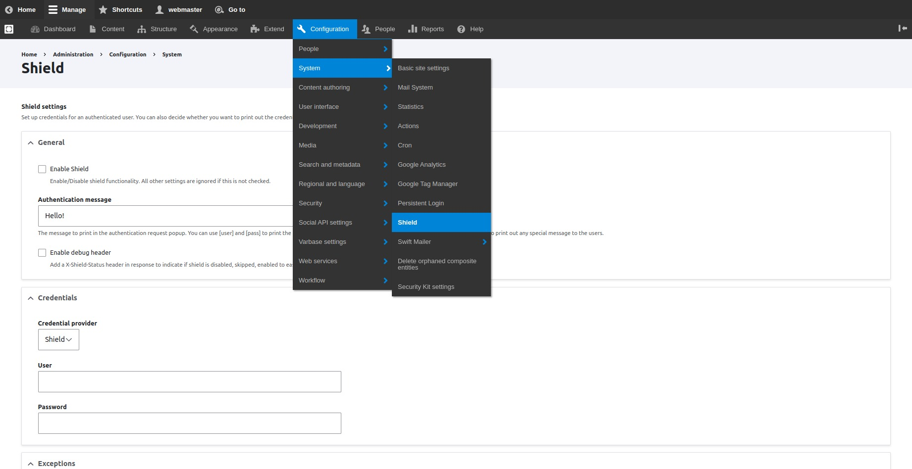
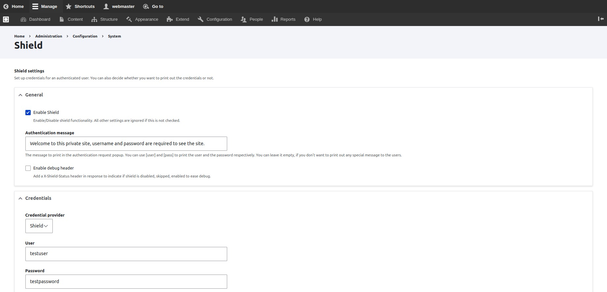
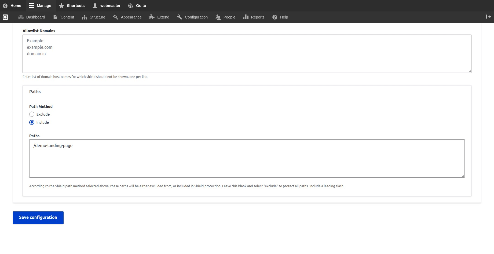

# Enable HTTP Password Authentication

## How to Enable HTTP Password Authentication on The Whole Site

The **PHP Authentication Shield** module was packaged with **Varbase Core**, but not enabled on the installation of **Varbase**.

A simple shield for the site with **Apache** authentication. It hides the sites, if the user does not know a simple username/password.

Enable the **PHP Authentication Shield** module to be able to have general shield for the site.

```
drush pm:enable shield
```

Navigate to **Configurations \ System \ **_**Shield**_** ** from the administration toolbar menu.

<figure><figcaption><p>Navigate to Shield Settings Page</p></figcaption></figure>

Check or un-check the `"Enable Shield"` checkbox to enable/disable shield functionality. All other settings are ignored if this is not checked.

Add an authentication message to show it in the authentication request popup. Use the `[user]` and `[pass]` tokens to print the user and the password respectively. leave it empty, when not wanting to print out any special message to users.

Provide the desired **User** and **Password** in the credential part of the settings.

<figure><figcaption><p>Authentication Message, User and Password Example</p></figcaption></figure>

Press the Save Configuration button to save the changed configurations.

The site will start asking to fill in a user and password on every opened new session.


## How to Enable HTTP Password Authentication on Specific URLs/Pages

Adding HTTP authentication for a specific route/pattern instead of the whole site.

<figure><figcaption><p>Paths and Path Methods</p></figcaption></figure>

The list of paths will be either excluded from, or included in Shield protection.

Select `"Include"` to protect only the listed paths.

Include a leading slash to listed internal links.
