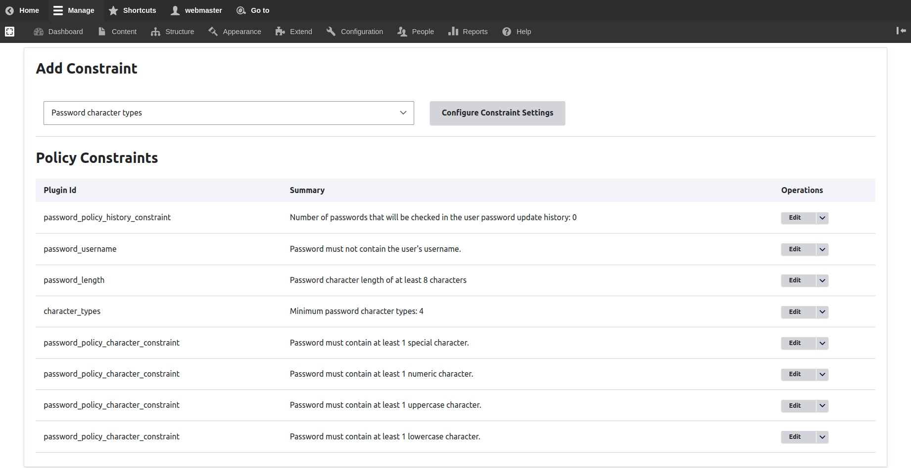

# Password Policies

To configure the Password Policies on your site, navigate to:\
**Administration** \ **Configuration** \ **Security** \ _**Password Policy**_

Varbase ships with a default password policy to provide a way to enforce restrictions on user passwords by defining password policies.

You can add multiple policies each policy is assigned to a specific role, or edit the default provided policy&#x20;

A password policy can be defined with a set of constraints that must be met before a user password change will be accepted. Each constraint has a parameter allowing for the minimum number of valid conditions which must be met before the constraint is satisfied.

> **Example:** an uppercase constraint (with a parameter of 2) and a digit constraint (with a parameter of 4) means that a user password must have at least 2 uppercase letters and at least 4 digits for it to be accepted.

<figure><figcaption>
Configure Constraints - Policy Constraints
</figcaption></figure>

### Change Password Suggestions settings

Changing policy constraints won't affect the markup or wordings found in the "Recommendations to make your password stronger" box on the user profile page, to reflect changes to the end-user when creating or editing their password you should edit the password suggestions settings form found at **Administration** \ **Configuration** \ **Varbase settings \ Varbase Security settings \ **_**Password Suggestions settings.**_

