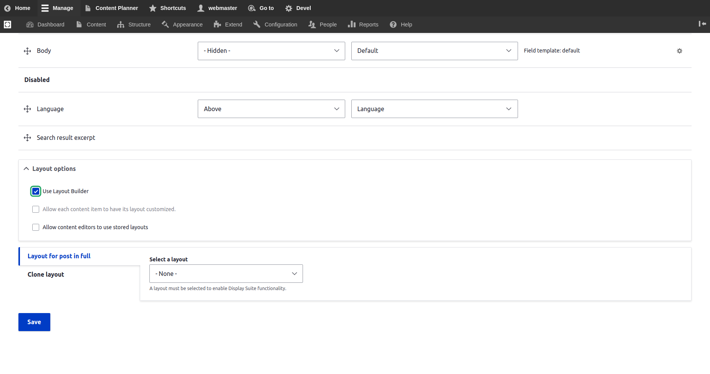
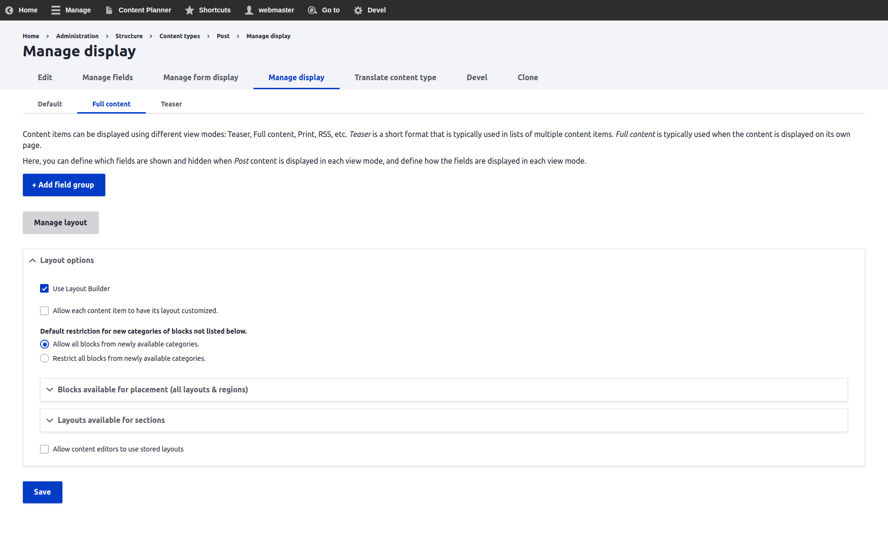
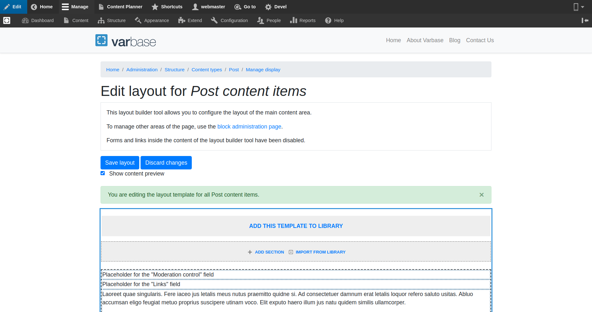
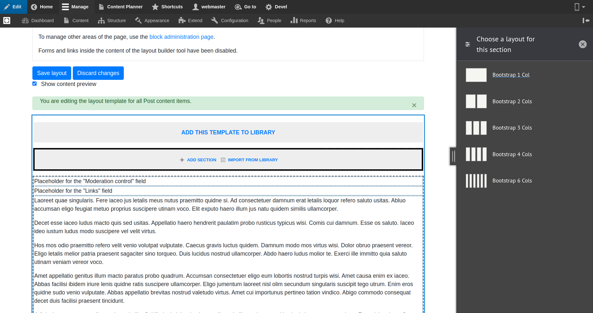
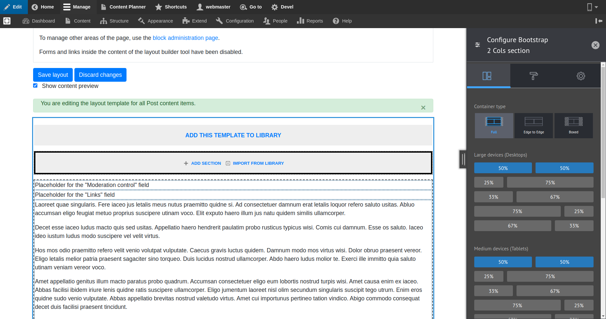
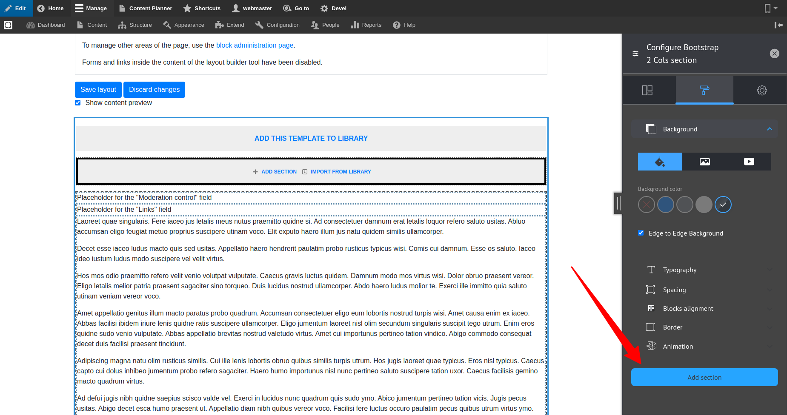
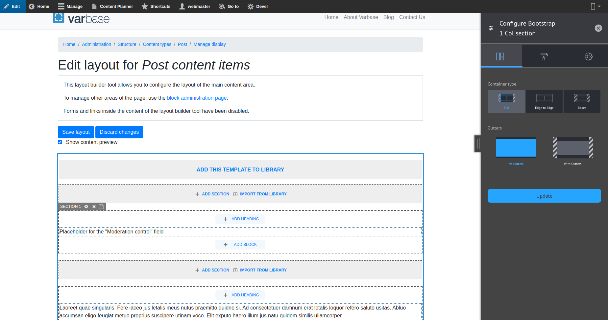
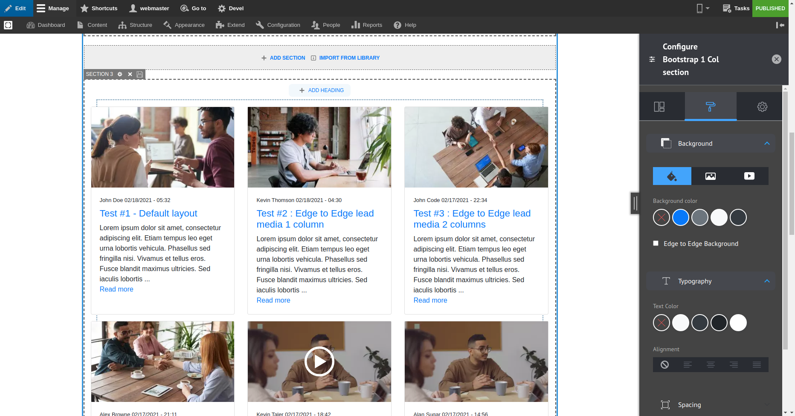

# Activating Varbase Layout Builder for Content Types

The logical use for Varbase Layout Builder configs is with the **"Full Content"** display mode for most planed content types. If the Content type has an access permission for users to open a page with a URL to see the full content. It's better to activate the Layout Builder for the default layout for that full content.

## Steps to Activate

### Create a New Content Type

**Example:** Let consider creating a _**"Post"**_ content type

* Go to _`"/admin/structure/types/add"`_ link to add a new content type
* Fill in _`"Post"`_ in the _"Name"_ field
* Fill in _**"**Use the Post to add posts to the website. So that they will show up under the posts site section."_ in the _`"Description"`_ field
* Press the _`"Save and manage fields"`_ submit button to create the content type
* Then the website will be directed to the _**"Manage fields"**_ page
* Add more fields as needed for the project

### Enable the Full Content display mode

* Go to "/admin/structure/types/manage/post/display" page&#x20;

* Click on "Custom display settings" tab to show the list of view modes

* Check the "Full content" checkbox  and press save to activate it

* Check the "Use Layout Builder" under the "Layout options" settings group and press save

* Select the following layouts from "Layout available for sections" and press save
  * _**Bootstrap 1 Col**_
  * _**Bootstrap 2 Cols**_
  * _**Bootstrap 3 Cols**_
  * _**Bootstrap 4 Cols**_
  * _**Bootstrap 6 Cols**_

* Click on the "Manage layout" button to change the default layout for the "Full content" display

* The default set of fields as a block are placed in a default section will show up

* Add Section to choose a layout for new sections

* On choosing the "Bootstrap 2 Cols" section layout. Another styling settings tray options will show up to configure the section

* Set the desired Layout options, Styling options then click on the "Add Section" button in the setting try

* Important to manage to have only the supported Varbase Layout Builder layouts. having the "Moderation control" field in a section with Bootstrap 1 Col layout, and the Body and other fields or needed blocks in other sections.

## Full Example with Code and Configs


[**Varbase Blog**](https://www.drupal.org/project/varbase\_blog) is the standard example for how a content type could be configured, then packaged to work with **Varbase.** Using Varbase Layout Builder default configs.

Use the learn by example method. In case of wanting to create a custom Varbase compatible features.



Have a look at the default configs and code for **Varbase Blog**

[https://git.drupalcode.org/project/varbase\_blog](https://git.drupalcode.org/project/varbase\_blog/-/tree/9.0.x)



Install **Varbase Blog** in a **Varbase site.** It comes with Varbase by default.

Have a look at the default **Varbase Blog** configs. Manage custom content types using the same configs.



Have a quick look at the following link. More enlightenment on how to use Varbase Layout Builder.

[**Issue #3163199: Switch Blog section, Blog post, Blog categories, and Tags to use Varbase Layout Builder**](https://www.drupal.org/project/varbase\_blog/issues/3163199)


