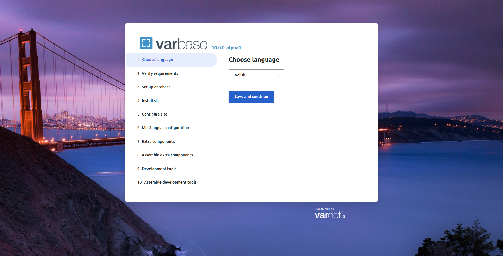

# Installing Varbase

If you already have a local or hosted environment available for your use that meets [Drupal system requirements](https://www.drupal.org/requirements) and/or [Varbase's system requirements](requirements.md) including working versions of Apache, MySQL, and PHP, you’re ready to install Varbase.

## Installing Varbase locally with Composer

Follow the steps below to install Varbase distribution for Drupal 9 on a local server.

### Requirements

1. [Composer](https://getcomposer.org/doc/00-intro.md) package manager
2. [NPM](https://www.npmjs.com/) package manager
3. [Yarn](https://yarnpkg.com/) package manager

### Procedure


### 2 easy steps to install


1.  Run the following command:&#x20;

    ```
    composer create-project Vardot/varbase-project:^10.0@alpha YOUR_PROJECT --no-dev --no-interaction
    ```

    Composer will create a new directory called `YOUR_PROJECT` containing a `docroot` directory with a full Varbase codebase.&#x20;

2\. Point your browser to your localhost folder where you installed ran the command. \
You can then install Varbase as you install Drupal normally.

<figure><figcaption><p>Varbase Installation Screen</p></figcaption></figure>

## Installing Varbase with Lando

We recommend you install Varbase with Lando to start a new project.

[Lando](https://lando.dev/) is a great local development environment for Drupal and other applications that vastly simplifies local development and DevOps so you can focus on the application, rather than the environment.


[installing-varbase-with-lando.md](installing-varbase-with-lando.md)



## Deploy Varbase on Platform.sh

You can install Varbase on [Platform.sh](https://platform.sh/) and enjoy 30 days free trial for new users!

Follow this link to provision your Varbase instance on Platform.sh: [**Deploy Varbase on Platform.sh**](https://console.platform.sh/projects/create-project?template=https://raw.githubusercontent.com/Vardot/templates-external/master/templates/varbase.template.yaml)!

Or deploy it using the baseline [Varbase Platform.sh template project](https://github.com/Vardot/platformsh-varbase).


Follow Platform.sh documentation on developing with Drupal and Varbase.\
See [https://docs.platform.sh/guides/drupal9/deploy.html](https://docs.platform.sh/guides/drupal9/deploy.html)

