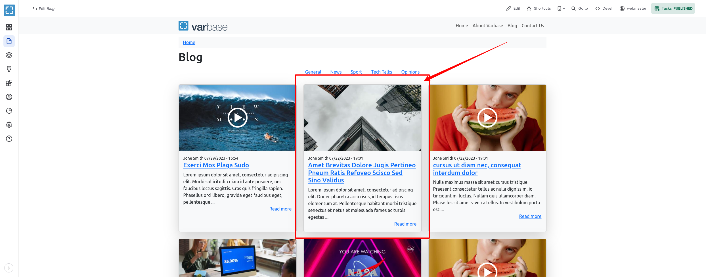
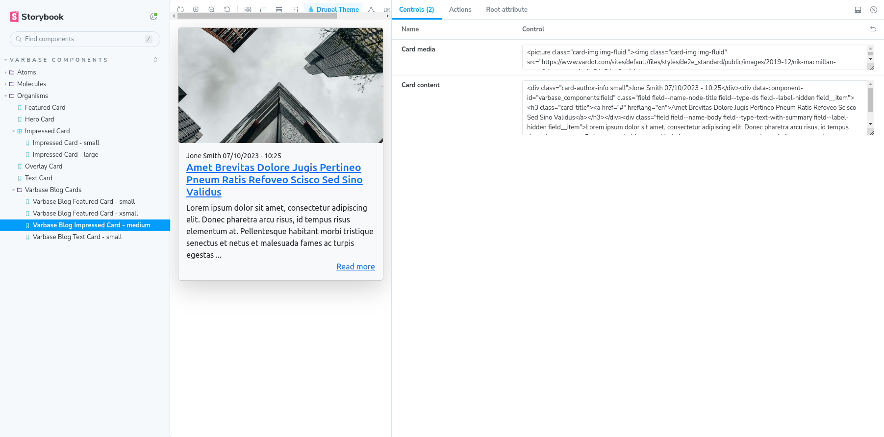

# Customize a Varbase SDC Component In a Custom Theme

The **Single Directory Components (SDC)** folder contains various components. To enhance the default components, Projects are using the components provided by [**Varbase Components**](https://www.drupal.org/project/varbase\_components) module.

To replace any component from the **Varbase Components** module, follow the example below:

#### Example:

Suppose we have a custom style for the Alert component on our site, which differs from the default style. Here are the steps to implement the custom style:

## Copy the Varbase Component to the Custom theme

Copy the alert folder from **Varbase Components** to your project's theme folder:

```
cd PATH_TO_THE_PROJECT/docroot
cp -r modules/contrib/varbase_components/components/molecules/alert themes/custom/PROJECT_THEME/components/molecules/alert
```

## Add replaces to the Copied Component

Edit the `alert.component.yml` file in your `PROJECT_THEME` folder.&#x20;

Add the following line after `name: Alert` in the YAML file:

```
replaces: 'varbase_components:alert'
```

The updated `alert.component.yml` should look like this:

```
name: Alert
replaces: 'varbase_components:alert'
```

## Add the Custom SCSS files to the Webpack Config for Components

Uncomment the following line in the `PROJECT_THEME/webpack.config.components.js` file:

```
    './components/molecules/alert/alert': ['./components/molecules/alert/alert.scss'],
```


**Note:** As a custom theme, Developers and themers have the authority to modify any part of the <mark style="color:green;">"</mark><mark style="color:green;">`status-messages.html.twig"`</mark> template file, which is the default system template in Drupal.&#x20;

You can also make changes to the **SASS**, **TWIG**, and **JavaScript** files in the <mark style="color:green;">`components/molecules/alert`</mark> folder.


## Compile `SASS` to `CSS` files for components

```
yarn components:build
```

These steps will allow you to incorporate your custom style for the **Alert component**, using the **Varbase Components** module as a base.

## Change the SDC Component to Customize

* Add JS file, or more JS files to dependencies
* Add more SCSS/CSS files
* Change the custom component twig template


## Defining Schemas for SDC Component Metadata

Following with [**Draft 4**](http://json-schema.org/draft-04/schema) of **JSON Schema,** which is a declarative language that allows you to **annotate** and **validate** JSON documents.

The draft has been seamlessly integrated with YAML in SDC Components within the Drupal core. This integration now serves as the backbone for all front-end and web components, providing a unified and efficient system.


* **Required in modules**
* **Optional in themes** (file presence needed)



Add the Schema Metadata

```php
$schema: https://git.drupalcode.org/project/drupal/-/raw/10.1.x/core/modules/sdc/src/metadata.schema.json
```

In all SDC components in **Varbase Components** or custom **`myproject_components`** module.

To follow with **metadata.schema.json** selected by Drupal Core team [https://git.drupalcode.org/project/drupal/-/raw/10.1.x/core/modules/sdc/src/metadata.schema.json](https://git.drupalcode.org/project/drupal/-/raw/10.1.x/core/modules/sdc/src/metadata.schema.json)



The [**IDE**](#user-content-fn-1)[^1] will read the schema file to understand the syntax for fixes and enable autocomplete.


### Drafts of JSON Schema


JSON Schema Enables the Confident and Reliable use of the JSON Data Format



Front End frameworks are using a selected draft to create their custom schema metadata for components.

`http://json-schema.org/draft-01/schema#`\
`http://json-schema.org/draft-02/schema#`\
`http://json-schema.org/draft-03/schema#`\
`http://json-schema.org/draft-04/schema#` **( Used by Drupal  core SDC module)**\
`http://json-schema.org/draft-05/schema#`\
`http://json-schema.org/draft-06/schema#`\
`http://json-schema.org/draft-07/schema#`


[Storybook JSON Schema Addon](https://storybook.js.org/addons/@kickstartds/storybook-addon-jsonschema/) to integrate with that


[integration-of-varbase-with-storybook.md](integration-of-varbase-with-storybook.md)


## More Info and FAQ about SDC


### **Read: Using Single Directory Components**

[https://www.drupal.org/docs/develop/theming-drupal/using-single-directory-components](https://www.drupal.org/docs/develop/theming-drupal/using-single-directory-components)


### **Read: F.A.Q. (Frequently Asked Questions) about SDC**

[https://www.drupal.org/docs/develop/theming-drupal/using-single-directory-components/faq-frequently-asked-questions](https://www.drupal.org/docs/develop/theming-drupal/using-single-directory-components/faq-frequently-asked-questions)


### **Read: Creating Your First Single Directory Component within Drupal**

[https://herchel.com/articles/creating-your-first-single-directory-component-within-drupal](https://herchel.com/articles/creating-your-first-single-directory-component-within-drupal)


### **Read: Single Directory Components in Drupal Core**

[https://www.lullabot.com/articles/getting-single-directory-components-drupal-core](https://www.lullabot.com/articles/getting-single-directory-components-drupal-core)


### **Watch: Single Directory Components in Core: Pittsburgh 2023**

[https://www.youtube.com/watch?v=gDd7pCK9KsA](https://www.youtube.com/watch?v=gDd7pCK9KsA)&#x20;


## SDC Examples <a href="#page-subtitle" id="page-subtitle"></a>


### [SDC Examples](https://git.drupalcode.org/project/sdc\_examples/-/tree/1.x/components) module

`Component Libraries: Components Examples`



### [**Varbase Components**](https://github.com/Vardot/varbase\_components/tree/2.0.x/components) **module**

**Varbase Components :** [Button](https://github.com/Vardot/varbase\_components/tree/2.0.x/components/atoms/button) , [Close Button](https://github.com/Vardot/varbase\_components/tree/2.0.x/components/atoms/close-button)

**Varbase Components :** [Badge](https://github.com/Vardot/varbase\_components/tree/2.0.x/components/atoms/badge)

**Varbase Components :** [Alert](https://github.com/Vardot/varbase\_components/tree/2.0.x/components/molecules/alert)

**Varbase Components :** [Progress Bar](https://github.com/Vardot/varbase\_components/tree/2.0.x/components/atoms/progress-bar)

***

**Varbase Components :** [Featured Card](https://github.com/Vardot/varbase\_components/tree/2.0.x/components/organisms/card-featured)

**Varbase Components :** [Impressed Card](https://github.com/Vardot/varbase\_components/tree/2.0.x/components/organisms/card-impressed)

**Varbase Components :** [Overlay Card](https://github.com/Vardot/varbase\_components/tree/2.0.x/components/organisms/card-overlay)

**Varbase Components :** [Hero Card](https://github.com/Vardot/varbase\_components/tree/2.0.x/components/organisms/card-hero)

**Varbase Components :** [Text Card](https://github.com/Vardot/varbase\_components/tree/2.0.x/components/organisms/card-text)


## Options to custom

* Clone the custom card component, which is targeted for a selected content type, and have the custom changes for with styles(`css`) and scripts(`js`), or even with custom props and slots.
* Switch to use the `starterkit/recipes` for the provided **Varbase Cards** from **Varbase Components** directly from the display mode for an entity.
* Clone the **Varbase Card** component and customize it in a custom theme

## **Proof of Concept: Custom Varbase Blog Card Components**


While **Varbase Blog** will retain the use of the standard **Varbase Card Components**, This is an proof of concept example with a selection of custom components.&#x20;


This offers an avenue to customize card components for specific content types. Our present example revolves around the **Varbase Blog** content type.

> * [varbase-blog-card-impressed-medium.zip](https://www.drupal.org/files/issues/2023-08-02/varbase-blog-card-impressed-medium.zip)
> * [varbase-blog-card-featured-small.zip](https://www.drupal.org/files/issues/2023-08-02/varbase-blog-card-featured-small.zip)
> * [varbase-blog-card-featured-xsmall.zip](https://www.drupal.org/files/issues/2023-08-02/varbase-blog-card-featured-xsmall.zip)
> * [varbase-blog-card-text-small.zip](https://www.drupal.org/files/issues/2023-08-02/varbase-blog-card-text-small.zip)


You're welcome to download the component and tailor it according to your chosen view mode and content type's requirements.


Make the transition from the `inline CSS class placement` method for **UI patterns** to using custom **Card components**. Additionally, enhance organization and readability by integrating **Varbase Blog Cards** as stories within **Varbase Storybook**.

**Example:** Use the **General Cards/Teasers** view modes for your site, and if necessary, you can utilize or clone the **Varbase Cards** `Starterkit/Recipe`.

* Incorporate custom Card components when working with specific Content types like the Varbase Blog
* This approach streamlines the development workflow, enabling smooth collaboration between Design, Storybook, Front-End development with SDC components and stories, and the mapping process in the theme. The Back-end team can also effortlessly integrate components into the site structure.
* The **Site builder** gains the flexibility to associate **SDC** components with both **UI Pattern** and **SDC Display**, ensuring a cohesive and efficient implementation.

Field mapping with components can be managed\
**Example:** Create a `card-text-body-field` component and use the component with the twig template in Vartheme BS5 suggestion for the field body.

> ( Building the list of components for fields can be now in projects or products ) Then later SDC Display can map them from the UI.

## **Example:** Impressed Card as a View Mode for a Content Type

> **Example:** Impressed Card with **`style size`** of `medium`, **`card border`**, **`Equal height`**, **`Anchoring all`** the card, **`media position`** to the `top`, and passing an extra **Bootstrap \~5.3.0** **`utility classes`** for `light background` and `large shadow` over the used card
>
> The component files are in ( [varbase-blog-card-impressed-medium.zip](https://www.drupal.org/files/issues/2023-08-02/varbase-blog-card-impressed-medium.zip) )
>
> Which only has the following in  `varbase-blog-card-impressed-medium.twig` file:
>
> ```php
> 
> ```

<figure><figcaption><p>View of the Impressed Card size of medium with custom in Varbase ~10.0.0</p></figcaption></figure>

The equivalent in Storybook using the custom Varbase Impressed Card -medium

<figure><figcaption><p>View of the Impressed Card size of medium with custom in Varbase Storybook</p></figcaption></figure>

Which is the equivalent of using the default **`Impressed Card - medium - with Read more`** story with the default standard Impressed Card in the storybook - but without the light background and no shadows.

<figure><figcaption><p>Impressed Card - medium - with Read more</p></figcaption></figure>

##


[^1]: Integrated Development Environment

