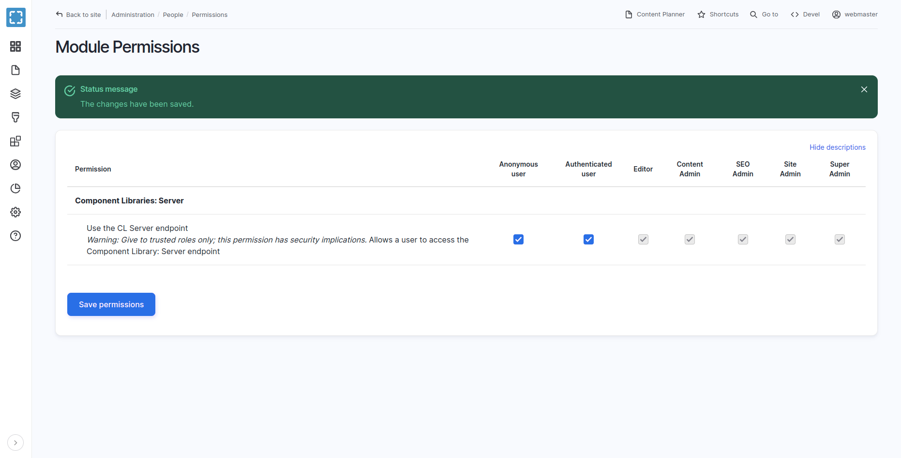
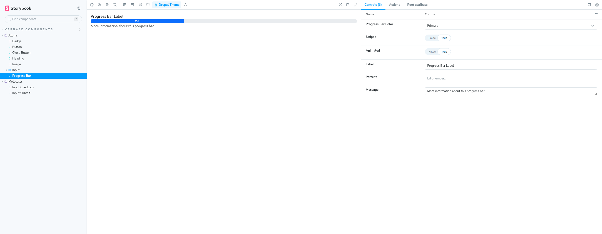
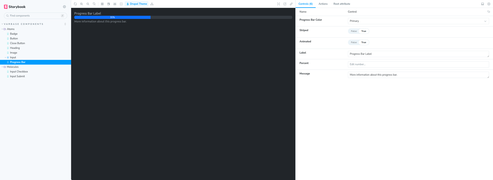
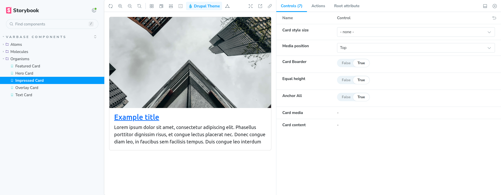

# Integration of Varbase with Storybook

**Varbase** has been integrated with [**Storybook**](https://storybook.js.org/) to provide a listing of stories for [**Single Directory Components (SDC)**](https://www.drupal.org/docs/develop/theming-drupal/using-single-directory-components) components. This integration allows for easier development and testing of [**Varbase Components**](https://www.drupal.org/project/varbase\_components).


#### Not for production!!, only for development or staging.


## Steps to Set up a Working Storybook for Varbase

* Enable the **`cl_server`** module on the site either through the site's interface or by running the command `./bin/drush en cl_server` with Drush. Note that the CL Server module should not be kept running on a production site.
* Navigate to **`"/admin/people/permissions/module/cl_server"`**  to give the `Use the CL Server endpoint` permission to all user roles. Check the  `Anonymous user` and `Authenticated user` checkbox and press **`Save permission`** submit button

<figure><figcaption><p>Use the CL Server endpoint Module Permissions</p></figcaption></figure>


**Use the CL Server endpoint**

_**Warning:** Give to trusted roles only; this permission has security implications._

&#x20;Allows a user to access the Component Library: Server endpoint


* Add the following exclude of modules to the `settings.php` or `settings.local.php` only to the development environment:

```php
# Disable caches during development. This allows finding new components without clearing caches.
// $settings['cache']['bins']['component_registry'] = 'cache.backend.null';
# Then disallow exporting config for 'cl_server'. Instructions are at the bottom of the file.
$settings['config_exclude_modules'] = ['devel', 'stage_file_proxy', 'cl_server'];
```

* Change the following **Cross-Site HTTP requests (CORS)** in the **`development.services.yml`** file.


```yaml
# Local development services.
#
# To activate this feature, follow the instructions at the top of the
# 'example.settings.local.php' file, which sits next to this file.
parameters:
  twig.config:
    debug: true
    cache: false
  http.response.debug_cacheability_headers: true
  cors.config:
    enabled: true
    # Specify allowed headers, like 'x-allowed-header'.
    allowedHeaders: ['*']
    # Specify allowed request methods, specify ['*'] to allow all possible ones.
    allowedMethods: []
    # Configure requests allowed from specific origins. Do not include trailing
    # slashes with URLs.
    allowedOrigins: ['*']
    # Sets the Access-Control-Expose-Headers header.
    exposedHeaders: false
    # Sets the Access-Control-Max-Age header.
    maxAge: false
    # Sets the Access-Control-Allow-Credentials header.
    supportsCredentials: true
services:
  cache.backend.null:
    class: Drupal\Core\Cache\NullBackendFactory
```



Not recommended to keep **`"cors.config"`** with **`"enabled: true"`** in production environments.

#### **Better to keep all changes in the `"development.services.yml"` file**


* Enable Twig debugging by `debug: true`  in the `development.services.yml` file.


Enabling Twig debugging is not recommended in production environments.


* Disable the Twig cache by `cache: false`  in the `development.services.yml` file.


Disabling the Twig cache is not recommended in production environments.



**Set up Storybook for your Drupal site.**

Please see the [@lullabot/storybook-drupal-addon](https://www.github.com/lullabot/storybook-drupal-addon#readme), which will make your Storybook aware of Drupal by connecting it to this module.




| [📋 Step-by-step tutorial 📋](https://git.drupalcode.org/project/cl\_server/-/blob/2.x/docs/storybook.md) |
| --------------------------------------------------------------------------------------------------------- |

#### Change the Local Development Domain

* Change `varbase.local` in the **`package.json`** file to the appropriate local or development domain name.
* Replace `http://varbase.local` in the **`preview.js`** file with the base URL of your project or an environment variable representing the local or development domain.
* Open a command terminal window and navigate to your project's directory.
* Run the **`yarn install`** command in the terminal to install the necessary dependencies.
* Run the **`yarn storybook:dev`** command to start the development site for the **Storybook**.
* The default browser will open, displaying the list of Default Varbase Components in the Storybook.

### Storybook Build

Building the storybook ones for the project, only for demos, staging, or hosted  development, when the other ports are not allowed.

Run the **`yarn storybook:build`** command to build the story, in the local or in at the dev, test, staging, or demo server.


#### Not for production!!, only for development or staging.


A domain name could point at the storybook folder.

**Example:**

1. An example development, staging or demo  `my-staging-varbase-site.com` domain name can point at the  `docroot` directory, which will bootstrap from **Varbase**
2. A sub domain `storybook.my-staging-varbase-site.com` domain name can point at the `storybook` directory, which will load the **Varbase Storybook**, and the **Component Library Server** will have requests from the `my-staging-varbase-site.com`

## Customizing Varbase Storybook for a Project:

### **Switching Between Themes**

To showcase a custom cloned generated theme, uncomment and modify the following line in the **`.storybook/preview.js`** file:

&#x20;`// mytheme: {title: 'My Custom Theme for a Project'}`&#x20;

### **Show Custom Vartheme BS5's Components**

To include components from **Vartheme BS5 Starterkit**, uncomment and modify the following line in the `.storybook/main.js` file:

```
"../docroot/themes/contrib/vartheme_ba5/components/**/*.mdx",
"../docroot/themes/contrib/vartheme_ba5/components/**/*.stories.@(json|yml)",
```

### Show Custom Theme**'s Components**

In case of having a custom theme for a project by


[creating-your-own-theme.md](creating-your-own-theme.md)


To include components from a custom cloned generated theme, uncomment and modify the following line in the `.storybook/main.js` file:

```
"../docroot/themes/custom/mytheme/components/**/*.mdx",
"../docroot/themes/custom/mytheme/components/**/*.stories.@(json|yml)",
```


Please ensure that the path to the custom theme is correct. It should be located either in `"../docroot/themes"` or `"../docroot/themes/custom"`&#x20;


### Show Custom Module**'s Components**

To include components from a custom module, uncomment and modify the following line in the `.storybook/main.js` file:

```
"../docroot/modules/custom/my_custom_module/components/**/*.mdx",
"../docroot/modules/custom/my_custom_module/components/**/*.stories.@(json|yml)",
```

## More Information About Bootstrap \~5.3.0 Theme Color Modes


In the `` main.js` `` file:\


* Add the attribute `data-bs-theme='dark'` to the body tag of the inner iframe in the canvas only when necessary. The default value is `data-bs-theme='light'`.
* Bootstrap now supports color modes, or themes, starting from version **\~5.3.0.** You can explore the default light color mode and the new dark mode, or create your own theme using Bootstrap's styles as a template.\
  [https://getbootstrap.com/docs/5.3/customize/color-modes/](https://getbootstrap.com/docs/5.3/customize/color-modes/)


<figure><figcaption><p><strong>Varbase Components</strong> in <strong>Storybook</strong> with <strong>Bootstrap 5.3.0</strong> <code>"light"</code> theme color mode</p></figcaption></figure>

<figure><figcaption><p><strong>Varbase Components</strong> in <strong>Storybook</strong> with <strong>Bootstrap 5.3.0</strong> <code>"dark"</code> theme color mode</p></figcaption></figure>


<figure><figcaption><p>Example <strong>Impressed</strong> <strong>Card SDC Component</strong> and <strong>UI Pattern</strong> as a Story in <strong>Varbase Storybook</strong></p></figcaption></figure>

## Related Integration Issues

* [Integrate Varbase Project with Storybook using Component Libraries: Theme Server for Varbase Components and Vartheme BS5 with and Bootstrap 5.3.0 #182](https://github.com/Vardot/varbase-project/issues/182)
* [#3372551: Integrate Varbase Components with Storybook using Component Libraries: Theme Server and Bootstrap 5.3.0](https://www.drupal.org/project/varbase\_components/issues/3372551)
* [#3372546: Integrate Vartheme BS5 with Storybook using Component Libraries: Theme Server for Varbase Components](https://www.drupal.org/project/vartheme\_bs5/issues/3372546)
