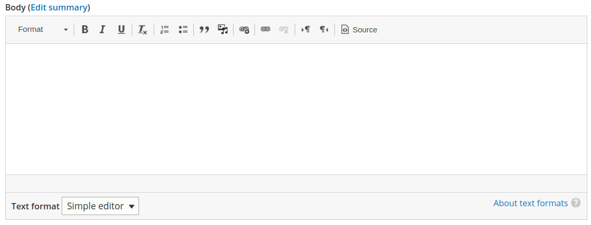

# Varbase Editor

Integrates a rich editor into [Varbase](https://www.drupal.org/project/varbase) distribution.

## Varbase Editor Module


Varbase editor features are bundled through the **Varbase Editor** module.\
GitHub: [https://github.com/Vardot/varbase\_editor](https://github.com/Vardot/varbase\_editor)\
Drupal.org: [https://www.drupal.org/project/varbase\_editor](https://www.drupal.org/project/varbase\_editor)&#x20;

After building a project using the `varbase-project` template, you can see the code of the **Varbase Editor** module in:


```
project_directory
|-- docroot
    |-- modules
        |-- contrib
            |-- varbase_editor
```

Brings in the following core and contributed modules to your site:

| Module                                                                                           | Purpose                                                                                                                    |
| ------------------------------------------------------------------------------------------------ | -------------------------------------------------------------------------------------------------------------------------- |
| <p><strong>Node</strong></p><p><em>(in Drupal core)</em></p>                                     | Allows content to be submitted to the site and displayed on pages.                                                         |
| <p><strong>Text Editor</strong></p><p><em>(in Drupal core)</em></p>                              | Provides a means to associate text formats with text editor libraries such as WYSIWYGs or toolbars.                        |
| <p><strong>CKEditor</strong></p><p><em>(in Drupal core)</em></p>                                 | WYSIWYG editing for rich text fields using CKEditor.                                                                       |
| <p><strong>Filter</strong></p><p><em>(in Drupal core)</em></p>                                   | Filters content in preparation for display.                                                                                |
| ****[**Ace Code Editor**](https://www.drupal.org/project/ace\_editor)****                        | Provides integration with [Ace code editor](https://ace.c9.io).                                                            |
| ****[**CKEditor BiDi Buttons**](https://www.drupal.org/project/ckeditor\_bidi)****               | Enables CKEditor 2 bi directional Buttons. One for Right To Left text direction (RTL) and another for Left To Right (LTR). |
| ****[**CKEditor Media Embed Plugin**](https://www.drupal.org/project/ckeditor\_media\_embed)**** | Adds the Media Embed CKEditor plugins to Drupal.                                                                           |
| ****[**Entity Embed**](https://www.drupal.org/project/entity\_embed)****                         | Allows entities to be embedded using a text editor.                                                                        |
| ****[**Image Resize Filter**](https://www.drupal.org/project/image\_resize\_filter)****          | Resizes images based on width and height attributes and optionally link to the original image.                             |
| ****[**External Links**](https://www.drupal.org/project/extlink)****                             | Modify behavior and appearance of external links.                                                                          |
| ****[**Linkit**](https://www.drupal.org/project/linkit)****                                      | Provides an easy interface for internal and external linking with wysiwyg editors.                                         |
| ****[**Editor Advanced link**](https://www.drupal.org/project/editor\_advanced\_link)****        | Add title, target etc. attributes to Text Editor''s link dialog if the text format allows them.                            |
| ****[**CKEditor Anchor Link**](https://www.drupal.org/project/anchor\_link)****                  | This plugin module adds the better link dialog and anchor related features to CKEditor in Drupal 8/9                       |
| ****[**Pathologic**](https://www.drupal.org/project/pathologic)****                              | Helps avoid broken links and incorrect paths in content.                                                                   |
| ****[**Token**](https://www.drupal.org/project/token)****                                        | Provides a user interface for the Token API and some missing core tokens.                                                  |
| ****[**Token Filter**](https://www.drupal.org/project/token\_filter)****                         | Allows token values to be used as filters.                                                                                 |
| ****[**CKEditor Paste Filter**](https://www.drupal.org/project/ckeditor\_paste\_filter)****      | This module implements extra filtering of text pasted from Word.                                                           |


## Features

* Full media integration with CKEditor including caption and much more.
* LinkIt Integration for easy internal linking of content.
* Image enhancements and optimizations.
* Embeddable media and entities.
* Path fixing when uploading images or linking to content with absolute URLs directing to staging or development environments.
* Code Editor for Web Admins.

## List of Text Formats

### Rich editor


### Simple editor



####

### HTML code

.png>)

