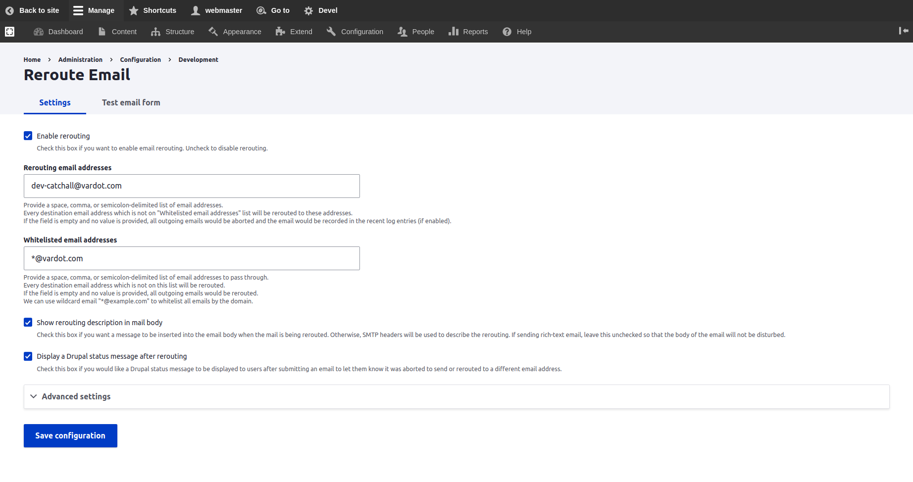
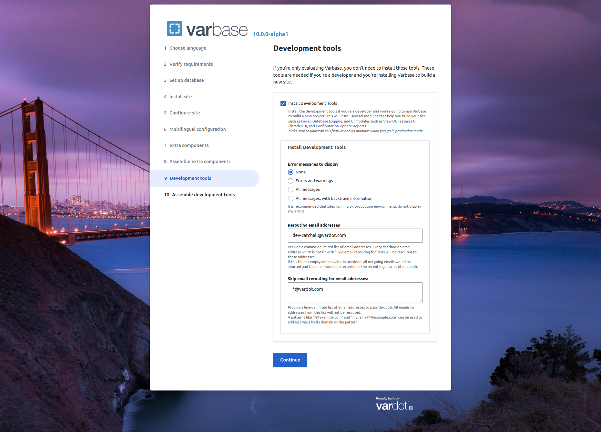

# Reroute Email

Intercepts all outgoing emails from a Drupal site and reroutes them to a predefined configurable email address.

**Example use for rerouting emails :**

If a live production site was copied to a testing server for the purpose of development. The copied site should not send any emails to real users of the original production site.&#x20;


_Make sure to uninstall this module before deployment to production sites._


## Configuring the Reroute Email Settings for a Development Environment

Navigate to:  **Administration \ Configuration \ Development \ **_**Reroute Email**_

Enter a list of email addresses to route all emails to.

On enabling the **Varbase Development** module in a development environment, a default config values will be sat to the reroute email settings.

* **Rerouting email addresses:** `dev-catchall@vardot.com`
* **Whitelisted email addresses:** `*@vardot.com`

Having an empty field with no provided values for rerouted email addresses will results on having all outgoing emails been aborted and recorded in the recent log entries, with a full dump of the email variables, which could provide an additional debugging method.

The allowed list section allows setting up lists of email address and domain name exceptions for which outgoing emails would not be rerouted.

## Configuring the Reroute Email Settings on Varbase Installation

While installing a fresh Varbase for a project. It is available to setup the rerouting email address in the **Development Tools** installation step.

Check the "Install Development Tools" check box to expend out the mini development setting.

Change the default emails for "Rerouting email addresses" and **"**Whitelisted email addresses"&#x20;

<figure><figcaption>
Configure Rerouting Emails When installing Development Tools While Installing Varbase
</figcaption></figure>

