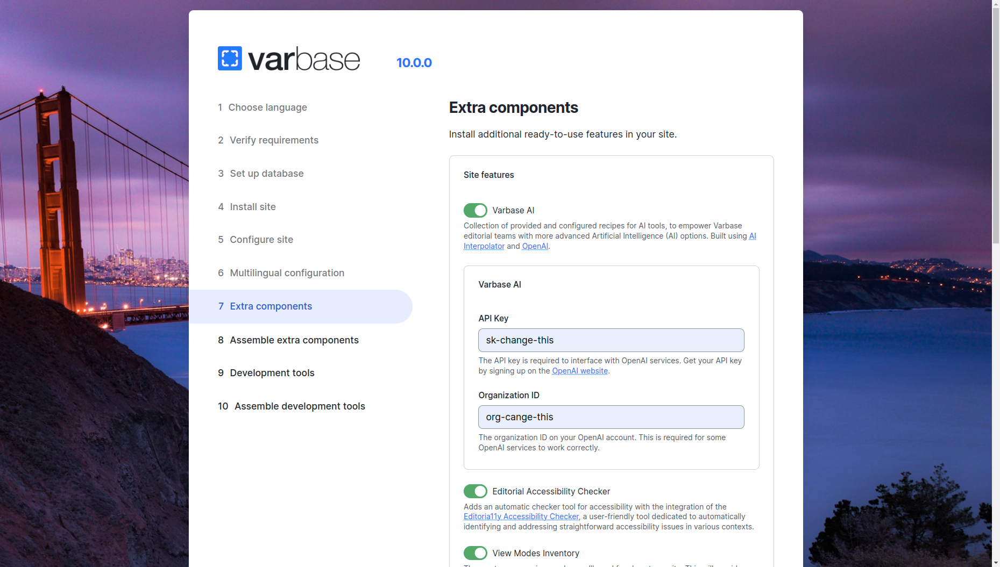

# Varbase AI

Provides a collection of recipes for AI tools. Enhances editorial team's capabilities with a range of advanced Artificial Intelligence (AI) options.

## Varbase API Module


Varbase AI features are bundled through the **Varbase AI** module.\
GitHub: [https://github.com/Vardot/varbase\_ai](https://github.com/Vardot/varbase\_ai)\
Drupal.org: [https://www.drupal.org/project/varbase\_ai](https://www.drupal.org/project/varbase\_ai)

After building a project using the `varbase-project` template, you can see the code of the **Varbase API** module in:


```
project_directory
|-- docroot
    |-- modules
        |-- contrib
            |-- varbase_ai
```

Brings in the following core and contributed modules to your site:

| [**OpenAI Core**](https://www.drupal.org/project/openai)                              | A set of modules to enable OpenAI integration with Drupal and augment the content experience with AI assisted tools. |
| ------------------------------------------------------------------------------------- | -------------------------------------------------------------------------------------------------------------------- |
| [**OpenAI Content Editing Tools**](https://www.drupal.org/project/openai)             | Adds assistive tools for different areas of the content editing process for entities.                                |
| [**OpenAI CKEditor integration**](https://www.drupal.org/project/openai)              | Adds a plugin for CKEditor 5 to let editors prompt OpenAI for text generation purposes.                              |
| [**AI Interpolator**](https://www.drupal.org/project/ai\_interpolator)                | Provides a way to fill structured fields based on AI queries on a textual field.                                     |
| [**AI Interpolator OpenAI**](https://www.drupal.org/project/ai\_interpolator\_openai) | Fill in data in the Interpolator from OpenAI.                                                                        |

## Listed in the extra components

Can be installed in the extra components installation step with Varbase.

<figure><figcaption><p>Extra Components with Varbase AI</p></figcaption></figure>

## **Optional Varbase AI Recipes**

By installing the **Varbase AI** module, the site will only have the [**Default Varbase AI Recipe**](https://git.drupalcode.org/project/varbase\_ai/-/blob/1.0.x/recipes/default/recipe.yml?ref\_type=heads), but developers can apply optional recipes.

* [Add OpenAI to Simple Editor text format](https://git.drupalcode.org/project/varbase\_ai/-/tree/1.0.x/recipes/add-openai-to-basic\_html-text-format?ref\_type=heads)
* [Add OpenAI to Rich Editor text format](https://git.drupalcode.org/project/varbase\_ai/-/tree/1.0.x/recipes/add-openai-to-basic\_html-text-format?ref\_type=heads)


#### Planned to add more **Varbase AI Recipes**

