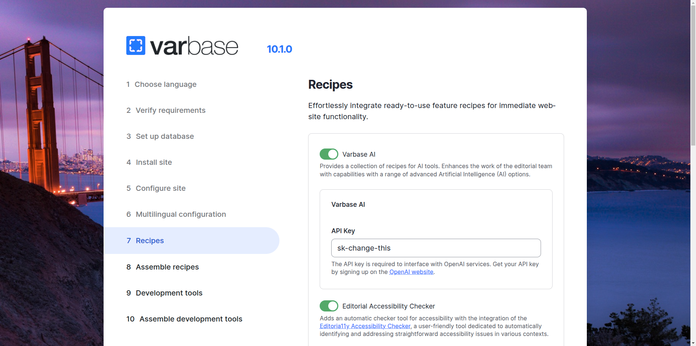

# Varbase AI

Provides a collection of recipes for AI tools, empowering editorial teams with a wide range of advanced Artificial Intelligence (AI) capabilities.

Enables seamless management of custom AI integrations for Varbase and supports updatable AI workflows.

## Varbase API Module


Varbase AI features are bundled through the **Varbase AI** module.\
GitHub: [https://github.com/Vardot/varbase\_ai](https://github.com/Vardot/varbase_ai)\
Drupal.org: [https://www.drupal.org/project/varbase\_ai](https://www.drupal.org/project/varbase_ai)

After building a project using the `varbase-project` template, you can see the code of the **Varbase API** module in:


```
project_directory
|-- docroot
    |-- modules
        |-- contrib
            |-- varbase_ai
```

Brings in the following core and contributed modules to your site:

| [**AI (Artificial Intelligence)**](https://www.drupal.org/project/ai)          | This module provides and abstraction layer for AI services.                                        |
| ------------------------------------------------------------------------------ | -------------------------------------------------------------------------------------------------- |
| [**OpenAI Provider**](https://www.drupal.org/project/ai_provider_openai)       | This enables the use of OpenAI for the AI module.                                                  |
| [**AI Automators**](https://www.drupal.org/project/ai)                         | Allows AI and other tools and services to automatically generate field values on content creation. |
| [**AI Assistant API**](https://www.drupal.org/project/ai)                      | Adds decoupled AI Assistants for any frontend to work with.                                        |
| [**AI Agents**](https://www.drupal.org/project/ai_agents)                      | The Agents module makes Drupal taskable by AI agents.                                              |
| [**AI Chatbot**](https://www.drupal.org/project/ai)                            | Provides a chatbot frontend for the AI Assistant API.                                              |
| [**AI Image Alt Text**](https://www.drupal.org/project/ai_image_alt_text)      | Provided the possibility to fill out the alt text of an image field using AI.                      |
| [**AI Image Bulk Alt Text**](https://www.drupal.org/project/ai_image_alt_text) | Adds the possibility to bulk change the alt text.                                                  |

## Listed in Recipes

Can be installed in the recipes installation step with Varbase.


<figure><figcaption><p>Activate the Default Varbase AI recipe</p></figcaption></figure>

## **Varbase AI Recipes**

When the **Varbase AI** module is installed, the site is initially equipped with the  **Default Varbase AI Recipe**. However, developers can extend its capabilities by integrating optional recipes.


By installing the **Varbase AI** module, the site will applay the **Default Varbase AI Recipe**, but developers can apply optional recipes too.


Below are the recipes designed to integrate AI in Varbase:

|   [**Varbase AI Default recipe**](https://www.drupal.org/project/varbase_ai_default)                  | A recipe to configure default AI modules, settings, and permissions in Varbase, enabling OpenAI integrations for alt-text generation, CKEditor enhancements, and various AI-powered features. |
| ---------------------------------------------------------------------------------------------------------------------------------------------------------------------------------------------------------------------- | --------------------------------------------------------------------------------------------------------------------------------------------------------------------------------------------- |
|  [**Varbase AI Editor Assistant recipe**](https://www.drupal.org/project/varbase_ai_editor_assistant) | A recipe to add AI-powered features and an assistant button to a CKEditor 5 text editor.                                                                                                      |
|  [**Varbase AI Image Alt recipe**](https://www.drupal.org/project/varbase_ai_image_alt)               | Provides a recipe to automatically generate and fill the alt text of an image field using AI.                                                                                                 |
|  [**Varbase AI Taxonomy Tagging recipe**](https://www.drupal.org/project/varbase_ai_taxonomy_tagging) | Provides a recipe to automatically tag selected referenced taxonomy terms based on the content entity's body field.                                                                           |
|  [**Varbase AI Agents recipe**](https://www.drupal.org/project/varbase_ai_agents)                     | Provides an AI-powered chatbot for streamlined administration and allows managing multiple agents with distinct functionalities.                                                              |
