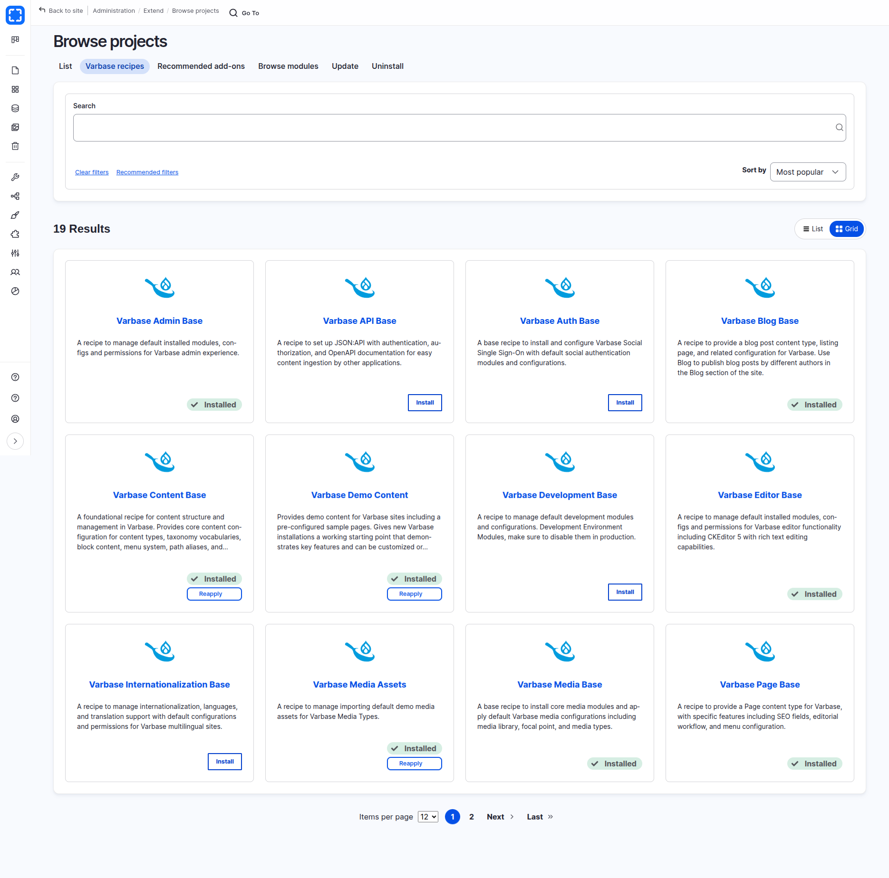
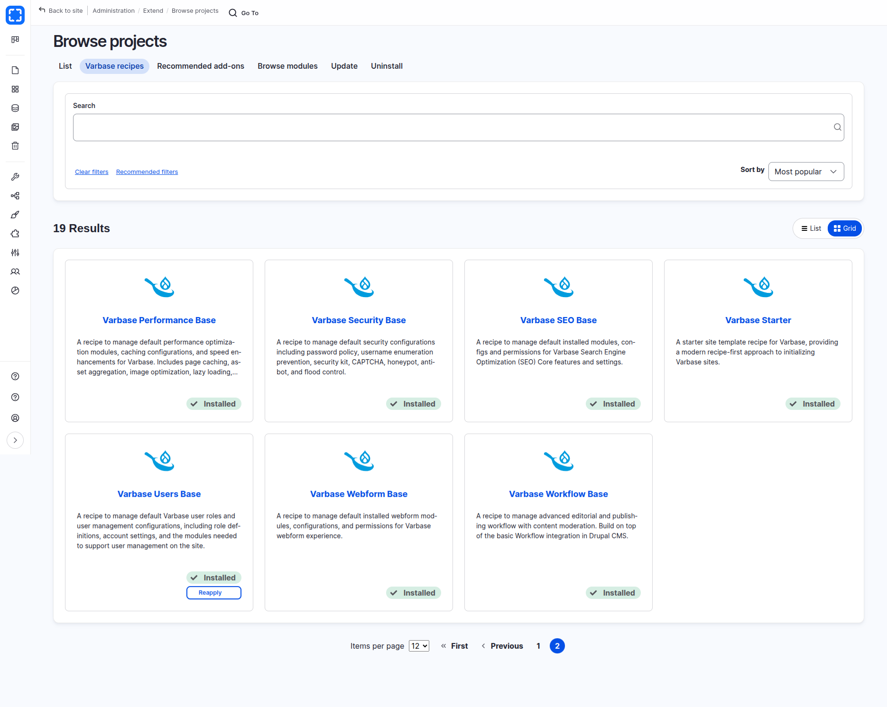

# Varbase Recipes

**Varbase 11.0.x** adopts a modern, recipes-based architecture built on **Drupal Recipes**, replacing the traditional module-based installation approach used in earlier Varbase versions. Drupal Recipes are a standardized way to package and apply sets of modules, configurations, and permissions as reusable, composable units.

## What Are Drupal Recipes?

Drupal Recipes allow distributions like Varbase to define discrete bundles of functionality that can be applied individually or composed together. Each recipe declares its dependencies, installs the required modules, applies configuration, and sets up permissions, all in a single, repeatable operation.

This approach provides several advantages over the previous module-based architecture:

* **Composability**: Recipes can depend on and build upon other recipes, creating a layered architecture.
* **Selective installation**: Sites can apply only the recipes they need rather than installing the entire distribution.
* **Maintainability**: Each recipe is an independently versioned Drupal.org project, making updates and patches more straightforward.
* **Compatibility**: Varbase recipes build on top of Drupal CMS recipes, ensuring alignment with the broader Drupal ecosystem.

## The Varbase Starter Recipe

The [Varbase Starter](../site-templates/varbase-starter.md) recipe serves as the main site template that orchestrates the entire Varbase installation. It bundles all core Varbase recipes along with Drupal CMS recipes, Easy Email, and the Vartheme BS5 theme. For most projects, applying the Varbase Starter recipe is the recommended starting point.

## Varbase Recipes Overview

The following recipes comprise the Varbase 11.0.x recipe ecosystem. The **Applied By** column shows whether a recipe is applied automatically when installing with the **Varbase Starter** recipe, ships in the project codebase as an optional recipe you can apply on demand, or is a separate add-on project you require first.

| Recipe                                                  | Description                                                                                     | Applied By |
| ------------------------------------------------------- | ----------------------------------------------------------------------------------------------- | ---------- |
| [Varbase Starter](../site-templates/varbase-starter.md)                   | Main site template recipe that orchestrates the full Varbase installation                       | Installer |
| [Varbase Users Base](varbase-users-base.md)             | Default user roles, account settings, and user management configurations                        | Varbase Starter |
| [Varbase Admin Base](varbase-admin-base.md)             | Default admin experience with Gin theme, navigation, audit trail, and admin tools               | Varbase Starter |
| [Varbase Content Base](varbase-content-base.md)         | Core content configuration including node types, taxonomy, views, ECA automation, and essential content modules | Varbase Starter |
| [Varbase Media Base](varbase-media-base.md)             | Media types, image styles, responsive images, media library enhancements, and file handling     | Varbase Starter |
| [Varbase Editor Base](varbase-editor-base.md)           | CKEditor 5 with rich text editing capabilities, plugins, and enhancements                       | Varbase Starter |
| [Varbase Security Base](varbase-security-base.md)       | Password policies, CAPTCHA, honeypot, antibot, security kit, and flood control                  | Varbase Starter |
| [Varbase SEO Base](varbase-seo-base.md)                 | SEO modules including metatag, pathauto, redirect, sitemap, and structured data                 | Varbase Starter |
| [Varbase Workflow Base](varbase-workflow-base.md)       | Content moderation, scheduled publishing, and workflow notifications                            | Varbase Starter |
| [Varbase Performance Base](varbase-performance-base.md) | Page caching, asset aggregation, image optimization, and lazy loading                           | Varbase Starter |
| [Varbase Webform Base](varbase-webform-base.md)         | Default webform modules, configurations, and professional contact form template                 | Varbase Starter |
| [Varbase Page Base](varbase-page-base.md)               | Page content type with SEO fields, editorial workflow, and menu configuration                   | Varbase Starter |
| [Varbase Blog Base](varbase-blog-base.md)               | Blog post content type with featured images, tags, categories, and listing pages                | Varbase Starter |
| [Varbase Demo Content](varbase-demo-content.md)         | Demo content for new Varbase sites                                                              | Varbase Starter |
| [Varbase Media Assets](varbase-media-assets.md)         | Default demo media assets including images, videos, and documents                               | Varbase Demo Content |
| [Varbase API Base](varbase-api-base.md)                 | JSON:API with authentication, authorization, and OpenAPI documentation                          | On demand |
| [Varbase Auth Base](varbase-auth-base.md)               | Social Single Sign-On with default social authentication providers                              | On demand |
| [Varbase Internationalization Base](varbase-i18n-base.md) | Internationalization, language management, and translation support                            | On demand |
| [Varbase Development Base](varbase-dev-base.md)         | Development modules and configurations for local development environments                       | On demand |
| [Varbase News Base](varbase-news-base.md)               | News content type with featured images, categories, listing page, and Drupal Canvas templates   | Add-on |
| [Varbase Events Base](varbase-events-base.md)           | Event content type with smart date and location, events listing, and related events             | Add-on |


The [**Varbase AI Recipes**](../varbase-ai-recipes/README.md) are documented in their own section. The **Varbase AI Base** recipe and its feature recipes ship in the project codebase and can be applied on demand. **Varbase AI Figma Base** is a separate add-on project.


## Applying a Recipe

All recipes marked **Varbase Starter** or **On demand** already ship in the `recipes/` folder of your Varbase project. Composer downloads them as `drupal-recipe` packages, and Drupal core's **Recipe Unpack** plugin unpacks them into `recipes/` with their dependencies added to your project's `composer.json`.

To apply a recipe that ships with the project, run Drush from the project:

```bash
ddev drush recipe ../recipes/recipe_name
```

For example, to add multilingual support:

```bash
ddev drush recipe ../recipes/varbase_i18n_base
```

Recipes marked **Add-on**, such as **Varbase News Base** and **Varbase Events Base**, are separate Drupal.org projects. Require them first, then apply them:

```bash
ddev composer require drupal/varbase_news_base
ddev drush recipe ../recipes/varbase_news_base
```

Refer to each recipe's documentation page for specific installation commands and details.


**Having** [**Varbase Recipes**](https://www.drupal.org/project/varbase_recipes)

Provides general custom config action plugins for Drupal recipes.

Manages a custom optional list of Varbase recipes for projects, with the full list of [**Varbase Recipes**](https://docs.varbase.vardot.com/11.0.x/developers/understanding-varbase/varbase-recipes) to apply, and integration with the [Project Browser](https://www.drupal.org/project/project_browser).



**Varbase Recipes - Page 1**

<figure><figcaption></figcaption></figure>

**Varbase Recipes - Page 2**

<br>

<figure><figcaption></figcaption></figure>
