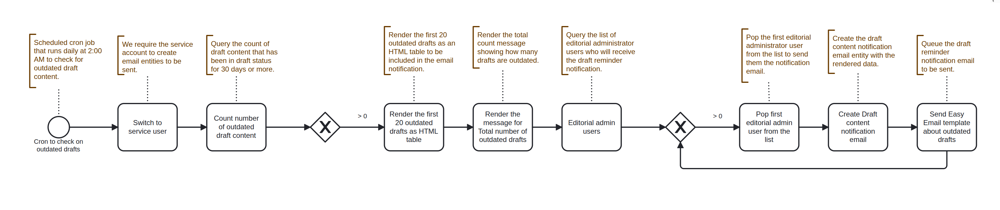

# Draft Reminder

An automated workflow that monitors content in draft status and sends email notifications to editorial administrators when drafts have been unchanged for **30 days** or more. This helps content teams stay on top of stale draft content and maintain an efficient editorial workflow.

* Automatically identifying draft content that hasn't been updated in over a month
* Sending regular email reminders to editorial administrators
* Providing a summary table of outdated drafts for easy review
* Running automatically without manual intervention

<figure><figcaption>
Workflow Sequence - Draft Reminder
</figcaption></figure>

### How It Works

#### Trigger

The workflow is triggered by a scheduled cron job that runs **daily at 2:00 AM**.

#### Workflow Process

1. **Service Account Switch**: The workflow switches to a service user account to ensure proper permissions for creating and sending email entities.
2. **Count Draft Content**: Queries the system to count how many draft content items have been unchanged for 30 days or more.
3. **Conditional Check**: If the count is greater than 0, the workflow continues; otherwise, it stops.
4. **Render Draft Table**: Generates an HTML table displaying the first 20 outdated drafts, including:
   * Content title
   * Last changed date
   * Edit link
5. **Render Total Message**: Creates a summary message showing the total number of outdated drafts with a link to view the full list.
6. **Query Editorial Administrators**: Retrieves the list of users with editorial administrator permissions who should receive the notification.
7. **Send Email Notifications**: For each editorial administrator:
   * Creates a draft content notification email entity
   * Populates it with the rendered HTML table and summary
   * Queues the email to be sent

The workflow loops through all editorial administrators, sending each one a personalized notification.
