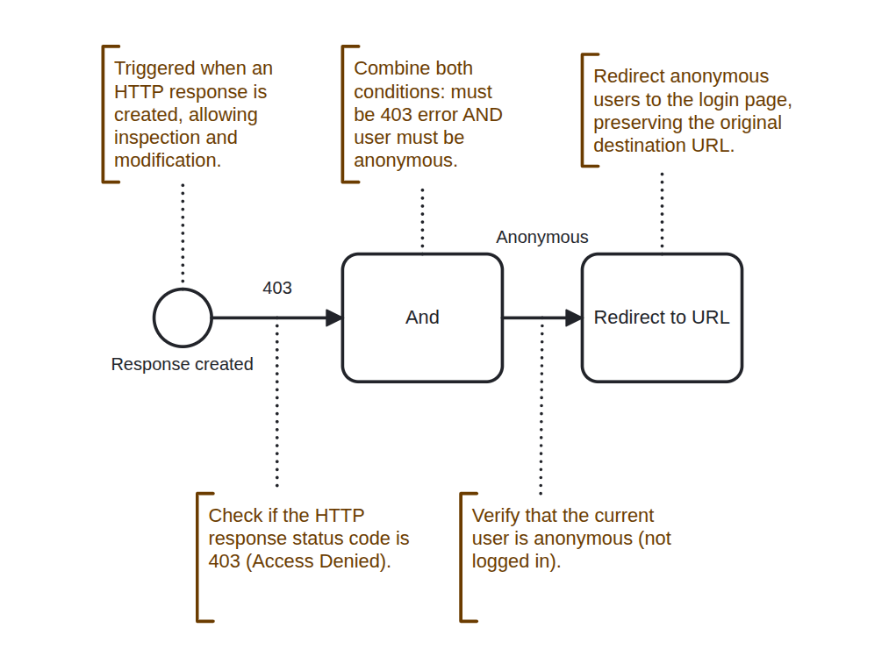

# Redirect 403 to Login

The **Redirect 403 to Login** ECA model automatically redirects anonymous (non-logged-in) users to the login page when they encounter a 403 Access Denied error. This improves user experience by guiding users to authenticate rather than showing them an error page.

* **Improved User Experience**: Users are guided to login rather than seeing an error page
* **Seamless Authentication Flow**: Original destination is preserved, so users return to their intended page after login
* **Automatic Process**: No manual intervention required
* **Role-Specific**: Only affects anonymous users; authenticated users with insufficient permissions still see the 403 error

<figure><figcaption>
Workflow Sequence - Redirect 403 to Login
</figcaption></figure>

This model intercepts that error and redirects them to the login page, preserving the originally requested URL so they can be redirected back after successful authentication.

Cloned from [**Redirect 403 to Login Page**](https://ecaguide.org/library/use%20case/redirect_403_to_login_page/) In the [**ECA Library**](https://ecaguide.org/library) and use cases.

### Related Resources

* [ECA Guide Library](https://ecaguide.org/)
* [Drupal ECA Project](https://www.drupal.org/project/eca)

