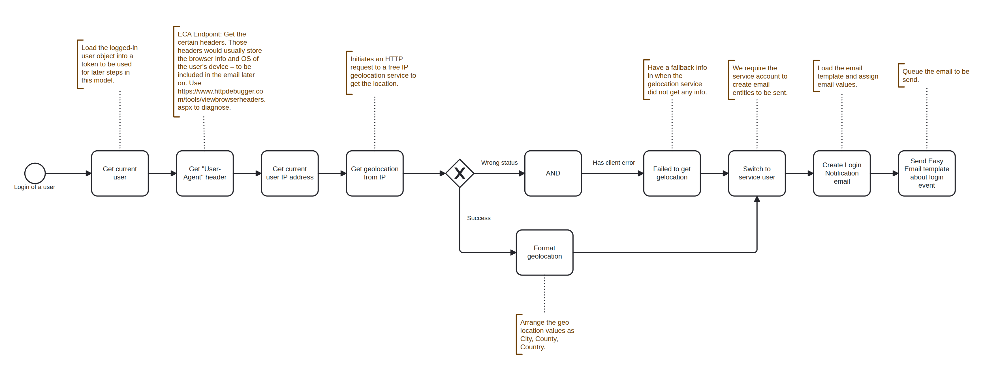

# User Login Notification

The User Login Notification model is an automated workflow that sends email notifications to users when they log into the system. It captures relevant login information including the user's IP address, geolocation, and browser details, then sends this information via email for security monitoring purposes.

* Automatically triggers on user login events.
* Captures user IP address and geolocation data.
* Retrieves browser and device information from User-Agent headers.
* Sends formatted email notifications with login details.
* Includes fallback handling for geolocation service failures.

<figure><figcaption>
Workflow sequence - User Login Notification
</figcaption></figure>

### How It Works

The workflow follows these steps:

#### 1. Event Trigger

The model activates when a user successfully logs into the system.

#### 2. Data Collection

**Get Current User**

* Loads the logged-in user object into a token (`logged_user`) for use throughout the workflow

**Get User-Agent Header**

* Captures the `User-Agent` HTTP header
* Stores browser and OS information in the `logged_user_agent` token
* This data helps identify the device and browser used for login

**Get User IP Address**

* Retrieves the current user's IP address
* Stores it in the `logged_user_ip_address` token

#### 3. Geolocation Lookup

**HTTP Request to Geolocation Service**

* Makes a GET request to `https://api.ipwho.org/ip/[logged_user_ip_address]`
* Stores the response in the `logged_user_ip_http_request` token
* Uses a free IP geolocation service to determine the user's location

**Conditional Processing** The workflow includes a decision gateway that handles the geolocation response:

* **Success Path**: If the HTTP status is 200 and the response indicates success
  * Formats the location as: City, Region, Country
  * Stores formatted data in the `logged_user_location` token
* **Failure Path**: If the status is not 200 or there's a client error
  * Sets `logged_user_location` to "No info"
  * Ensures the workflow continues even if geolocation fails

#### 4. Email Creation and Delivery

**Switch to Service User**

* Changes the execution context to a service account
* Required to have proper permissions for creating and sending email entities

**Create Login Notification Email**

* Creates an Easy Email entity using the `login_notification` template
* Populates the email with collected data (user info, location, browser details)
* Stores the email entity in the `login_notification` token

**Send Email**

* Queues the email for delivery
* Sends the notification to the user with their login information

### Tokens Available

The following tokens are created and available throughout the workflow:

| Token Name                    | Description                                       |
| ----------------------------- | ------------------------------------------------- |
| `logged_user`                 | The logged-in user object                         |
| `logged_user_agent`           | Browser and OS information from User-Agent header |
| `logged_user_ip_address`      | User's IP address                                 |
| `logged_user_ip_http_request` | Full geolocation API response                     |
| `logged_user_location`        | Formatted location string or "No info"            |
| `login_notification`          | The created email entity                          |

### Troubleshooting

#### Geolocation Not Working

If geolocation data shows "No info":

* Verify the IP geolocation service (ipwho.org) is accessible
* Check that outbound HTTP requests are allowed from your server
* Ensure the IP address is publicly routable (won't work for localhost/private IPs)

#### Emails Not Sending

* Verify the `login_notification` Easy Email template exists and is configured
* Check that the service account has permission to create and send emails
* Review email queue and cron settings

#### Missing Browser Information

* Ensure the User-Agent header is being sent by the client
* Test using: [https://www.httpdebugger.com/tools/viewbrowserheaders.aspx](https://www.httpdebugger.com/tools/viewbrowserheaders.aspx)

### Customization

You can customize this model by:

* Modifying the email template to include additional fields
* Changing the geolocation service URL
* Adding additional conditions or validation steps
* Adjusting the formatted location string pattern
* Adding logging or database storage of login attempts

### Security Considerations

* Login notifications help users detect unauthorized access
* The model captures enough information to identify suspicious login patterns
* Consider adding rate limiting to prevent notification spam
* Review and secure the service account permissions
