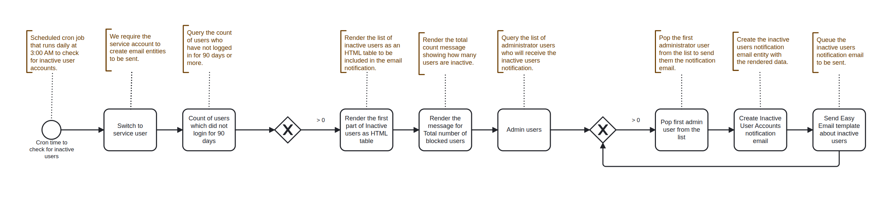
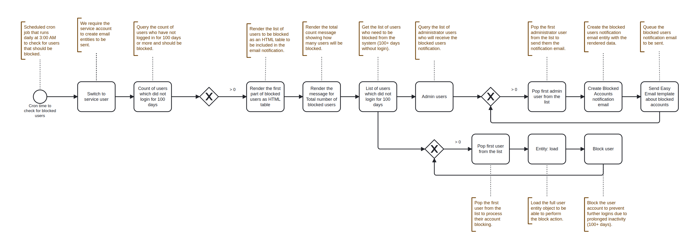

# User Recertification

The User Re-certification ECA model provides automated security monitoring and user account management for Drupal sites. It tracks user activity, sends notifications about role changes, and automatically manages inactive user accounts to maintain security compliance.

* Monitoring user role changes and sending notifications to administrators
* Identifying users who haven't logged in for extended periods
* Automatically blocking accounts after prolonged inactivity
* Providing regular reports on inactive and blocked user accounts

## Role Change Notifications

Workflow sequence to trigger Immediate Email to Admins on User Role Changes.

When a user's roles are modified, the model:

* Detects the role change.
* Filters out the default 'authenticated' role to focus on meaningful changes.
* Notifies all administrator users about the modification.
* Includes details about the user and their old/new roles.

<figure><figcaption>
Workflow sequence - Role Change Notifications
</figcaption></figure>

## Inactive User Monitoring

Workflow sequence to trigger inactive user list notification to admins after **3 months ( +90 days )** of inactivity.

* Queries the count of inactive users.
* Generates an HTML table listing all inactive accounts.
* Creates a summary message with the total count.
* Sends notification emails to all administrators.

<figure><figcaption>
Workflow sequence - Inactive User Monitoring
</figcaption></figure>

## Automatic Account Blocking

Workflow sequence to trigger to Ensure proper blocking and notification logic after repeated inactivity of **3 months and 10 more days ( +100 days )**.

* Queries users meeting the inactivity threshold.
* Iterates through each user and blocks their account.
* Generates an HTML report of blocked accounts.
* Notifies administrators with a summary email.

<figure><figcaption>
Workflow sequence - Automatic Account Blocking
</figcaption></figure>

