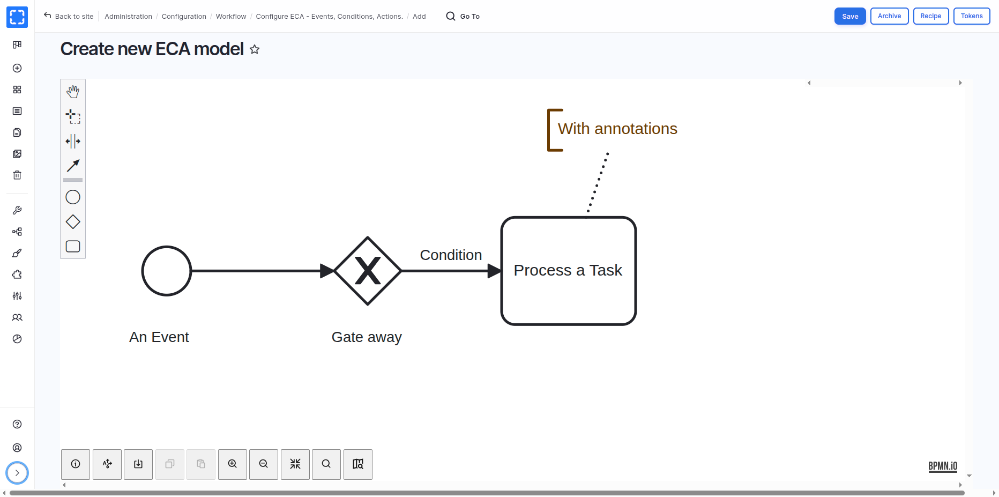

# Varbase ECA (Visual Workflow Builder)

Varbase has adopted ECA (Event - Condition - Action) as its core visual workflow builder automation framework, replacing hard-coded event subscribers and custom hooks with configurable, maintainable ECA models. This transition improves modularity, simplifies maintenance, and enables future AI integrations while providing a no-code solution for orchestrating automated workflows throughout your Drupal site.

ECA models in Varbase are pre-configured workflow automations that respond to specific events on your site, evaluate conditions, and execute actions—all without requiring custom code.

## What is ECA?

[**ECA**](https://www.drupal.org/project/eca) (Event - Condition - Action) is a powerful rules engine for Drupal that enables automated workflows through three core components:

* **Event**: Something that happens on your site (user login, content creation, form submission, etc.)
* **Condition**: Optional checks that determine whether actions should execute
* **Action**: Tasks performed when events occur and conditions are met (send emails, display messages, modify data, etc.)

ECA leverages existing Drupal core components and extends them through a flexible plugin system, making workflows visual, maintainable, and accessible to non-developers through the integrated BPMN.iO modeler.

<figure><figcaption></figcaption></figure>

## Why Varbase Uses ECA

The adoption of ECA in Varbase provides several key advantages:

* **Maintainability**: Replace hard-coded event subscribers with configurable models
* **Modularity**: Workflows are stored as configuration that can be imported, exported, and version controlled.
* **No-Code Solution**: Site builders can create and modify workflows without writing custom code.
* **Visual Editing**: BPMN.iO modeler provides intuitive diagram-based workflow design.
* **AI Integration Ready**: Foundation for future AI-powered automation features.
* **Performance**: Intelligent event subscription with negligible overhead.
* **Extensibility**: Plugin-based architecture allows easy integration with custom and contributed modules.

## Getting Started with ECA Models

#### Viewing ECA Models

Navigate to **Administration > Configuration > Workflow > ECA** to view all available ECA models on your site.

Each model appears with its name, description, status (enabled/disabled), and modeler type.

## Pre-Configured ECA Models in Varbase


[user-login-notification.md](user-login-notification.md)



[user-recertification.md](user-recertification.md)



[redirect-403-to-login.md](redirect-403-to-login.md)



[draft-reminder.md](draft-reminder.md)

