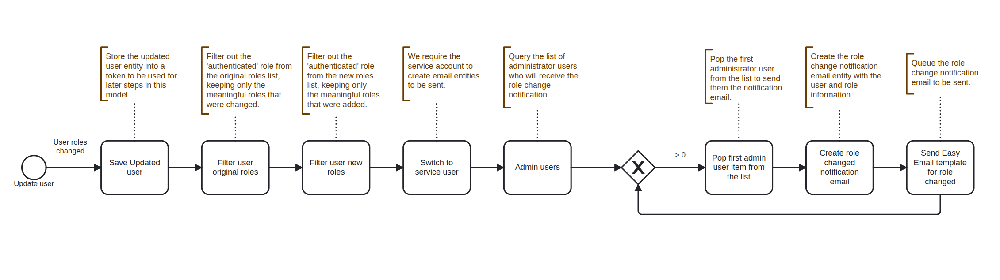

# Admin Change Role Notification

Provides automated security monitoring and user account management for Drupal sites. It sends notifications about role changes

* Monitoring user role changes and sending notifications to administrators

## Role Change Notifications

Workflow sequence to trigger Immediate Email to Admins on User Role Changes.

When a user's roles are modified, the model:

* Detects the role change.
* Filters out the default 'authenticated' role to focus on meaningful changes.
* Notifies all administrator users about the modification.
* Includes details about the user and their old/new roles.

<figure><figcaption>
Workflow sequence - Role Change Notifications
</figcaption></figure>
