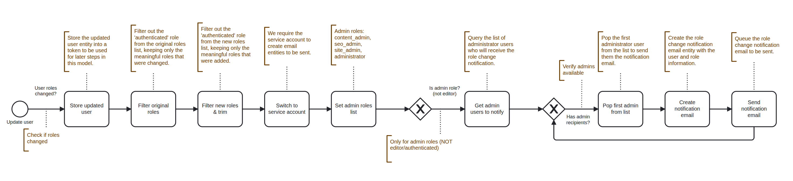

# Admin Change Role Notification

Provides automated security workflow that monitors user role changes and sends real-time email notifications to system administrators when administrative roles are modified. This provides an audit trail and immediate awareness of critical permission changes within the system.

* Detecting when user roles are added, removed, or modified.
* Immediately notifying administrators of role changes for high-privilege accounts.
* Providing visibility into permission escalations or de-escalations.
* Helping prevent unauthorized privilege changes.

<figure><figcaption>
Workflow sequence - Admin Change Role Notification
</figcaption></figure>

### How It Works

#### Trigger

The workflow is triggered by the **Update User** event, which fires whenever a user entity is updated in the system.

#### Workflow Process

1. **Detect Role Changes**: When a user is updated, the workflow checks if the user's roles field has changed. If no role changes occurred, the workflow stops.
2. **Store Updated User**: Captures the updated user entity into a token for use throughout the workflow.
3. **Filter Original Roles**: Removes the default "authenticated" role from the original roles list to focus only on meaningful administrative roles.
4. **Filter New Roles**: Removes the default "authenticated" role from the new roles list and trims whitespace to ensure clean data.
5. **Switch to Service Account**: Changes to a service user account with appropriate permissions to create and send email entities.
6. **Set Admin Roles List**: Defines which roles are considered "administrative" that should trigger notifications:
   * Content Admin
   * SEO Admin
   * Site Admin
   * Administrator ( Super Admin)
7. **Admin Role Check**: Verifies that the role change involves administrative roles (not just "editor" or "authenticated"). If the change only affects non-admin roles like "editor", the workflow stops.
8. **Query Admin Users**: Retrieves the list of active administrator users who should receive the notification from the system.
9. **Send Notifications Loop**: For each administrator in the list:
   * Pops the first administrator from the list
   * Creates a role change notification email entity
   * Populates it with information about which user's roles changed
   * Queues the email to be sent
   * Loops back to send to the next administrator

The workflow continues until all administrators have been notified
