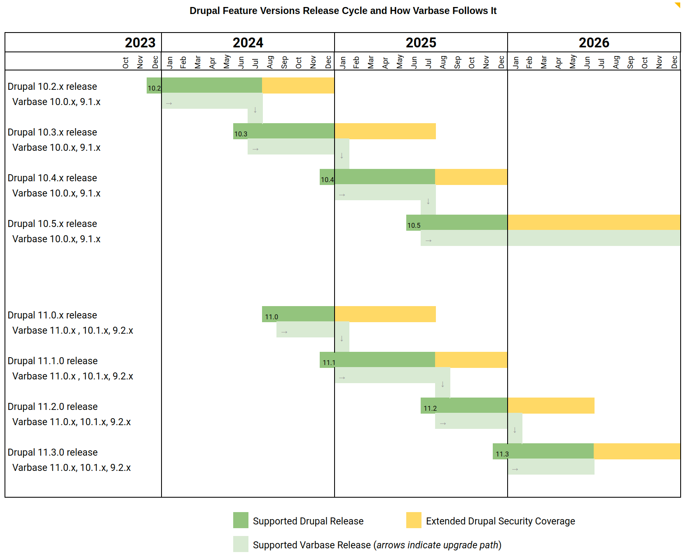
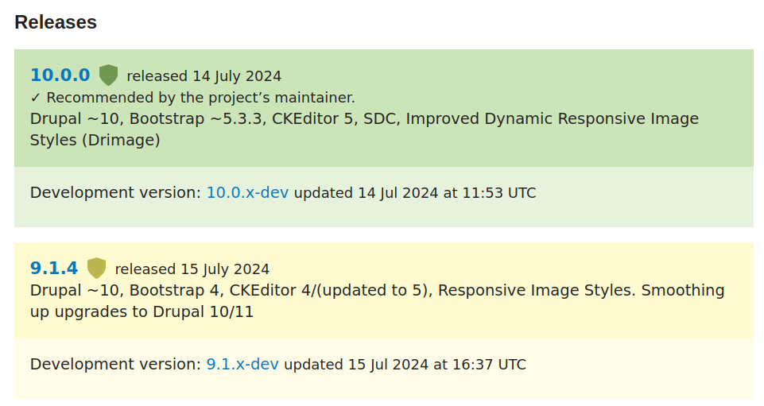

# Release Cycle and Supported Versions

## Understanding Version Numbers

Varbase follows the Drupal 9/10/11 release cycle. Therefore, a version of Varbase is named 10.0.x uses the same **major** version of Drupal 10.

## Varbase Supported Versions

Varbase supports one major version. That is the most recent one using the most recent Drupal 9/10 major version (_e.g. `9.0.x` , `10.0.x`_, _`11.0.x`_ )

Upgrade paths will always be provided to guarantee a smooth move between supported Varbase versions.

See the below image for an illustration of supported versions and major release cycle:

<figure><figcaption>
From 2023 to 2026
</figcaption></figure>

***

**Varbase 9.1.x** will continue to be supported for **Drupal 10** and later on **Varbase 9.2.x** will be supported for **Drupal 11**


#### Varbase 10 structure is totally different from Varbase 9

Many new methods from Drupal Core and contributed modules


**Varbase \~10.0.0** uses **Drupal 10**, [**Bootstrap \~5.3.3**](https://blog.getbootstrap.com/2024/02/20/bootstrap-5-3-3/), **CKEditor 5**, [ **Single Directory Components (SDC)**](https://www.drupal.org/docs/develop/theming-drupal/using-single-directory-components), [**Improved Dynamic Responsive Image Styles (Drimage)**](https://www.drupal.org/project/drimage\_improved) - also using [**Drupal Recipes**](https://www.drupal.org/docs/extending-drupal/drupal-recipes)

***

**Varbase \~9.1.0** uses **Drupal 10**, **Bootstrap 4**, **CKEditor 4/5**, **Default Drupal Responsive Image Styles**. Smoothing up upgrades to **Drupal 10/11**


**No upgrade path from Varbase 9 to Varbase 10**


<figure><figcaption>
Varbase Releases
</figcaption></figure>

[View all Releases](https://www.drupal.org/project/varbase/releases)

***

If a project started with **Varbase 9.0.x** branch and then upgraded to **9.1.x**, the project should keep using **Varbase 9** as it will have support for **Drupal 11** in the **9.2.x** branch.


Recommended to start new projects with latest version of **Varbase \~10.0.0**

