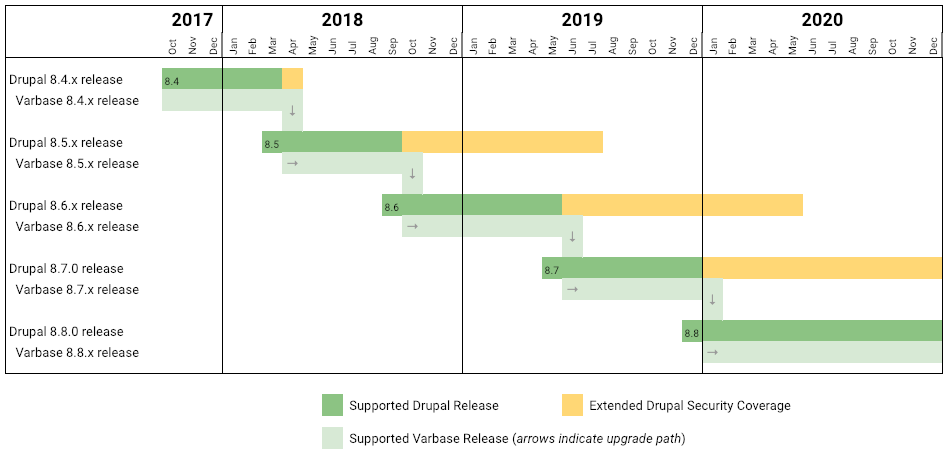

# Release Cycle and Supported Versions

## Understanding Version Numbers

Varbase follows Drupal 8/9 release cycle. Therefore, a version of Varbase that is named 8.x-5.x uses the same **major** version of Drupal 8.x-5.x.

## Varbase Supported Versions

Varbase supports one major version. That is the most recent one using the most recent Drupal 8/9 major version \(_e.g. `8.x-6.x`_\).

Once the most recent stable version of Drupal 8 is released \(_e.g. `8.x-7.x`_\), Varbase will release its _`8.x-7.x`_ version and drop support of oldest supported version \(_e.g. `8.x.4.x`_\).

Upgrade paths will always be provided to guarantee smooth move between Varbase versions.

See the below image for illustration of supported versions and major release cycle:

